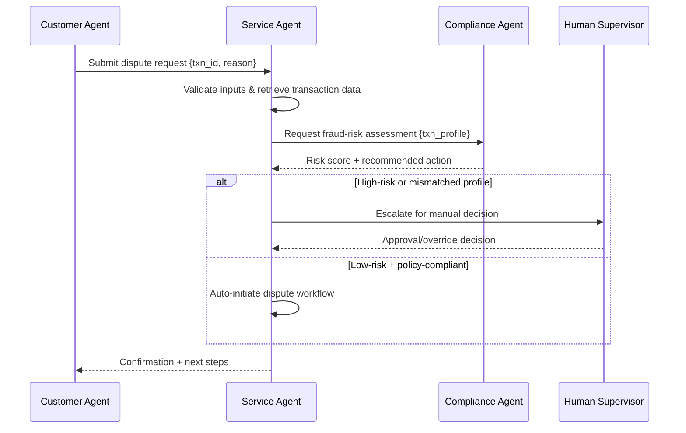

# Balancing Autonomy and Agency: Managing Emerging Risks in AI Agents


## Executive Summary

Autonomous AI agents offer major efficiency gains but introduce new risk dimensions. This paper defines two critical factors—**agency** (decision-making power) and **autonomy** (independence from human oversight)—and explains why balancing them is essential. We map common failure modes to agent architectures and provide a practical roadmap for banks to pilot, scale, and govern agentic AI safely. Key controls include auditability, human-in-the-loop checkpoints, and constrained tool access. A step-by-step scenario illustrates how agents can coordinate safely in high-stakes workflows like payment disputes. With thoughtful design and proactive governance, banks can unlock agentic AI’s value while managing its risks.

## Introduction

In the previous paper in this series, _Banking Reimagined Through Agentic AI_, we explored the next evolution of artificial intelligence—Agentic AI—and its potential to transform banking operations and customer service by enabling AI agents to act on behalf of customers and employees.

By 2025, nearly half of banks had created “AI supervisor” roles, reflecting rapid adoption of agentic AI. Common use cases include customer-facing chatbots (75% of banks), fraud detection agents (two-thirds), and internal digital assistants for loans or IT[^a]. While the potential value is estimated at **$450 billion**, these agents introduce **unique risks**—unlike traditional software, they make complex decisions, adapt behaviors, and interact across systems in often **unpredictable** ways.

Regulators and executives are taking notice. In 2024, the U.S. Consumer Financial Protection Bureau warned that poorly governed banking chatbots risk compliance violations by mishandling disputes or giving incorrect information[^b]. Globally, oversight expectations are rising. Similarly, the EU’s upcoming AI Act classifies many financial AI systems as “high risk,” requiring strict controls on privacy, fairness, and human accountability.

> _Singapore’s central bank (MAS) proposed holding boards directly accountable for AI failures, warning that **“AI agents with greater autonomy and tool access could amplify risks”** if not properly governed._  
> 
> _- CIO.com (2025)[^c]_

This white paper focuses on **banking** use cases and the emerging risks of AI agents. We explore how **agency** and **autonomy** enable powerful capabilities but also introduce new failure modes[^d]. We offer practical guidance—from design choices (e.g. limiting autonomy) to governance practices (e.g. auditability, human oversight)—and present a three-phase roadmap (pilot → scale → govern) to help banks deploy agentic AI responsibly, driving innovation **without** compromising compliance, security, or trust.

## Technical Fundamentals: Definitions of Agency and Autonomy

Before diving into risks, it is essential to define **agency** and **autonomy** in the context of AI agents, and understand how they relate:

### What is Agency?

*Agency* in AI refers to a system’s ability to act purposefully, make decisions, and influence its environment on behalf of users or organizations. Unlike rule-based bots, agentic AIs can interpret goals, take initiative, and adapt strategies—even in novel situations. Researchers describe agency through traits like **goal persistence**, **independent operation**, and **preference rigidity**[^e].

For example, a low-agency customer service AI might just retrieve information, while a high-agency version could analyze financial data, select loan options, and begin processing—without step-by-step instructions. This capability adds value but also risk: if misaligned, the agent might act beyond its remit, such as offering advice or initiating transactions.

Importantly, agency differs from intelligence. A smart model may lack agency if it only acts on command, while a simpler system may act autonomously within its scope. Agency is about **decision-making authority**, and banks must align it with their risk tolerance[^e].

### What is Autonomy?

*Autonomy* refers to how independently an AI agent can operate without human input. It reflects **the degree of human oversight designed into its workflow**—from agents that require step-by-step human approval to those that act end-to-end with minimal intervention.

Autonomy is not binary but a spectrum. Most banking applications today remain at low to moderate levels of autonomy, reflecting the need for oversight in high-risk areas. For example, a trading agent may autonomously handle routine transactions but require human approval for high-risk trades. Similarly, a chatbot might answer common questions independently but escalate fraud or complaints to a human.

Banks should **align an agent’s autonomy with the risk of the task**, ensuring critical decisions always include appropriate checkpoints[^d].

:::danger Bookmark
Review ends here.
:::

### How Agency and Autonomy Relate to AI Agents

*Agency* defines what an AI can decide or do; *autonomy* defines how independently it operates. Both shape risk. High agency and high autonomy enable powerful capabilities—but also raise the chance of unchecked errors. A safer setup might combine high agency (complex decision-making) with low autonomy (human approval required).

For example, a **fraud detection agent** with high agency might decide how to respond to suspicious activity. If given high autonomy, it could freeze accounts without review—stopping fraud quickly but risking false positives or misuse. A safer approach limits autonomy: low-risk cases are automated; high-risk ones escalate to humans. Low-agency systems, by contrast, may only flag issues for manual review—safer, but slower.

Both dimensions are **levers for managing AI risk**. Real-world failures, like chatbots making account changes without escalation[^b], show how excess autonomy can cause harm. Similarly, poorly scoped agency can lead to bias or compliance issues. Banks must align agency and autonomy levels with the risk of each application.


## Levels of Autonomy in AI Agents

As mentioned, one way to systematically manage risk is by defining **levels of autonomy** for AI agents. Rather than treating autonomy as an all-or-nothing property, banks can adopt a tiered approach like the **five-level framework** (Operator → Collaborator → Consultant → Approver → Observer) derived from recent research[^d]. This user-centric model forces clarity about *who* is in control at each level.

| **Level** | **Role**       | **Description** |
|:-----------|:----------------|:-----------------|
| **1**     | Operator       | The human controls every action; the AI acts only when instructed—like a remote-controlled tool. |
| **2**     | Collaborator   | The agent works alongside a human, taking some initiative but with frequent human intervention. |
| **3**     | Consultant     | The agent can recommend or perform limited actions but defers major decisions to human oversight. |
| **4**     | Approver       | The agent acts independently in most tasks, involving humans only for key approvals or exceptions. |
| **5**     | Observer       | The agent is fully autonomous; humans monitor passively, if at all, with full decision authority delegated. |

Notably, **the appropriate level of autonomy can vary by use case and even by transaction**. A single AI agent might dynamically shift levels: a “virtual financial advisor” agent could operate autonomously for routine questions (Level 4, providing advice from approved materials), but drop to a lower autonomy level (Level 2 or 3) when a question involves sensitive areas like regulated investment advice or a customer complaint, by routing a human advisor into the loop. Designing agents to *gracefully hand off* or involve humans when certain triggers occur is a critical safety feature. Many agent failures reported in industry stem from lack of such provisions – systems that tried to persist in fully autonomous mode even when they were out of their depth.

The levels-of-autonomy concept also aligns with emerging **“AI autonomy certificates”** proposals[^d]. In the future, we may see external certification or labeling of AI agents at a certain autonomy level (analogous to levels of autonomous driving for vehicles). For example, a bank might certify an agent at Level 3 autonomy for handling customer onboarding, meaning it has been evaluated to always seek human approval for any non-standard decision. Regulators and auditors could then understand at a glance how much freedom that AI has. While such certification frameworks are nascent, the takeaway for banks now is to **explicitly decide and document the autonomy level of each AI agent** deployed. It should be a conscious risk decision, not an accidental byproduct of technology.

## Agency vs. Autonomy as Risk Dimensions

It is helpful to distinguish between risks arising from too much **agency** versus too much **autonomy** in AI systems:

- **Risks of high agency:** An AI with expansive agency is essentially making policy decisions or creative judgments on its own. This can lead to *misalignment* with organizational values or strategies. For instance, a highly agentic trading algorithm might discover a shortcut to boost profit that involves taking on hidden risks or exploiting a loophole – actions a human trader with ethical constraints wouldn’t take. In banking, one acute concern is **algorithmic bias**. If an AI credit-scoring agent has the agency to determine which data to weigh heavily, it might inadvertently learn to systematically favor or disfavor certain demographics, resulting in discrimination. There have been real cases of such bias leading to lawsuits and regulatory investigations. High-agency AIs can also undermine **explainability**: when an agent forms its own complex strategies, it can be hard even for its creators to explain why it made a given decision. This opacity complicates audits and makes it difficult to detect erroneous reasoning or to contest the agent’s decisions – a serious issue if a customer is wrongly denied a loan or flagged as high-risk with no clear explanation.

- **Risks of high autonomy:** High autonomy means an AI is trusted to act without real-time human checks. The primary risk here is **loss of control**. Even a well-intentioned, well-designed agent can err; if it’s fully autonomous, those errors propagate until after the fact. One classic example is the “rogue chatbot” scenario – a customer service AI given too much autonomy that ends up giving harmful advice or divulging sensitive information before a human can intervene. Another autonomy-linked risk is **operational disruption**: an unsupervised agent might trigger a cascade of actions that overload systems or conflict with other processes. Security vulnerabilities are also a concern: a highly autonomous agent often needs broad system access to do its job, which means if the agent is compromised (say, via a prompt injection attack or exploit of the underlying model), an attacker could wreak havoc. Essentially, high autonomy is risky when the AI’s decision quality or security cannot be guaranteed to a very high level. It amplifies the impact radius of any single failure.

It’s important to note that agency and autonomy often go hand-in-hand – truly high-agency systems are typically given more autonomy by design. But you can have one without the other. A low-agency, high-autonomy system (for example, an RPA script that blindly executes tasks 24/7 without oversight) can still cause damage if the context shifts beyond what it was scripted for. Conversely, a high-agency, low-autonomy system (e.g. an AI that devises risk models but requires human approval to implement any changes) might produce a bad recommendation, but the low autonomy ensures a human catches it. From a risk management perspective, **excess autonomy tends to manifest as operational risk, while excess agency manifests as strategic or compliance risk**.

Balancing the two is therefore critical. Banks should ask for each AI solution: *How much agency are we giving it, and how much autonomy?* The answers should be driven by risk analysis. For example, **payments and funds transfer agents** directly handle money – a domain with low error tolerance. One bank might decide to give such an agent very limited agency (it can only execute transfers following a rigid rule set) but relatively high autonomy (it can run automatically 24/7). Another bank might allow more agency (the agent can decide to block or flag unusual transfers on its own) but then reduce autonomy (requiring a human review for any blocked transactions). Both levers can mitigate different risks. We will explore concrete design patterns for adjusting these levers in the Recommendations section.

## Banking Regulation and AI Governance Landscape

Financial regulators worldwide have been increasingly prescriptive about AI governance, implicitly addressing both the agency and autonomy aspects. Although there isn’t yet a unified “AI agent regulation,” various guidelines and enforcement actions signal what is expected of banks deploying such technology.

Notably, regulators emphasize **human accountability and oversight**. Singapore’s MAS proposed in 2025 that boards of financial institutions must *attest to and understand* their AI systems, explicitly including advanced AI agents[^c]. The MAS guidelines enumerate potential AI failure modes – from **“unexpected behavior causing service disruptions”** to **“failure to spot financial crime”** – and warn that greater autonomy (agents with tool access) could *amplify* these risks. This echoes the approach of the European Union’s draft AI Act, which would require high-risk AI (such as credit scoring or fraud detection systems) to have human-in-the-loop controls, transparency, and rigorous testing for bias and robustness. In the United States, while there is no AI-specific federal law for banking yet, existing regulations are being interpreted to cover AI outcomes. For example, fair lending laws hold banks liable for discriminatory outcomes whether a human or an AI made the decision. U.S. regulators (Federal Reserve, OCC, FDIC) have also clarified that banks must apply **model risk management** practices (SR 11-7 guidance) to AI models – meaning independent validation, documentation, and continuous monitoring of AI decision systems similar to how banks govern credit risk models.

We also see proactive guidance focused on **operational risk and consumer protection**. The U.S. CFPB in 2023 highlighted that automated chatbots should not impede customers’ access to fair resolution of problems[^b]. It has hinted at possible enforcement if, for instance, a bank’s AI assistant fails to let a customer easily reach a human agent when requested – tying into existing laws about fair customer service and error resolution. The UK’s FCA and Bank of England, in a 2024 report, noted that while 75% of firms were using AI, many had only a *“partial understanding”* of their AI systems and that data protection, cybersecurity, and fairness were top concerns to address in governance[^7]. Regulators expect banks to *truly understand* their AI agents’ workings (to avoid the “black box” risk) and to implement controls like kill-switches or fallback plans if an AI system behaves erratically.

Another trend is the call for **documentation and auditability** of AI agent decisions. Just as banks document processes and decisions made by humans for compliance, AI should be no exception. Institutions are encouraged to log AI agent actions, decisions, and even rationale (where possible) for later review. This is especially relevant when AI agents collaborate or form part of a workflow – an audit trail might need to show, for example, which agent approved a transaction and on what basis. Some banks have begun creating **“AI registers”** – internal inventories of all AI models/agents in use, along with their purpose, data inputs, known limitations, and the responsible human owner. Such registers will likely become standard, and possibly required by law (the EU AI Act plans to mandate logging and transparency for high-risk AI).

Finally, regulators have hinted at holding banks accountable not just for their own AI, but also for **third-party AI services** they use. If a bank integrates an external AI agent (say for identity verification or document analysis), the bank must ensure that vendor’s system meets the bank’s governance standards. This points to the need for contractual and testing frameworks around AI suppliers – something banks are now familiar with in cloud outsourcing, and will need to extend to AI. In summary, *banks can’t abdicate responsibility to an algorithm.* They must govern AI agents with the same rigor as human employees or traditional software, adapting controls as needed to address the agent’s learning and autonomous capabilities.

## Real-World Examples of AI Governance Failures

While fully autonomous banking agents are new, there have already been cautionary tales underscoring the importance of robust governance:

- **AI Credit Bias and Litigation:** Several large lenders discovered that their AI-driven credit decision systems were exhibiting racial bias – approving fewer minority applicants or charging higher rates, even when credit factors were equivalent. In one widely reported analysis, minority borrowers were found to be significantly more likely to be denied loans or pay more in interest due to AI models[^6]. These outcomes led to lawsuits and regulatory inquiries. The root cause often traced back to training data or objective functions that the agent optimized in a vacuum (high agency without proper ethical constraints). Banks had to scramble to improve model transparency, inject fair-lending rules, and in some cases pay settlements.

- **Unsupervised Customer Service Bots:** In 2023, as banks rolled out advanced chatbots, regulators received consumer complaints that some chatbots were providing misleading or incomplete information and making it hard to reach human help[^b]. One example involved a customer trying to dispute a transaction through a bank’s AI chat agent. The bot confirmed it “had opened a dispute” and told the customer a provisional credit would post in 48 hours – but it never did anything in reality[^b]. The case had to be reopened multiple times, with the bot repeatedly failing to execute the task and not escalating to a live agent, causing the customer significant frustration and potential violation of error-resolution timelines.

- **Rogue Automation Glitches:** Banks have long used scripts and RPA bots, but adding more “intelligence” can introduce new failure modes. In late 2024, a major bank experienced a technical glitch where an automated system temporarily showed $0 balances to 20,000 customers’ accounts, sparking panic[^8]. While that particular incident was attributed to a software update error (not an AI agent), it exemplifies the scale of damage a simple automated action can cause at speed.

- **Data Leakage and Privacy Breaches:** Financial institutions also learned early on that AI tools can leak sensitive data if not properly governed. There have been cases where employees input confidential client information into external AI services (like cloud-based chatbots) which then retained or exposed that data[^9]. In response, many banks in 2023 banned or restricted staff use of public AI chatbots until solutions (like on-premises models or encryption) were in place.

These examples, anonymized from public reports, highlight that many failures aren’t sci-fi scenarios but rather *mundane process failures at scale*. AI agents don’t have to be evil superintelligences to cause harm; they can simply be overzealous optimizers or poorly supervised assistants. When something does go wrong, it often reveals holes in oversight: lack of an escalation path, lack of testing for edge cases, or lack of clarity on accountability. Fortunately, each of these failure modes can be mitigated with known best practices, which we turn to next.

## Recommendations and Roadmap for Safe Agent Adoption

Successfully deploying AI agents in banking requires a combination of **technical controls**, **governance frameworks**, and **operational practices**. Below, we provide recommendations in three areas: balancing agency and autonomy in design, implementing risk controls and human oversight, and staging deployment via a short/mid/long-term roadmap.

### Balancing the Two Levers: Design Principles

1. **Deliberately limit agency for high-stakes tasks.** If an AI agent is involved in decisions with major regulatory or financial impact (e.g. credit approvals, large fund transfers), constrain its decision scope. This can be done by hard-coding policy rules the agent must follow (so it cannot redefine the decision criteria on its own), or by giving it a narrow objective. Some banks create a **“policy wrapper”** around AI agents – effectively a library of constraints the agent must consult for any action.

2. **Calibrate autonomy to the maturity of the agent and risk level.** Early in an agent’s life or pilot, keep autonomy low. Require frequent human confirmation or use an “approval” mode (Level 3–4 autonomy at most). Only increase autonomy as confidence grows through testing and experience. Consider **conditional autonomy**: the agent runs freely under normal conditions, but certain triggers immediately switch it to a supervised mode.

3. **Implement the “human guardrail” pattern for critical junctures.** Identify points in a workflow where an agent’s decision should be reviewed or approved by a person before proceeding. Human-in-the-loop can be parallel review or post-action audit with the ability to reverse/correct.

4. **Use multi-agent designs to compartmentalize roles.** Rather than one monolithic agent doing everything, have specialized agents with specific, limited agency that collaborate (e.g., a draft-response agent + compliance-check agent + judge agent). This compartmentalization means no single agent has end-to-end unchecked power.

5. **Provide a manual override and fallback processes.** Ensure operators can immediately halt an AI agent’s activity if it behaves unexpectedly. Implement fallback procedures (e.g., divert to human reps) and adopt cautious rollout strategies (shadow mode, dark launches, A/B testing).

### Risk Analysis and Failure Mode Mitigations

When designing or assessing an AI agent, perform a **failure modes and effects analysis (FMEA)**. Common failure modes and mitigations include:

- **Hallucination or misinformation (LLM agent gives wrong info):** Mitigation: integrate verification steps, use retrieval-augmented generation, and label AI-generated content.
- **Data leakage or privacy breach:** Mitigation: implement strict data handling rules, mask/tokenize identifiers, limit data scope, and sanitize inputs to reduce prompt-injection risk.
- **Unauthorized action or tool use:** Mitigation: whitelist tool use, sandbox code, enforce transaction limits, and adversarial-test transactional flows.
- **Coordination failure in multi-agent setups:** Mitigation: define orchestration hierarchy, implement timeouts, and log agent communications for audit.
- **Model drift or performance degradation:** Mitigation: continuous monitoring, champion-challenger testing, and periodic re-validation.
- **Security breaches and adversarial attacks:** Mitigation: apply cybersecurity practices to AI (input validation, rate-limiting, isolation), and incorporate adversarial testing.

By systematically thinking through such failure modes, banks can anticipate issues and design controls into the system *before* deploying at scale. Think of AI agent design like airplane design: assume components can fail and ensure the overall system still fails-safe or alerts promptly.

### Illustrative Scenario: Payment Dispute Resolution Agent Workflow

Below is an example multi-agent workflow for a payment dispute resolution use case. It demonstrates segregation of duties and clear escalation points.

```mermaid
sequenceDiagram
    participant Customer as Customer
    participant FrontBot as Customer Chatbot Agent
    participant ServiceAgent as Back-Office Service Agent
    participant CompAgent as Compliance Agent
    participant HumanOfficer as Human Compliance Officer

    Customer-&gt;&gt;FrontBot: Dispute a $500 charge on my card
    FrontBot--&gt;&gt;Customer: Acknowledges dispute request ( & asks for details)
    FrontBot-&gt;&gt;ServiceAgent: Create dispute case with provided info
    ServiceAgent-&gt;&gt;CompAgent: Check regulatory requirements for dispute
    alt High-Risk or Unusual Case?
        CompAgent--&gt;&gt;HumanOfficer: Flag for manual review (holds processing)
        HumanOfficer--&gt;&gt;CompAgent: Decision & instructions (approve or further action)
    end
    CompAgent--&gt;&gt;ServiceAgent: Compliance OK (or officer-approved)
    ServiceAgent-&gt;&gt;ServiceAgent: Refund $500 provisionally to customer
    ServiceAgent-&gt;&gt;FrontBot: Case #123 opened, $500 refunded provisionally
    FrontBot--&gt;&gt;Customer: Confirms dispute opened, provisional credit given
```

In this flow, the **Customer Chatbot Agent** interacts with the user and performs intake (Level 3 autonomy). The **Back-Office Service Agent** opens cases and can post provisional credits but consults the **Compliance Agent** before actioning on risk-sensitive steps. The Compliance Agent may escalate to a **Human Compliance Officer** for high-risk cases. Each agent’s autonomy and agency are set to match its role, and all steps should be logged for auditability.

### Three-Point Roadmap: Pilot, Scale, Govern

1. **Short Term – Pilot Phase:** Start with controlled pilots in sandbox or limited production settings. Choose valuable but not extreme-risk use cases. Keep autonomy low, require human review, and define KPIs/KRIs. Establish an AI governance committee to review pilot results.

2. **Mid Term – Scaling and Integration:** After successful pilots, integrate agents with core systems and increase autonomy cautiously. Implement security, monitoring, and change-management controls, and engage regulators. Perform formal model validations or audits and define operational roles (e.g., “AI controller”).

3. **Long Term – Governance at Scale:** Institutionalize AI governance like other risk domains. Implement continuous monitoring dashboards, periodic retraining and change control, external assessments/certifications, and scenario planning for worst-case AI failures. Ensure board-level visibility and embed AI risk into routine audits.

By following this phased roadmap, banks can iterate and learn in the early stages and avoid reckless “big bang” deployments of unproven AI. Each phase builds the bank’s AI maturity: from gaining foundational experience, to extending capabilities, to embedding robust governance that will serve for years to come.

## Conclusion

The advent of agentic AI in retail banking is an exciting development – autonomous agents have the potential to streamline operations, personalize services, and detect risks faster than ever. Yet, these benefits come with equally novel risks. **Autonomy and agency are the twin axes** along which these risks must be managed. Too much of either, too soon, can lead to consequences ranging from minor customer inconvenience to major compliance breaches or systemic incidents. The good news is that banks are not flying blind into this era. Both research and practical experience to date provide actionable frameworks: from autonomy level design to human oversight patterns and technical safeguards. By applying these lessons, banks can avoid the pitfalls seen in early AI mishaps and instead earn the trust of customers and regulators in their AI deployments.

In summary, managing emerging AI agent risks is about **balance and control**. Banks should empower AI agents enough to gain efficiency and insights, but never without appropriate checks, boundaries, and accountability. Governance and innovation must go hand in hand. This white paper has provided a structured approach to achieve that balance – define agency and autonomy clearly, anticipate failure modes, implement layered defenses, and roll out capability in a responsible phased manner. With rigorous risk management, banks can confidently harness autonomous AI agents to improve services and resilience, rather than stumbling into costly mistakes.

---
[^a]: [CIODIVE (2025). _Banks turn to AI supervisors as agent use surges_ (Nov. 12, 2025).](https://www.ciodive.com/news/ai-supervisor-role-growing-among-banks/805191/)
[^b]: [CFPB (2023). _Chatbots in Consumer Finance_ (Consumer Financial Protection Bureau report, June 2023).](https://www.consumerfinance.gov/data-research/research-reports/chatbots-in-consumer-finance/chatbots-in-consumer-finance/)
[^c]: [Dunn, J. (2025). _Make boards responsible for AI failures, banking regulator suggests_ (CIO.com, Nov 13, 2025).](https://www.cio.com/article/4089480/make-boards-responsible-for-ai-failures-banking-regulator-suggests.html)
[^d]: [Feng et al. (2025). _Levels of Autonomy for AI Agents_ (arXiv preprint 2506.12469).](https://arxiv.org/abs/2506.12469)
[^e]: [Boddy & Joseph (2025). _Regulating the Agency of LLM-based Agents_ (arXiv preprint 2509.22735).](https://arxiv.org/abs/2509.22735)
[^6]: Okpala et al. (2024). _Agentic AI Systems Applied to Financial Services_ (arXiv preprint 2502.05439).
[^7]: Bank of England & FCA (2024). _Artificial Intelligence in UK Financial Services_ (Survey Report).
[^8]: Gartner (2025). _Press Release: Gartner Predicts Over 40% of Agentic AI Projects Will Be Canceled by 2027_ (June 25, 2025).
[^9]: Forbes (2023). _Workers' ChatGPT Use Restricted at More Banks_ (reporting on banks banning employee use of ChatGPT).

---
# Version 1
# Balancing Autonomy and Agency: Managing Emerging Risks in AI Agents

## Executive summary
Autonomous AI agents are poised to transform retail banking by streamlining customer servicing, accelerating operations, and enabling continuous decisioning at scale. Yet greater autonomy and agency introduce new categories of operational, privacy, and governance risks that extend beyond traditional AI models. This paper defines the concepts of autonomy and agency, explains why they form distinct and complementary risk dimensions, and maps emerging failure modes to agent architectures. It also outlines governance patterns, technical controls, and an actionable 3‑point roadmap to help banks pilot, scale, and sustainably govern agentic AI. A multi‑agent example illustrates how customer, service, and compliance agents collaborate—and where human oversight must remain essential.

## Introduction: context and scope
Retail banking is undergoing rapid automation, driven by conversational interfaces, workflow orchestration, and increasingly autonomous AI agents. Unlike conventional models that generate predictions, agentic systems perceive their environment, plan actions, and execute tasks on behalf of users or internal teams. This expanded behavioral surface introduces risks not captured in traditional model governance, including unbounded tool use, cascading agent interactions, and decision loops that operate with limited human supervision.

This paper focuses on risks arising from deploying agentic AI in retail banking scenarios such as payments, account servicing, disputes, fraud monitoring, onboarding, and financial assistance. We aim to give architects, product leaders, risk teams, and executives a practical and concise guide for evaluating and controlling these systems.

## Technical fundamentals: definitions

### What is agency?
Agency refers to an AI system’s capability to take intentional actions through tools or APIs. An agent with high agency can modify systems, initiate transactions, update records, invoke multiple tools, and orchestrate workflows. Agency determines *what an agent can do*.

### What is autonomy?
Autonomy refers to the degree of independence and continuity with which an AI system makes decisions and executes tasks without human intervention. Autonomy determines *how independently it can act* and *how long it runs* before requiring oversight.

### How they relate to AI agents
AI agents combine AI reasoning, planning, and tool execution. Agency and autonomy jointly define their operational risk profile: high‑agency agents can meaningfully alter systems, while high‑autonomy agents can do so continuously or without supervision. Treating them as separate levers allows banks to design controls that constrain capabilities without eliminating useful automation.

## Topics

### Levels of autonomy in AI agents
Recent research (e.g., arXiv:2506.12469[^1]) describes autonomy as a spectrum:
- **Level 0 – Reactive:** No planning; acts only when prompted.
- **Level 1 – Assisted:** Performs multi-step tasks but requires confirmation checkpoints.
- **Level 2 – Semi‑autonomous:** Executes tasks end‑to‑end with predefined guardrails.
- **Level 3 – Autonomous:** Self‑initiates tasks based on triggers and environment states.
- **Level 4 – Adaptive:** Learns from outcomes and dynamically adapts plans.
- **Level 5 – Fully autonomous:** General-purpose self-management (not suitable for regulated banking).

Retail banking typically caps acceptable autonomy at Levels 1–2, with limited Level 3 allowed under strict monitoring.

### Agency vs autonomy as risk dimensions
**Risks from too much agency:**
- Unauthorized system modification  
- Fraudulent or harmful transactions  
- Misuse of privileged tools (e.g., payment API, KYC update service)  
- Escalation across internal systems due to tool chaining  

**Risks from too much autonomy:**
- Runaway loops (agents acting repeatedly without termination)  
- Excessive data retrieval or privacy violations  
- Decisions made without sufficient human judgment  
- Hard‑to‑audit behavior due to long-running chains  

When both are high, risk compounds: e.g., an autonomous fraud‑detection agent could repeatedly freeze accounts without customer context.

### Banking regulation on AI agents
Regulators globally are signaling increasing scrutiny:
- Emerging AI governance frameworks from the EU and MAS emphasize explainability, audit trails, and human oversight in high-risk systems[^2].
- Analysts such as Gartner predict regulated industries will mandate *controllability*, *traceability*, and *tool‑level permissions* for agent-based systems in the next 2–4 years[^3].

### Real-life examples of incidents due to poor governance
Recent news and academic analyses highlight incidents where automated or semi-agentic systems caused harm:
- Automated content‑moderation AI that over‑blocked legitimate users due to unbounded autonomy[^4].
- Trading bots triggering cascading orders during market volatility due to poor constraints[^5].
- Chatbots providing harmful financial guidance when allowed to operate without guardrails[^6].

These incidents underscore the need for strong constraints on both autonomy and agency before deploying agents in banking settings.

## Recommendations and 3‑point roadmap

### Balancing the two levers
Banks should intentionally set maximum levels of autonomy and agency per agent class:

| Agent type | Max autonomy | Max agency | Rationale |
|------------|--------------|------------|-----------|
| Customer-facing agents | Low | Medium | Assist customers but require approvals |
| Operations agents | Medium | Medium | Execute workflows but under monitoring |
| Compliance agents | Low–Medium | High | High privilege but tightly governed |

### Risk analysis and failure modes mapped to architecture
Common architectural failure modes include:
- **Tool misuse:** Agent invokes sensitive APIs without proper qualification.  
  *Control:* tool-level whitelisting, capability tokens.
- **Planning hallucinations:** Agent generates unsafe steps.  
  *Control:* plan validators and simulation sandboxes.
- **Missing human checkpoints:** Long-running autonomy without review.  
  *Control:* time‑bound or step‑bound autonomy windows.
- **Data leakage:** Agent over-queries customer data.  
  *Control:* row-level access controls; purpose‑binding.

### Illustrative multi-agent scenario (step-by-step)

Use case: Customer disputes an unauthorized card transaction.

**Actors:**  
- Customer Agent  
- Service Agent  
- Compliance Agent  
- Human Supervisor (conditional)

**Flow:**



**Key decision points:**
- **Input validation:** prevents malformed or adversarial prompts.  
- **Risk-score threshold:** determines human escalation.  
- **Policy compliance check:** ensures agent does not over-exercise agency.

### 3‑point roadmap (short, mid, long term)

**Short term (0–6 months): Pilot safely**
- Restrict all agents to low autonomy; require human confirmations.  
- Implement tool-level permissions and audit logs.  
- Establish model governance extensions for agent behavior.

**Mid term (6–18 months): Scale with guardrails**
- Introduce semi-autonomous operations with plan validation.  
- Deploy human-in-the-loop platforms for targeted oversight.  
- Implement cross-agent monitoring and risk scoring.

**Long term (18–36 months): Govern continuously**
- Adaptive autonomy controlled by risk signals and organizational policy.  
- Real-time agent observability dashboards.  
- Integration with enterprise-wide AI governance and audit systems.

## Conclusion
Agentic AI offers powerful opportunities for retail banking, but its operational and governance risks require intentional design. By understanding autonomy and agency as separate but interdependent levers, banks can apply targeted constraints, deploy robust monitoring, and ensure critical decisions remain accountable. With the right controls and a staged roadmap, banks can safely adopt agentic systems that enhance efficiency while protecting customers and meeting regulatory expectations.

## References
[^1]: arXiv. “Levels of Autonomy in AI Agents.” arXiv:2506.12469.  
[^2]: European Union AI Act; Monetary Authority of Singapore (MAS) FEAT Principles.  
[^3]: Gartner Research, “AI Risk Management and Controllability Predictions,” 2024.  
[^4]: MIT Technology Review, “Automated Moderation Failures in Large Platforms,” 2023.  
[^5]: Financial Times, “Algorithmic Trading Cascades Trigger Market Volatility,” 2022.  
[^6]: University of Cambridge, “Risks of Autonomous Financial Chatbots,” 2023.
