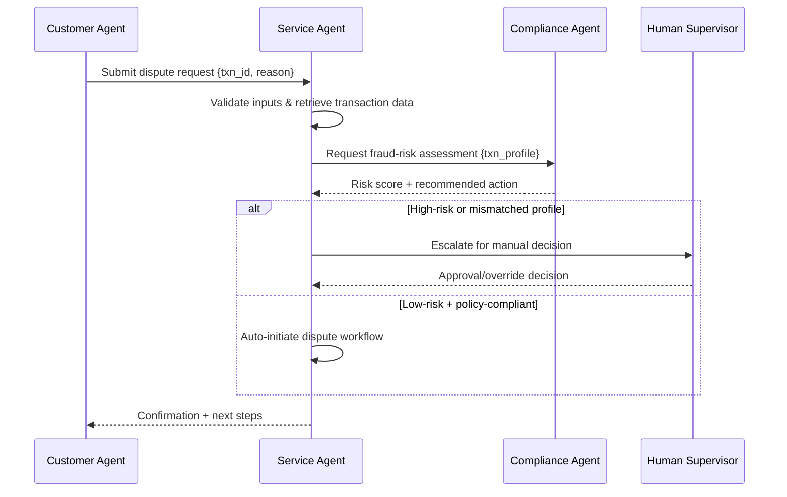

# Balancing Autonomy and Agency: Managing Emerging Risks in AI Agents

## Executive summary
Autonomous AI agents are poised to transform retail banking by streamlining customer servicing, accelerating operations, and enabling continuous decisioning at scale. Yet greater autonomy and agency introduce new categories of operational, privacy, and governance risks that extend beyond traditional AI models. This paper defines the concepts of autonomy and agency, explains why they form distinct and complementary risk dimensions, and maps emerging failure modes to agent architectures. It also outlines governance patterns, technical controls, and an actionable 3‑point roadmap to help banks pilot, scale, and sustainably govern agentic AI. A multi‑agent example illustrates how customer, service, and compliance agents collaborate—and where human oversight must remain essential.

## Introduction: context and scope
Retail banking is undergoing rapid automation, driven by conversational interfaces, workflow orchestration, and increasingly autonomous AI agents. Unlike conventional models that generate predictions, agentic systems perceive their environment, plan actions, and execute tasks on behalf of users or internal teams. This expanded behavioral surface introduces risks not captured in traditional model governance, including unbounded tool use, cascading agent interactions, and decision loops that operate with limited human supervision.

This paper focuses on risks arising from deploying agentic AI in retail banking scenarios such as payments, account servicing, disputes, fraud monitoring, onboarding, and financial assistance. We aim to give architects, product leaders, risk teams, and executives a practical and concise guide for evaluating and controlling these systems.

## Technical fundamentals: definitions

### What is agency?
Agency refers to an AI system’s capability to take intentional actions through tools or APIs. An agent with high agency can modify systems, initiate transactions, update records, invoke multiple tools, and orchestrate workflows. Agency determines *what an agent can do*.

### What is autonomy?
Autonomy refers to the degree of independence and continuity with which an AI system makes decisions and executes tasks without human intervention. Autonomy determines *how independently it can act* and *how long it runs* before requiring oversight.

### How they relate to AI agents
AI agents combine AI reasoning, planning, and tool execution. Agency and autonomy jointly define their operational risk profile: high‑agency agents can meaningfully alter systems, while high‑autonomy agents can do so continuously or without supervision. Treating them as separate levers allows banks to design controls that constrain capabilities without eliminating useful automation.

## Topics

### Levels of autonomy in AI agents
Recent research (e.g., arXiv:2506.12469[^1]) describes autonomy as a spectrum:
- **Level 0 – Reactive:** No planning; acts only when prompted.
- **Level 1 – Assisted:** Performs multi-step tasks but requires confirmation checkpoints.
- **Level 2 – Semi‑autonomous:** Executes tasks end‑to‑end with predefined guardrails.
- **Level 3 – Autonomous:** Self‑initiates tasks based on triggers and environment states.
- **Level 4 – Adaptive:** Learns from outcomes and dynamically adapts plans.
- **Level 5 – Fully autonomous:** General-purpose self-management (not suitable for regulated banking).

Retail banking typically caps acceptable autonomy at Levels 1–2, with limited Level 3 allowed under strict monitoring.

### Agency vs autonomy as risk dimensions
**Risks from too much agency:**
- Unauthorized system modification  
- Fraudulent or harmful transactions  
- Misuse of privileged tools (e.g., payment API, KYC update service)  
- Escalation across internal systems due to tool chaining  

**Risks from too much autonomy:**
- Runaway loops (agents acting repeatedly without termination)  
- Excessive data retrieval or privacy violations  
- Decisions made without sufficient human judgment  
- Hard‑to‑audit behavior due to long-running chains  

When both are high, risk compounds: e.g., an autonomous fraud‑detection agent could repeatedly freeze accounts without customer context.

### Banking regulation on AI agents
Regulators globally are signaling increasing scrutiny:
- Emerging AI governance frameworks from the EU and MAS emphasize explainability, audit trails, and human oversight in high-risk systems[^2].
- Analysts such as Gartner predict regulated industries will mandate *controllability*, *traceability*, and *tool‑level permissions* for agent-based systems in the next 2–4 years[^3].

### Real-life examples of incidents due to poor governance
Recent news and academic analyses highlight incidents where automated or semi-agentic systems caused harm:
- Automated content‑moderation AI that over‑blocked legitimate users due to unbounded autonomy[^4].
- Trading bots triggering cascading orders during market volatility due to poor constraints[^5].
- Chatbots providing harmful financial guidance when allowed to operate without guardrails[^6].

These incidents underscore the need for strong constraints on both autonomy and agency before deploying agents in banking settings.

## Recommendations and 3‑point roadmap

### Balancing the two levers
Banks should intentionally set maximum levels of autonomy and agency per agent class:

| Agent type | Max autonomy | Max agency | Rationale |
|------------|--------------|------------|-----------|
| Customer-facing agents | Low | Medium | Assist customers but require approvals |
| Operations agents | Medium | Medium | Execute workflows but under monitoring |
| Compliance agents | Low–Medium | High | High privilege but tightly governed |

### Risk analysis and failure modes mapped to architecture
Common architectural failure modes include:
- **Tool misuse:** Agent invokes sensitive APIs without proper qualification.  
  *Control:* tool-level whitelisting, capability tokens.
- **Planning hallucinations:** Agent generates unsafe steps.  
  *Control:* plan validators and simulation sandboxes.
- **Missing human checkpoints:** Long-running autonomy without review.  
  *Control:* time‑bound or step‑bound autonomy windows.
- **Data leakage:** Agent over-queries customer data.  
  *Control:* row-level access controls; purpose‑binding.

### Illustrative multi-agent scenario (step-by-step)

Use case: Customer disputes an unauthorized card transaction.

**Actors:**  
- Customer Agent  
- Service Agent  
- Compliance Agent  
- Human Supervisor (conditional)

**Flow:**

**Key decision points:**
- **Input validation:** prevents malformed or adversarial prompts.  
- **Risk-score threshold:** determines human escalation.  
- **Policy compliance check:** ensures agent does not over-exercise agency.

### 3‑point roadmap (short, mid, long term)

**Short term (0–6 months): Pilot safely**
- Restrict all agents to low autonomy; require human confirmations.  
- Implement tool-level permissions and audit logs.  
- Establish model governance extensions for agent behavior.

**Mid term (6–18 months): Scale with guardrails**
- Introduce semi-autonomous operations with plan validation.  
- Deploy human-in-the-loop platforms for targeted oversight.  
- Implement cross-agent monitoring and risk scoring.

**Long term (18–36 months): Govern continuously**
- Adaptive autonomy controlled by risk signals and organizational policy.  
- Real-time agent observability dashboards.  
- Integration with enterprise-wide AI governance and audit systems.

## Conclusion
Agentic AI offers powerful opportunities for retail banking, but its operational and governance risks require intentional design. By understanding autonomy and agency as separate but interdependent levers, banks can apply targeted constraints, deploy robust monitoring, and ensure critical decisions remain accountable. With the right controls and a staged roadmap, banks can safely adopt agentic systems that enhance efficiency while protecting customers and meeting regulatory expectations.

## References
[^1]: arXiv. “Levels of Autonomy in AI Agents.” arXiv:2506.12469.  
[^2]: European Union AI Act; Monetary Authority of Singapore (MAS) FEAT Principles.  
[^3]: Gartner Research, “AI Risk Management and Controllability Predictions,” 2024.  
[^4]: MIT Technology Review, “Automated Moderation Failures in Large Platforms,” 2023.  
[^5]: Financial Times, “Algorithmic Trading Cascades Trigger Market Volatility,” 2022.  
[^6]: University of Cambridge, “Risks of Autonomous Financial Chatbots,” 2023.