# Understanding AI Agents and Autonomy: A Comprehensive Analysis

As artificial intelligence continues to evolve, the distinction between AI agents and traditional AI systems becomes increasingly important. This white paper aims to clarify the concepts of AI agents, autonomy, and agency, while exploring how higher autonomy AI agents represent the next frontier in artificial intelligence. We examine the relationship between these concepts and present a framework for understanding different levels of AI agent autonomy.

<!-- truncate -->

## 1. Introduction
The field of artificial intelligence has witnessed remarkable advancement, particularly in the development of AI agents. However, the terminology surrounding AI agents, agentic AI, and autonomy often leads to confusion. This paper seeks to disambiguate these concepts and provide a clear framework for understanding the future of autonomous AI systems.

## 2. Key Concepts and Terminology

This section provides precise definitions for key terms used throughout this paper, clarifying common misconceptions and ambiguities in the field.

### 2.1 Core Components

#### AI Agents and Users

```mermaid
graph TB
    %% User and Agent relationship
    U("🧑‍💼 User<br><small>(Human or AI)</small>")
    A["🤖 AI Agent"]

    U -- issues requests --> A
    U -- defines<br>objectives<br>& contraints --> A
    U -- monitors<br>& evaluates --> A

```

An **AI agent** is a software entity that perceives its environment, makes autonomous decisions using artificial intelligence, and acts on behalf of users or systems to achieve defined or adaptive goals.

**Key Features:**
- **Perceptive:** Collects and processes data from its environment.
- **Goal-Oriented:** Pursues objectives or optimizes defined reward functions.
- **Autonomous:** Operates with minimal human intervention, adapting through learning.
- **Collaborative:** Can coordinate with other agents to solve complex, multi-step tasks.
- **Cognitive:** Exhibits reasoning, planning, and memory to interact effectively and automate processes.

are compound software systems that consist of: [^1]
- One or more AI models as core components
- Environmental sensors or data inputs
- Decision-making mechanisms
- Action execution capabilities
- Learning and adaptation mechanisms

**Users** are entities (human or AI) who:
- Issue initial requests for the agent's services
- Interact with the agent in various capacities
- Define objectives and constraints
- Monitor and evaluate agent performance

:::warning[Common Misconception: AI Agents vs. Agentic AI]

The term "Agentic AI" is often used ambiguously in literature and popular discourse. While some use it interchangeably with "AI Agents," others define it specifically as AI systems with the highest levels of autonomy and agency. This paper focuses on "AI Agents" as defined above, providing a more precise and technically grounded framework for discussion.

:::

### 2.2 Understanding Agency and Autonomy

#### Fundamental Distinctions
**Agency** refers to an AI system's inherent capabilities:
- Ability to formulate intentions
- Capacity to make decisions
- Power to execute actions
- Capability to learn from outcomes

**Autonomy** defines the operational freedom granted to the system:
- Degree of independent operation allowed
- Level of human oversight required
- Scope of decision-making authority
- Extent of self-governance permitted

:::note[Key Distinction]

**Agency** is about what the AI *can* do.  
**Autonomy** is about what the AI *is allowed* to do on its own.

:::

#### Practical Example
:::tip[Real-World Analogy: The Self-Driving Car]

Consider a modern self-driving vehicle system:

**Agency Capabilities:**
- Perceive environment through sensors
- Process traffic patterns and road conditions
- Calculate optimal routes
- Make real-time driving decisions

**Autonomy Levels:**
- Level 0: No automation (human drives)
- Level 1-2: Driver assistance (AI helps)
- Level 3-4: Conditional automation (AI drives with human backup)
- Level 5: Full autonomy (AI drives independently)

A car might possess advanced agency (capable of fully autonomous driving) but operate at a lower autonomy level (requiring human approval for certain actions) due to regulatory, safety, or design choices.

:::

## 3. The Importance of Autonomy in AI Agents

### 3.1 Why Higher Autonomy Matters
Higher autonomy in AI agents represents the next frontier in artificial intelligence for several reasons:
1. **Scalability**: Autonomous agents can handle complex tasks with minimal human intervention
2. **Adaptability**: They can respond to changing conditions without requiring constant human guidance
3. **Efficiency**: Reduced need for human oversight enables faster decision-making and execution
4. **Innovation**: Autonomous agents can explore solution spaces more comprehensively

### 3.2 The Double-Edged Nature of Autonomy
While higher autonomy offers significant benefits, it also presents challenges:
- **Opportunities**: Transformative possibilities and unprecedented scale of AI benefits
- **Risks**: New classes of AI risks and exacerbation of existing concerns
- **Control**: Balance between independence and maintaining appropriate human oversight

## 4. Levels of Autonomy in AI Agents

### 4.1 Framework Overview

Based on recent research, AI agent autonomy can be classified into five distinct levels, each characterized by the role of the user in the interaction:

#### Quick Reference: Autonomy Levels Diagram

#### Level 1: User as Operator
- User directs and makes decisions
- Agent acts on specific instructions
- Example: ChatGPT Canvas, Microsoft Copilot

#### Level 2: User as Collaborator
- Collaborative planning and execution
- Shared control between user and agent
- Example: OpenAI Operator, Cocoa

#### Level 3: User as Consultant
- Agent leads planning and execution
- User provides expertise and preferences
- Example: Gemini Deep Research, GitHub Copilot Agent

#### Level 4: User as Approver
- Agent operates independently
- User involvement only for high-risk decisions
- Example: SWE Agent, Devin

#### Level 5: User as Observer
- Full autonomy with monitoring capabilities
- Emergency controls only
- Example: Voyager, The AI Scientist

### 4.2 Control Mechanisms
Each level of autonomy requires specific control mechanisms:
1. **L1**: User-managed planning and explicit action approval
2. **L2**: Control transfer capabilities and shared progress tracking
3. **L3**: Rich feedback interfaces
4. **L4**: Approval systems for consequential actions
5. **L5**: Emergency off switch and monitoring tools

## 5. Future Implications and Considerations

### 5.1 Design Decisions
Autonomy should be treated as a deliberate design decision, independent of:
- Agent capabilities
- Operational environment
- Technical implementation

### 5.2 Governance and Safety
As AI agents become more autonomous, several considerations become crucial:
- Development of AI autonomy certificates
- Establishment of governance frameworks
- Implementation of safety measures
- Regular evaluation of autonomy levels

## 6. Conclusion
Understanding the distinctions between AI agents, agentic AI, autonomy, and agency is crucial for the future development of artificial intelligence. As we move toward higher levels of autonomy, careful consideration must be given to the design, implementation, and governance of these systems. The framework of autonomy levels provides a structured approach to developing and deploying AI agents while maintaining appropriate human oversight and control.

---

[^1]: [Feng, K. J., McDonald, D. W., & Zhang, A. X. (2025). Levels of Autonomy for AI Agents. arXiv preprint arXiv:2506.12469.](https://arxiv.org/abs/2506.12469) | [PDF](https://arxiv.org/pdf/2506.12469)