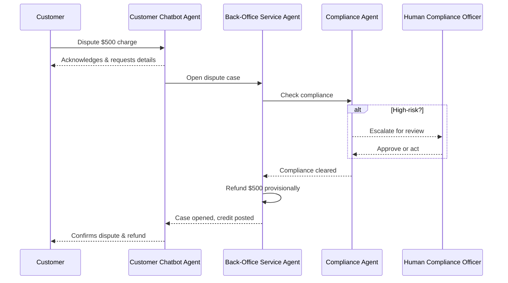

# Balancing Autonomy and Agency: Managing Emerging Risks in AI Agents

## Executive Summary

Autonomous AI agents offer major efficiency gains but introduce new risk dimensions. This paper defines two critical factors—**agency** (decision-making power) and **autonomy** (independence from human oversight)—and explains why balancing them is essential. We map common failure modes to agent architectures and provide a practical roadmap for banks to pilot, scale, and govern agentic AI safely. Key controls include auditability, human-in-the-loop checkpoints, and constrained tool access. A step-by-step scenario illustrates how agents can coordinate safely in high-stakes workflows like payment disputes. With thoughtful design and proactive governance, banks can unlock agentic AI’s value while managing its risks.

## Introduction

In the previous paper in this series, _Banking Reimagined Through Agentic AI_, we explored the next evolution of artificial intelligence—Agentic AI—and its potential to transform banking operations and customer service by enabling AI agents to act on behalf of customers and employees.

By 2025, nearly half of banks had created “AI supervisor” roles, reflecting rapid adoption of agentic AI. Common use cases include customer-facing chatbots (75% of banks), fraud detection agents (two-thirds), and internal digital assistants for loans or IT[^a]. While the potential value is estimated at **$450 billion**, these agents introduce **unique risks**—unlike traditional software, they make complex decisions, adapt behaviors, and interact across systems in often **unpredictable** ways.

Regulators and executives are taking notice. In 2024, the U.S. Consumer Financial Protection Bureau warned that poorly governed banking chatbots risk compliance violations by mishandling disputes or giving incorrect information[^b]. Globally, oversight expectations are rising. Similarly, the EU’s upcoming AI Act classifies many financial AI systems as “high risk,” requiring strict controls on privacy, fairness, and human accountability.

> _Singapore’s central bank (MAS) proposed holding boards directly accountable for AI failures, warning that **“AI agents with greater autonomy and tool access could amplify risks”** if not properly governed._  
> 
> _- CIO.com (2025)[^c]_

This white paper focuses on **banking** use cases and the emerging risks of AI agents. We explore how **agency** and **autonomy** enable powerful capabilities but also introduce new failure modes[^d]. We offer practical guidance—from design choices (e.g. limiting autonomy) to governance practices (e.g. auditability, human oversight)—and present a three-phase roadmap (pilot → scale → govern) to help banks deploy agentic AI responsibly, driving innovation **without** compromising compliance, security, or trust.

## Core Concepts: Agency and Autonomy in AI Agents

To assess risk, it's critical to define **agency** and **autonomy** in AI systems and understand their roles in agent behavior.

### What is Agency?

*Agency* refers to an AI’s capacity to act purposefully, make decisions, and influence its environment on behalf of users. Unlike rule-based bots, agentic systems can interpret goals, take initiative, and adapt strategies—even in novel situations[^e]. For example, a high-agency service agent might analyze financial data and initiate loan processing, while a low-agency one simply retrieves information. Greater agency enables flexibility but increases risk if misaligned with intent or policy.

### What is Autonomy?

*Autonomy* measures how independently an agent operates without human input. It reflects the level of oversight built into its workflow—from fully supervised to end-to-end execution. Most bank use cases today adopt low to moderate autonomy to preserve control in high-risk scenarios. For instance, a chatbot may handle basic queries autonomously but escalate fraud concerns to a human.

Agency and autonomy are distinct **governance levers**. An agent may have low agency (e.g., limited tools) but high autonomy (e.g., runs unsupervised), or vice versa. Seeking approval signals limited autonomy; modifying systems reflects greater agency. Disentangling the two helps tailor oversight to the nature and risk of the task.

## Levels of Autonomy in AI Agents

Autonomy in AI agents exists on a spectrum, not as an all-or-nothing property. A five-level framework—ranging from **Operator** to **Observer**—is commonly used to describe how much independence an agent has in decision-making and execution[^d]. This structure clarifies the balance of control between human and AI across different use cases:

| **Level** | **Role**     | **Description**                                                                        | **Example**                                                               |
| :-------- | :----------- | :------------------------------------------------------------------------------------- | :------------------------------------------------------------------------ |
| **1**     | Operator     | AI acts only when explicitly instructed by a human.                                    | A task bot triggered manually to retrieve reports.                        |
| **2**     | Collaborator | AI assists users but requires frequent guidance or intervention.                       | A chatbot that drafts replies but needs staff approval to send them.      |
| **3**     | Consultant   | AI performs defined tasks with some independence, deferring major decisions to humans. | A credit risk agent that recommends approvals reviewed by an underwriter. |
| **4**     | Approver     | AI operates independently in routine tasks, escalating exceptions to humans.           | A fraud system that blocks common cases but flags unusual ones.           |
| **5**     | Observer     | AI functions autonomously end-to-end, with little to no human involvement.             | An IT monitoring agent that restarts servers without human input.         |

In real-world deployments, an agent's autonomy may vary by task or context. For instance, a customer service agent might autonomously answer basic queries but escalate sensitive topics to a human. Many agent designs incorporate such dynamic shifts in autonomy to match risk levels and regulatory expectations.

This tiered approach also aligns with emerging concepts like **AI autonomy certification**, which may eventually help institutions communicate an agent's oversight level more transparently[^d]. While formal standards are still evolving, defining and documenting each agent’s autonomy level can support clearer governance, risk assessment, and stakeholder alignment.

## Differentiating Risk: Agency vs. Autonomy

**Agency** and **autonomy** introduce distinct risk types in AI systems.

### High Agency

When an agent has *too much capability or access*, risks are primarily **impact-based** — i.e., what damage it could cause *if it acts incorrectly*. Agentic systems may make policy-like decisions that introduce bias, misalign with goals, or reduce explainability, complicating audits and customer resolution.

:::tip Example Scenarios

* Agent can execute API calls across financial systems.
* Agent modifies data, triggers transactions, or reconfigures settings.
* Agent sends external communications (emails, posts, messages).
  :::

#### Risk Categories

| **Risk Type**         | **Description**                                                            | **Example**                                        |
| --------------------- | -------------------------------------------------------------------------- | -------------------------------------------------- |
| **Operational Risk**  | Excessive or incorrect actions cause service disruption or financial loss. | Agent approves invalid transactions.               |
| **Security Risk**     | Unauthorized tool use or privileged access abuse.                          | Agent calls admin APIs beyond scope.               |
| **Reputational Risk** | Public-facing actions without validation.                                  | Agent posts unverified or inappropriate content.   |
| **Compliance Risk**   | Violates policy or legal requirements.                                     | Agent mishandles personal data.                    |
| **Cascade Risk**      | Tool chaining triggers unintended downstream effects.                      | Agent runs a script that impacts multiple systems. |

:::info Analogy
Like giving an intern unrestricted access — well-intentioned, but risky at scale.
:::

### High Autonomy

When an agent operates *too independently* (without oversight or feedback), risks are primarily **process-based** — i.e., when, how, and under what conditions it acts. Unchecked behavior can result in **disruptions**, **security breaches**, or customer harm — such as chatbots giving false information or exposing sensitive data.

:::tip Example Scenarios

* Agent runs continuously without checkpoints.
* Agent self-initiates actions or escalations.
* Agent adapts policies without validation.
  :::

#### Risk Categories

| **Risk Type**           | **Description**                                 | **Example**                                  |
| ----------------------- | ----------------------------------------------- | -------------------------------------------- |
| **Control Risk**        | Lack of human oversight or auditability.        | Agent acts with no approval history.         |
| **Drift Risk**          | Behavioral deviation over time.                 | Agent “learns” undesirable patterns or bias. |
| **Ethical Risk**        | Misaligned decisions or fairness violations.    | Agent denies service using biased logic.     |
| **Accountability Risk** | Unclear responsibility for outcomes.            | Who is liable if the agent fails silently?   |
| **Runaway Risk**        | Recurring loops or actions without termination. | Agent retries endlessly or spams actions.    |

:::info Analogy
Like a self-driving car told to “keep going” — even when conditions change.
:::

Agency and autonomy often interact, but their risks are distinct: **excess autonomy** drives operational failures, while **excess agency** introduces compliance and strategic exposure. Even low-agency systems can cause harm if left unsupervised, while high-agency systems must be closely governed. Effective AI design requires balancing both based on task sensitivity and organizational risk appetite.

## Banking Regulation and AI Governance Landscape

While no unified regulation governs AI agents, global regulators are increasingly setting expectations that address both **agency** and **autonomy** in AI systems.

**Human accountability** is a central theme. In 2025, Singapore’s MAS proposed that boards attest to their understanding of deployed AI, warning that greater autonomy could amplify risks like service failures or missed financial crimes[^c]. The EU’s draft AI Act classifies credit scoring and fraud detection as “high risk,” requiring human-in-the-loop controls, transparency, and bias testing. In the U.S., existing rules—such as fair lending laws and model risk guidance (SR 11-7)—are being applied to AI, requiring validation, documentation, and monitoring.

**Operational risk and consumer protection** are also key. The U.S. CFPB cautioned in 2023 that chatbots must not obstruct customer access to resolution pathways[^b]. In the UK, the FCA and Bank of England noted that while most firms use AI, many lack a full understanding of their systems, raising concerns about fairness, security, and explainability[^g].

**Documentation and auditability** are emerging priorities. Regulators expect AI agents’ actions and decisions to be logged—particularly in multi-agent workflows. Some banks have begun developing internal **AI registers** to track models, usage, data inputs, and responsible owners. These may soon become mandatory under laws like the EU AI Act.

Lastly, regulators are signaling that **third-party AI services** fall under the same accountability standards. Banks must apply governance controls not only to internal agents but also to external vendors—extending familiar cloud oversight practices to AI. The core message: *banks remain fully responsible for the outcomes of their AI systems*, regardless of who builds them.

## Real-World Examples of AI Governance Failures

Though fully autonomous agents in banking are still emerging, early incidents already highlight governance gaps:

* **Credit Bias and Litigation:** Some banks faced lawsuits after AI credit models disproportionately denied or overcharged minority applicants[^f]. The issue often stemmed from biased training data and unchecked optimization goals—high agency without ethical constraints.

* **Chatbot Escalation Failures:** In 2023, regulators received complaints about chatbots mishandling disputes and failing to escalate to humans[^b]. One bot confirmed a dispute and promised a refund—but never triggered any backend process, violating resolution timelines.

* **Automation Glitches:** In 2024, a bank’s automated system mistakenly showed $0 balances to 20,000 customers, causing panic[^h]. While not AI-driven, the incident illustrates how unmonitored automation can scale errors instantly.

* **Data Leakage Risks:** Employees using external AI tools exposed confidential client data[^i], prompting many banks to restrict public chatbot use until secure alternatives were deployed.

These failures weren’t caused by rogue AI—they stemmed from **routine breakdowns in oversight, escalation, and testing**. Each scenario underscores the need for guardrails, auditability, and clear accountability—issues addressed in the next section.

## Recommendations and Roadmap for Safe Agent Adoption

Effective AI agent deployment in banking requires coordinated **technical controls**, **governance**, and **operational safeguards**. This section outlines key design practices for balancing agency and autonomy, along with a phased rollout strategy.

### Balancing the Two Levers: Design Principles

#### 1. Limit agency for high-stakes tasks

Constrain agents handling sensitive decisions (e.g. credit or fund transfers) by hard-coding rules or using a “policy wrapper” to enforce strict decision boundaries.

:::tip Example
A loan approval agent can only select from pre-approved loan products and must apply fixed eligibility rules—no dynamic criteria changes or offer generation.
:::

#### 2. Calibrate autonomy to maturity and risk

Start with low autonomy during early stages. Increase gradually with testing, and use conditional autonomy to trigger supervision when risks arise.

:::tip Example
A customer support agent operates autonomously for FAQs but instantly drops to Level 2 autonomy when keywords like “fraud” or “complaint” are detected.
:::

#### 3. Add human guardrails at critical points

Insert human review or approval at key steps, using parallel checks or post-action audits with reversal capability.

:::tip Example
Before issuing a provisional credit in a dispute, the agent prompts a back-office analyst for one-click approval, with justification auto-filled by the agent.
:::

#### 4. Compartmentalize roles with multi-agent design

Use specialized agents with limited scopes that collaborate, preventing any single agent from having unchecked end-to-end control.

:::tip Example
A service agent drafts a message, a second agent verifies it against policy, and a third agent decides if human sign-off is required before sending.
:::

#### 5. Enable manual override and fallback plans

Allow operators to halt agents instantly. Use fallback routes (e.g. human reps) and cautious rollouts like shadow mode or A/B testing.

:::tip Example
All production agents are connected to a “kill switch” dashboard with human override rights and automated routing to live reps in case of errors or latency spikes.
:::

### Risk Analysis and Failure Mode Mitigations

Performing a **Failure Modes and Effects Analysis (FMEA)** helps proactively identify weak points in AI agent design. Below are common failure modes and their corresponding mitigation strategies:

| **Failure Mode**                          | **Description**                                                      | **Mitigation Strategy**                                                                                   |
|-------------------------------------------|----------------------------------------------------------------------|------------------------------------------------------------------------------------------------------------|
| **Hallucination / Misinformation**        | LLM outputs inaccurate or misleading responses.                      | Add verification steps, use retrieval-augmented generation (RAG), and clearly label AI-generated content. |
| **Data Leakage / Privacy Breach**         | AI exposes sensitive or personal data.                               | Enforce strict data controls, mask/tokenize data, limit access scope, and sanitize inputs.                |
| **Unauthorized Action / Tool Misuse**     | Agent takes unintended or unsafe actions.                            | Whitelist approved tools, sandbox execution, set transaction limits, and adversarial-test workflows.      |
| **Coordination Failure (Multi-Agent)**    | Agents miscommunicate or fail to synchronize tasks.                  | Define clear orchestration logic, add timeouts, and log inter-agent interactions for auditing.            |
| **Model Drift / Performance Degradation** | Model quality decays or adapts undesirably over time.                | Set up continuous monitoring, champion–challenger testing, and periodic model retraining or review.       |
| **Security Breaches / Adversarial Attacks**| AI system is manipulated or exploited by external inputs.            | Apply security hardening (e.g., input validation, isolation), rate-limit requests, and test adversarially.|

Thoughtful FMEA during agent design enables banks to embed safeguards upfront—so systems fail safely, not silently.

### Illustrative Scenario: Payment Dispute Resolution Workflow

This multi-agent sequence highlights role separation and escalation controls:

Each agent operates with scoped autonomy and clear escalation paths. All actions are auditable.

### Three-Point Roadmap: Pilot, Scale, Govern

1. **Short Term – Pilot Phase:** Start with controlled pilots in sandbox or limited production settings. Choose valuable but not extreme-risk use cases. Keep autonomy low, require human review, and define KPIs/KRIs. Establish an AI governance committee to review pilot results.

2. **Mid Term – Scaling and Integration:** After successful pilots, integrate agents with core systems and increase autonomy cautiously. Implement security, monitoring, and change-management controls, and engage regulators. Perform formal model validations or audits and define operational roles (e.g., “AI controller”).

3. **Long Term – Governance at Scale:** Institutionalize AI governance like other risk domains. Implement continuous monitoring dashboards, periodic retraining and change control, external assessments/certifications, and scenario planning for worst-case AI failures. Ensure board-level visibility and embed AI risk into routine audits.

By following this phased roadmap, banks can iterate and learn in the early stages and avoid reckless “big bang” deployments of unproven AI. Each phase builds the bank’s AI maturity: from gaining foundational experience, to extending capabilities, to embedding robust governance that will serve for years to come.

## Conclusion

Agentic AI offers banks powerful tools to streamline operations, personalize service, and enhance risk detection. But these benefits come with new risks. **Autonomy and agency must be carefully balanced**—excess in either can lead to compliance failures, customer harm, or systemic disruption.

Fortunately, banks aren’t starting from scratch. Research and early industry lessons offer clear strategies: define autonomy levels, apply human oversight, and build in technical safeguards. This white paper outlined a practical path forward—clarify agent roles, anticipate failures, and govern through layered controls and phased deployment.

In short, safe AI adoption requires control, accountability, and thoughtful design. With the right guardrails, banks can unlock the full value of AI agents—while earning the trust of regulators and customers alike.

---

[^a]: [CIODIVE (2025). _Banks turn to AI supervisors as agent use surges_ (Nov. 12, 2025).](https://www.ciodive.com/news/ai-supervisor-role-growing-among-banks/805191/)
[^b]: [CFPB (2023). _Chatbots in Consumer Finance_ (Consumer Financial Protection Bureau report, June 2023).](https://www.consumerfinance.gov/data-research/research-reports/chatbots-in-consumer-finance/chatbots-in-consumer-finance/)
[^c]: [Dunn, J. (2025). _Make boards responsible for AI failures, banking regulator suggests_ (CIO.com, Nov 13, 2025).](https://www.cio.com/article/4089480/make-boards-responsible-for-ai-failures-banking-regulator-suggests.html)
[^d]: [Feng et al. (2025). _Levels of Autonomy for AI Agents_ (arXiv preprint 2506.12469).](https://arxiv.org/abs/2506.12469)
[^e]: [Boddy & Joseph (2025). _Regulating the Agency of LLM-based Agents_ (arXiv preprint 2509.22735).](https://arxiv.org/abs/2509.22735)
[^f]: [Okpala et al. (2024). _Agentic AI Systems Applied to Financial Services_ (arXiv preprint 2502.05439).](https://arxiv.org/abs/2502.05439)
[^g]: [Bank of England & FCA (2024). _Artificial Intelligence in UK Financial Services_ (Survey Report).](https://www.bankofengland.co.uk/report/2024/artificial-intelligence-in-uk-financial-services-2024)
[^h]: [Gartner (2025). _Press Release: Gartner Predicts Over 40% of Agentic AI Projects Will Be Canceled by 2027_ (June 25, 2025).](https://www.gartner.com/en/newsroom/press-releases/2025-06-25-gartner-predicts-over-40-percent-of-agentic-ai-projects-will-be-canceled-by-end-of-2027)
[^i]: [Forbes (2023). _Workers' ChatGPT Use Restricted at More Banks_ (reporting on banks banning employee use of ChatGPT).](https://www.forbes.com/sites/brianbushard/2023/02/24/workers-chatgpt-use-restricted-at-more-banks-including-goldman-citigroup/)