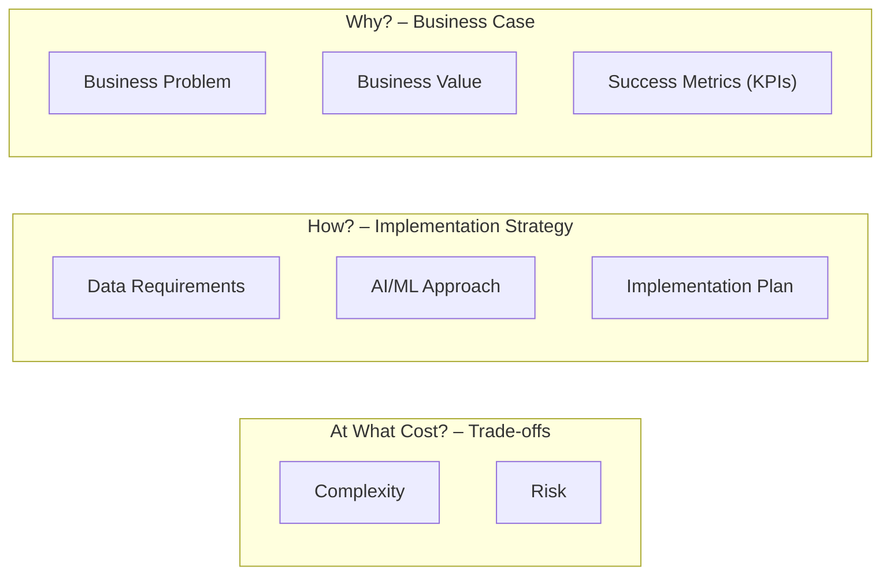

# The AI Use Case Canvas: A Structured Framework for Evaluating and Prioritizing AI Initiatives

## Executive Summary

Many AI projects in banking underdeliver due to hype and poor alignment with business goals[^1] [^2]. The **AI Use Case Canvas** offers a structured way to evaluate initiatives across three dimensions: **Why** (problem, value, KPIs), **How** (data, solution, implementation), and **At What Cost** (complexity, risks, ROI). It helps banks prioritize high-impact, feasible use cases and choose **agentic AI** only when it clearly outperforms simpler alternatives. This white paper explains the framework, applies it to banking scenarios, and offers a roadmap to support value-driven AI adoption as part of digital transformation.

## Introduction
<!-- Context and the Problem of Prioritizing AI Investments -->

In the previous paper in this series, *Banking Reimagined Through Agentic AI*, we explored the next evolution of artificial intelligence—agentic AI—and its potential to transform banking operations and customer service by enabling AI agents to act on behalf of customers and employees. That paper highlighted how autonomous agents could fundamentally reshape workflows, unlock new efficiencies, and deliver 24/7 personalized service.

However, as banks deepen their AI ambitions, a critical challenge emerges: **most AI initiatives in banking fail to deliver ROI due to weak business alignment**[^3] [^4]. Studies show **95% of AI pilots fall short**, and **over 40% of agentic AI projects will be canceled by 2027** due to unclear value and high cost[^5] [^6]. Poorly scoped AI can cause compliance issues, customer dissatisfaction, and wasted resources.

> _"It is tempting, if the only tool you have is a hammer, to treat everything as if it were a nail."_  
> — Abraham Maslow (The Psychology of Science, 1966)

The issue isn’t the technology—it’s the lack of a strong business case. As experts note, *AI accelerates existing flaws if the process isn’t sound*[^7]. To avoid this, banks need a structured way to evaluate AI proposals. The **AI Use Case Canvas** helps shift from an "AI-first" to a **problem-first** mindset—prioritizing projects based on real business value, feasibility, and risk. The following sections explain how to apply this framework to make informed, value-driven AI decisions.

## Fundamentals: Business Use Case Canvas Origins and Its Application to AI

The idea of a **“canvas”** comes from tools like the **Business Model Canvas**, a one-page template that became popular for its ability to map a business model clearly and holistically[^8]. But AI initiatives introduce factors—data quality, model choice, and new risk dimensions—that traditional canvases don’t address.

To fill this gap, researchers created AI-specific canvases. Ajay Agrawal’s **AI Canvas** centers on prediction, judgment, and action[^9], while Michael Porath’s **AI Use Case Canvas** extends the canvas approach to cover both business and technical considerations. As Porath notes, it’s essentially *a business model canvas designed for AI decision-making*[^10].

The **AI Use Case Canvas** organizes **eight components** across three dimensions:

* **Why** — business problem, value, and success metrics
* **How** — data needs, solution approach, and implementation plan
* **At What Cost** — complexity, risks, and expected ROI

By forcing these questions upfront, the canvas ensures alignment with business goals, feasibility, and risk awareness before any development begins. It also enables consistent comparison across multiple AI proposals—critical when banks must prioritize limited resources. The next section breaks down each component in detail.

## The AI Use Case Canvas in Detail

The AI Use Case Canvas covers three dimensions (**Why, How, Cost**), each containing specific fields that must be answered for any proposed AI initiative. **Figure 1** below illustrates the canvas structure with its components:

*Figure 1: The AI Use Case Canvas structure, adapted for banking needs (three dimensions and eight key components).* Each component is described below:

### The Why Dimension: Building the Business Case

The **Why** dimension establishes whether the project has a strong business justification. It covers the **Business Problem**, **Business Value**, and **Success Metrics (KPIs)**. If the “why” is weak or unclear, the project should not proceed.

#### Business Problem

Define the core issue in concrete terms: who is affected, how often it occurs, and its current impact (e.g., delays, cost, customer dissatisfaction). In banking, examples include slow dispute resolution or high volumes of routine support calls. The canvas recommends rating **urgency and frequency (1–5)**[^11]. If the problem isn’t clear, important, or recurring, **AI is unnecessary**.

#### Business Value

Describe the improvement gained from solving the problem—cost/time savings, revenue uplift, better compliance, or improved customer experience. Rate **ROI potential and strategic importance (1–5)**[^12]. If value is marginal or unclear, reconsider the initiative. Strong alignment to strategic banking priorities strengthens the business case.

#### Success Metrics (KPIs)

Define **1–3 measurable KPIs**, including baselines and target outcomes—e.g., dispute resolution time, fraud loss rate, CSAT, or call deflection. **If you can’t measure it, you can’t manage it**[^13]. KPIs must reflect **business outcomes**, not technical metrics like model accuracy.

### The How Dimension: Implementation Strategy

The **How** dimension turns the idea into an actionable plan. It covers **Data Requirements**, the **AI/ML Approach**, and the **Implementation Plan**.

#### Data Requirements

List required data sources, assess quality and availability, and check for privacy or regulatory constraints[^14]. Banking data often sits in silos, so data integration and classification (public → internal → anonymized → PII) is key[^15]. Poor or fragmented data is an early warning sign that the AI use case may fail.

#### AI/ML Approach

Specify the solution type and its level of autonomy: **autonomous agent**, **human-in-the-loop**, or **AI-assisted decision**[^16]. Higher autonomy brings more risk and complexity. Critically, compare the AI option with simpler alternatives. As Gartner notes, many problems can be solved with rules, analytics, or traditional ML at far lower risk and cost[^17]. Use agentic AI only when it clearly adds value.

#### Implementation Plan

Outline how the solution will be built and deployed—**build vs buy**, pilot vs MVP, required integrations, and timeline[^18]. Address change management and training. Many AI projects fail not because of poor models, but because implementation is weak. **Even the best solution fails if not rolled out well**[^19].

### The Cost Dimension: Understanding Trade-Offs

The **At What Cost** dimension evaluates feasibility and risk across **Complexity**, **Risks**, and **ROI/Payback**.

#### Complexity and Effort

Assess **technical**, **organizational**, and **data** complexity (1–5)[^20]. Even simple AI can become highly complex when integrating across multiple legacy systems or departments[^21]. High complexity isn’t disqualifying—but it must be justified by equally high value.

#### Risks

Evaluate **compliance**, **privacy**, and **reputational** risks (1–5)[^22]. Consider fallback plans, error handling, and transparency[^23]. Track KPIs that measure both value **and** potential negative impacts (e.g., customer complaints)[^24]. A use case with high risk and modest benefit should likely be deprioritized.

#### ROI and Payback Period

Estimate costs (tools, talent, infrastructure) and compare them with expected benefits. Identify realistic payback timelines. Quick-win, low-complexity projects may outperform ambitious long-term efforts. Conversely, large-scale AI may be justified for high-value, strategically critical banking use cases.

Having detailed each component of the AI Use Case Canvas, we can see how it provides a 360° evaluation of an AI proposal. Next, we will apply this framework to a few **retail banking examples** to demonstrate how it guides decision-making, especially in choosing between a cutting-edge AI solution and simpler alternatives.

:::danger Bookmark
:::

## Banking-Specific Examples: Applying the Canvas to Real Use Cases

To illustrate the AI Use Case Canvas in action, let's explore a few concrete banking scenarios. Each example will outline the canvas fields in brief and highlight how the framework aids in comparing an **agentic AI approach** with a more traditional AI or non-AI solution:

### Example 1: AI Customer Service Chatbot vs. Assistive Tool

**Scenario:** A retail bank's call center is swamped with routine customer inquiries (balance checks, card activation, FAQs), leading to long wait times and high support costs. The bank is considering using AI to handle these interactions.

- **Approach A – Agentic AI Chatbot:** Deploy a conversational AI agent that interacts directly with customers in place of a human agent. This chatbot would use a large language model to understand queries and provide answers or take actions (like resetting a password), handing off to a human only for complex cases.

- **Approach B – AI Assist for Human Agents:** Use AI to support human call center agents rather than replace them. For example, an ML system could listen to calls or read chats and **suggest responses** to the human agent, or automatically retrieve relevant information, speeding up each interaction. The final response is still delivered by the human agent.

**Using the Canvas:** For **both approaches**, the **Business Problem** is the same: high volume of simple inquiries consuming ~X hours of agent time daily, causing customer frustration with wait times. The **Business Value** is to improve customer experience (shorter waits) and reduce operational cost (free up agents or reduce headcount needs). Let's say the bank estimates this could save $2M/year in call center costs and raise its customer satisfaction score by a few points – a high ROI opportunity (rated 5/5 on ROI and strategic importance). The **Success Metrics** would include average call handle time (baseline maybe 5 minutes, target 2 minutes), customer satisfaction (baseline 80% happy, target 90%), and percentage of inquiries handled without human (for Approach A, perhaps target 50% deflection to the bot; for Approach B, target maybe a 30% productivity boost per agent).

Moving to **How**: **Data Requirements** – Both approaches need historical customer inquiry data (chat logs, call transcripts, FAQ answers). The data likely includes PII (customer names, account info in transcripts), so privacy is a concern. The bank must ensure data is anonymized for training the AI and that using it complies with privacy regulations. **AI Approach** – This is the crux: Approach A is a fully autonomous AI agent interacting with customers, whereas Approach B is a human-in-the-loop setup. The canvas would capture that Approach A offers more automation (potentially handling calls end-to-end) but carries higher risk if the AI responds incorrectly. Approach B keeps a human in control, reducing risk of bad responses, though it won't save as much labor. We'd also note the type of AI: likely a natural language processing (NLP) model or even a generative AI for Approach A's chatbot, versus maybe a simpler intent classification and knowledge retrieval system for Approach B. As Gartner suggests, the team should consciously evaluate if a generative AI chatbot is **truly needed** or if a guided FAQ bot or improved search tool could suffice for these routine queries[^17]. **Implementation Plan** – Approach A might involve buying or building a chatbot platform and integrating it with back-end systems (to answer account-specific questions). A pilot could be done as a "virtual assistant" on the website or mobile app for a subset of queries. Training front-line staff and setting up escalation paths (when the bot can't help) are critical. Approach B's implementation might be simpler: it could involve a plugin for the call center software that shows suggested replies from a knowledge base. Pilot could be with a small group of agents using the AI assist and measuring their performance versus a control group. In either case, timeline might be a few months pilot; Approach A likely longer to fully deploy because of more integration and testing.

Now the **Cost** dimension: **Complexity** – Approach A scores high on technical complexity (building a robust conversational AI is non-trivial, especially ensuring understanding of banking jargon and security authentication within the chat). It also has considerable organizational complexity: it will change customer-facing processes and requires training all customers to use the chatbot interface. Data complexity is moderate – data exists but requires cleaning and constant updates (e.g., if rates change or new FAQs come up, the bot needs to know). Approach B is less complex technically (it can rely on retrieving answers from a static knowledge base and doesn't need full natural language generation capabilities). Organizationally, it fits into existing workflows (agents still handle calls, just with help), so change management is easier. **Risk** – Approach A carries higher risk. Compliance and reputational risks are notable: an unsupervised AI could give an incorrect answer about a financial product or fail to recognize a fraud warning sign in a conversation. Mistakes would directly impact customers. Privacy risk: the chatbot will handle personal queries, so ensuring it doesn't expose sensitive info or get exploited is crucial. We'd need contingency plans (e.g., quickly route to a human if the AI is confused, and thorough testing for biased or dangerous outputs). Approach B's risks are lower: since a human reviews suggestions, the chance of a compliance error or bad info being given out is much smaller. The main risk is perhaps over-reliance – agents might trust a wrong suggestion – so training and monitoring are needed, but the human is ultimately accountable. **ROI & Payback** – Approach A could potentially eliminate a large chunk of routine call volume, yielding bigger long-term savings (perhaps it could allow the bank to handle growing call volume without adding staff). However, it also has higher upfront cost (buying/building the AI, integration work) and possibly a longer ramp-up (the bot might need continuous tuning and doesn't hit full success rate on day one). Payback might take, say, 1.5–2 years. Approach B, on the other hand, might deliver more immediate improvements: if agents handle 30% more calls with AI assistance, the bank can shorten queues and maybe avoid hiring new staff in the next budget cycle. The investment is lower (maybe just licensing an AI assist tool), so the payback could be within a year. The canvas makes this comparison transparent – stakeholders see that **Approach A offers a bigger prize but comes with significantly higher complexity and risk, whereas Approach B is a safer bet with quicker wins**. In a case like this, the bank might decide to start with Approach B (to quickly improve service and gain experience with AI in operations), while planning for a phased move toward a chatbot (Approach A) once data and customer readiness are proven. The AI Use Case Canvas effectively prevents a blind leap into a fancy AI solution by illuminating these trade-offs in advance.

### Example 2: Automating Fraud Detection vs. Rule-Based System

**Scenario:** The bank's fraud management team wants to improve detection of fraudulent credit card transactions. The current system is rule-based (if transaction meets certain rules, flag it for review), which generates many false positives (legitimate purchases flagged) and still misses some fraud. An AI project is proposed to use machine learning to identify fraud more accurately.

- **Approach A – Machine Learning Anomaly Detection:** Develop or deploy an ML model (e.g. using historical transaction data to spot patterns of fraud). The AI would score transactions in real-time. High-risk scores could automatically be blocked or flagged for manual review. This would be an intelligent, evolving system potentially catching fraud that rules miss.

- **Approach B – Enhanced Rule System (Non-AI):** Instead of a complex ML model, the team could simply refine the existing rules or use statistical analysis to update thresholds. Possibly incorporate some basic analytics (like whitelisting known good customers, or simple heuristic models) without deploying black-box AI. This is a more incremental improvement on the status quo.

**Canvas analysis:** **Business Problem:** Fraud losses are increasing, and the manual review workload is overwhelming because the system flags too many cases (many false alarms). For context, credit card fraud directly hits the bottom line and regulatory compliance (e.g., banks must reimburse customers for unauthorized charges, and failing to catch certain fraud could breach network rules or anti-money laundering regulations). **Business Value:** Better fraud detection has clear value – reduce direct financial losses (each prevented fraud saves money), reduce operational costs (fewer false positives means fewer cases for analysts to review), and improve customer experience (fewer unnecessary card blocks or calls to customers). If false positives are reduced, customers have fewer disruptions when traveling or making unusual purchases. The bank estimates an ML system could cut fraud losses by, say, 30% and reduce false positives by 50%, translating to millions saved and higher customer trust. This is high ROI and strategically important (perhaps rated 5/5 because fraud control is critical to the bank's profitability and reputation). **KPIs:** e.g. fraud loss rate (currently 0.3% of transaction volume, target 0.2%), number of false positive alerts per 1000 transactions (baseline 5, target 2), and maybe average time to detect/stop a fraudulent transaction.

**Data Requirements:** The ML approach needs a large historical dataset of transactions, with labels for which were fraudulent (from past cases). It also needs a feed of real-time transaction data. The data is sensitive (contains personal and card info), so strict privacy and security measures are needed. Data quality can be an issue – fraud patterns change over time, so the model must be trained on recent, representative data and continuously updated. If the bank's data is siloed (e.g. some fraud data sits with a third-party processor), that's a challenge. Approach B (rules) doesn't need new data beyond what's already used, but it might benefit from analysis of historical data to derive new rules. **AI Approach:** Approach A uses a predictive ML model, possibly an ensemble of anomaly detection algorithms. It's not an "agent" in the sense of a chatbot, but it is autonomous decision-making – the model might automatically block a transaction. So a human-in-loop might be considered: perhaps the AI flags suspicious transactions for a human to review rather than auto-blocking everything above a threshold (at least until trust in the model is built). Approach B is deterministic rules (no learning). The canvas would note that Approach A could adapt to new fraud patterns automatically (big upside), whereas Approach B relies on human updates to rules. But Approach A's complexity is far higher. **Implementation Plan:** For ML, the bank might partner with a fraud analytics vendor or build a data science team internally. A pilot could run the AI model shadow-mode alongside the rule system to compare performance, before fully switching. Integration with the transaction processing system is required (must score transactions in milliseconds). Also, the plan should involve the fraud operations team – training them on interpreting model outputs or new case workflows. For the rule-based enhancement, the implementation is basically to periodically revise rules – much simpler technically (no new system to integrate, just updating parameters). The plan might be to use some analytics offline to find better rules, then implement them in the existing engine.

**Complexity:** Approach A technical complexity is high – deploying real-time ML in a bank's transaction flow is non-trivial and mission-critical (system must be ultra-reliable). Data complexity is also high – requires consolidating a massive dataset (possibly from multiple products or channels) and continuous model retraining. Organizational complexity is moderate: primarily affects the fraud department, but also IT and customer service (who handle customer calls about blocked transactions). Still, an AI that changes who gets flagged could ripple into customer-facing impacts. Approach B complexity is low; it's essentially business-as-usual with incremental tweaks. **Risks:** For Approach A, **false negatives** (fraud that slips through) are a big risk – if the AI misses fraud that the old system caught, losses could spike. Conversely, **false positives** being too high would anger customers (though the goal is to reduce them, a poorly tuned model could also make it worse). There's also a **model transparency** risk: regulators or internal audit might ask, "Why did the AI let this transaction through?" Black-box models can be hard to explain, which is a compliance concern in regulated areas (some jurisdictions require explainability for automated decision systems). The project would need governance (testing the model for bias, ensuring it doesn't inadvertently discriminate or violate fair access laws). Privacy and cybersecurity are concerns too, since this deals with personal spending data and is a high-stakes system (could be targeted by criminals to trick the AI). Approach B has lower new risks (it's the status quo essentially), but it might carry the ongoing risk of being less effective against evolving fraud patterns. **KPIs for risk** might include monitoring the AI's precision/recall on fraud detection and tracking any unusual shifts in false positive rates after deployment. **ROI:** If the AI works as hoped, ROI is high – each percentage point of fraud prevented saves a lot. The cost, though, includes possibly purchasing a sophisticated fraud detection platform or investing in in-house model development, plus infrastructure for real-time scoring. The payback could be fairly quick if losses are big (preventing fraud directly returns money). For example, if current fraud losses are $10M/year, a 30% reduction saves $3M/year – easily justifying a project that costs maybe $1M upfront. Approach B's ROI is more incremental: maybe it can squeeze a 5-10% improvement by fine-tuning rules, at virtually no cost (just analyst time). That's a good cost-benefit but obviously smaller impact.

**Decision via Canvas:** The canvas makes clear that the ML approach could significantly outperform the old system, but the bank must be ready to handle the complexity (data and integration needs) and must mitigate the risks (through careful validation and maybe keeping humans in the loop for edge cases). If the bank's digital transformation strategy is to leverage advanced analytics for fraud (which many are, to combat increasingly sophisticated fraudsters), then taking on this AI project could be justified as building a strategic capability. However, the canvas might also reveal prerequisites: for example, if the data engineering infrastructure isn't in place, the project might fail – so those needs must be addressed first. The comparison with the simpler approach (tweaking rules) could even lead to a hybrid: implement some quick rule improvements **now** (short term win), while developing the ML system in parallel, using the quick wins to fund and learn for the larger AI rollout. The structured analysis ensures the bank is not doing AI for AI's sake, but because it's the best tool for the job with acceptable cost/risk.

### Example 3: AI-Driven Customer Segmentation vs. Traditional Segmentation

**Scenario:** The marketing team wants to increase the effectiveness of campaigns by segmenting customers more intelligently and personalizing offers. Currently, they use basic demographic segments and manual rules (e.g. customers under 25 get offer A, over 25 get offer B, etc.). The proposal is to use AI to find hidden patterns in customer behavior and segment or even micro-target at the individual level with next-best product predictions.

- **Approach A – ML-Based Segmentation:** Use machine learning (clustering or predictive models) on customer data (transactions, product usage, web interactions) to create dynamic segments or propensity scores for each product. For instance, an AI model might predict the likelihood each customer will respond to a credit card offer, and the marketing can tailor outreach accordingly.

- **Approach B – Traditional Segmentation:** Continue with rule-based segmentation but improve it slightly with analytics (e.g., refine segments using manual analysis of data, perhaps segment by more variables like life stage, or use simple decision trees that marketing analysts can create in a BI tool). Essentially, leverage data more, but without deploying complex AI algorithms.

**Canvas outline:** **Business Problem:** Low campaign response rates and conversion – meaning wasted marketing spend and lost opportunities for cross-sell. The bank isn't sure it's targeting the right customers with the right products. **Business Value:** More effective marketing could increase conversion rates (thus revenue), reduce cost per acquisition (by not spamming uninterested customers), and even improve customer satisfaction by offering them relevant products instead of generic mass emails. For example, a successful personalization initiative might improve email click-through rates from 2% to 5%, which for a large customer base translates to significant revenue. It's also strategically important as banks face competition from fintechs using AI for personalization; the bank doesn't want to fall behind in customer engagement capabilities. **KPIs:** campaign conversion rate, uptake of offers, or perhaps incremental revenue from targeted campaigns versus control. Customer retention could be another metric if personalized offers reduce churn.

**Data Requirements:** A rich dataset of customer information is needed – transaction history, demographics, product holdings, maybe online behavior data. This data is highly sensitive (PII all over, purchase histories, etc.) and likely fragmented across systems (core banking, credit card system, mobile app analytics, etc.). To do AI, the bank might need to consolidate this into a data lake or warehouse. Data quality can be an issue (e.g., linking records across systems for the same customer). Also, any use of personal data for marketing must comply with privacy laws and customer consent preferences. If data is not centrally available, that's a major obstacle (and a clue that maybe this project should wait until the data foundation is better – a case where digital transformation groundwork is needed). **AI Approach:** Approach A would use clustering algorithms or predictive ML models. It's not "agentic" AI in the sense of autonomous agents, but it is an advanced analytics approach as opposed to human-driven rules. There's no direct automated action on the customer without human oversight (marketing will decide which segment to target with which campaign), but the risk is in the model possibly identifying segments in ways humans don't easily understand (could be fine, but if a model inadvertently segments on something like ethnicity or gender proxies, there are ethical concerns). Approach B relies on human marketers' domain knowledge and simpler analytics – more transparent but potentially less nuanced. **Implementation Plan:** For the ML approach, the bank might engage a data science team or vendor to build a segmentation model. They would run a pilot campaign: e.g., use the model's segments for one product's marketing and see if results beat the old method. Implementation also involves choosing a technology (maybe the bank's existing analytics platform or a new AI marketing tool) and integrating with marketing systems (to deliver personalized content via email, etc.). Training the marketing team to trust and use the model's output is another aspect (change management – analysts might be skeptical of a "black box"). For the traditional approach, implementation is minimal – just require marketing analysts to do deeper analysis with existing tools, maybe hire a consultant to identify new segment opportunities, but it's within the current process.

**Complexity:** Approach A has high data complexity (need that unified customer view, possibly a big data engineering effort). Technical complexity is medium – customer segmentation models aren't as technically hard as, say, fraud detection, but the challenge is more data wrangling and integrating predictions into campaign workflows. Organizational complexity is moderate: marketing and data teams must collaborate; also, such personalization might involve compliance (for fairness and transparency) and IT. Approach B is low complexity in all aspects; it's just incremental improvement in the normal workflow. **Risks:** Privacy and compliance loom large for AI-driven marketing. The model might inadvertently discriminate or exclude groups (raising fairness or even legal issues). Also, using personal data must respect consent – e.g., if customers opted out of certain data uses, the bank must honor that. Reputationally, if the AI segments are used unwisely, it could cause a PR issue ("Bank targets vulnerable customers with high-interest offers using AI" – not a headline you want). However, these risks can be mitigated with proper governance – e.g., have compliance review the segments or use explainable AI tools to ensure the model's drivers make business sense. Another risk is over-personalization leading to the "creepy factor" – customers might feel their privacy invaded if offers are too tailored ("How did they know I was looking for a car loan?"). Approach B has much lower risk in that it's easier to explain to regulators ("we target seniors for product X, young professionals for product Y" – straightforward and based on business logic). It's less likely to produce bizarre or biased segments. **ROI:** If AI segmentation boosts campaign performance significantly, it could mean millions in new sales. But it might also require investing in a customer data platform or new marketing tech. Payback depends on scale: perhaps within a year if a few big campaigns perform much better. The simpler approach costs almost nothing new, but likely yields smaller improvement – still positive ROI but probably not game-changing.

**Canvas-informed decision:** The AI approach offers a path to *"digital transformation"* of marketing – leveraging data for competitive advantage – which might align with long-term strategy. The canvas, however, makes the preconditions clear: without good data integration and clear risk controls, jumping to AI here could backfire. It might show that the bank first needs to invest in building a unified customer data platform (a foundational step often part of digital transformation) before the fancy AI can work. In the interim, the marketing team could use the canvas insights to refine their current segmentation (for example, discovering through data analysis that a certain behavioral trait is a strong predictor of product uptake and adding that to their manual segmentation criteria). Thus, the canvas can help plan a roadmap: improve data and simple segmentation now (short-term win), pilot AI on a small scale (medium term), and aim for full AI-driven personalization as a long-term goal when the organization is data-mature. This phased approach mitigates risk and ensures value at each step.

In all these examples, the **AI Use Case Canvas** acts as a forcing function to ask tough questions early. It helps avoid situations like deploying an AI agent that customers end up hating, or investing heavily in a system without the data to support it. By comparing agentic AI solutions with simpler alternatives side-by-side, bank executives can make an evidence-based choice. Sometimes the canvas will validate that an AI solution is the way to go (e.g., when the problem is urgent, data is available, and AI can clearly outperform manual methods with acceptable risk). Other times, it may reveal that a more incremental or non-AI approach is better initially – which can save the bank from a costly mistake. Next, we turn to recommendations on how to implement this canvas framework in a banking organization, and a three-phase roadmap for embedding it into the institution's decision-making process.

## Recommendations and 3-Point Roadmap for Deploying the Canvas

Adopting the AI Use Case Canvas can be a catalyst for a more disciplined, value-driven AI strategy within a bank. Here are some recommendations and a phased roadmap to integrate this framework into your organization's processes, aligned with broader digital transformation efforts:

**Short Term (0–6 months): Pilot and Educate.** In the near term, focus on building awareness and proving the value of the canvas with a quick win:

- **Train & Evangelize:** Introduce the canvas to key stakeholders – innovation teams, product managers, data science leads, and business unit heads. Conduct a workshop or training session to walk through the canvas components using a real example from the bank's context (for instance, take an ongoing or recent AI idea and fill out the canvas). This builds a common understanding and buy-in.

- **Select a Pilot Use Case:** Choose one or two **specific, high-impact use cases** to evaluate with the canvas immediately. Look for areas where AI could deliver tangible benefits quickly – for example, a back-office automation in loan processing or a small-scale customer service bot for FAQs. (Research suggests starting with contained projects that **deliver immediate value**, rather than big-bang initiatives, is more likely to succeed[^25].) Use the canvas on these pilots to guide the project. For the chosen pilot, actually document each canvas section and use it as a project charter. Ensure you include cross-functional input (IT, compliance, business) when filling it out.

- **Make a Go/No-Go Decision with Canvas Insights:** After populating the canvas for the pilot use case, consciously decide whether to proceed. If the canvas exposed red flags (e.g. unclear value or high risk), be willing to pivot or pause the project – this shows the organization that *stopping* a dubious project is a positive outcome (saving resources for something better). If it's a go, use the canvas as a reference throughout implementation, and track the defined KPIs. Aim to complete a pilot project within a few months to demonstrate results. Early success will build credibility for the framework. As Gartner notes, even highly regulated smaller banks can successfully start with such focused AI projects that deliver measurable benefits, using partnerships or existing platforms to speed up implementation[^25].

**Mid Term (6–12 months): Integrate into Governance and Scale Usage.** Once initial pilots are done, the goal is to embed the canvas into the bank's project evaluation and governance structures, and expand its use across more teams:

- **Policy: Require Canvas for AI Initiatives:** Establish a policy (with executive sponsorship, e.g. CTO or Head of Innovation) that any proposed AI/ML project should be accompanied by a completed AI Use Case Canvas. This could be integrated into existing approval processes – for example, funding requests or project gateway reviews must include the canvas analysis as part of the documentation. By formalizing this, you ensure the critical questions are always addressed **before** a project gets green-lit. It also signals that the bank is taking a value-focused, risk-aware approach to AI (useful for boards and regulators to hear).

- **Expand Cross-Functional Involvement:** Set up an **AI review committee** or working group (if one isn't already in place) that includes stakeholders from business units, IT/data, risk/compliance, and enterprise architecture. This group can review the canvases of proposed projects and give feedback or approval. The canvas format makes it easier for non-technical leaders to engage in the discussion ("Why do we need this AI?" "How will we handle the risk?" are plainly answered on one page). As a result, you break down silos – for example, Compliance will appreciate that their concerns must be addressed in the Risk section, IT knows data needs upfront, etc. This cross-functional governance is key to moving beyond isolated AI experiments to **enterprise-aligned AI initiatives**[^14].

- **Scale to Multiple Use Cases:** Encourage different departments (retail banking, risk, operations, etc.) to identify their own candidate AI opportunities and use the canvas to evaluate them. By mid-term, you might have a dozen canvases in motion. It could be helpful to create an internal repository or library of filled-out canvases, so teams can learn from each other and avoid duplicate efforts. As patterns emerge (say, many projects cite similar data needs or risks), the organization can start addressing these systematically – e.g., if half the canvases flag data quality issues, it strengthens the case for a data lake or master data management as part of the **digital transformation** infrastructure. Essentially, the canvas can highlight common enablers needed for AI and feed into the transformation roadmap (e.g., "we keep seeing privacy risk – let's establish a better AI ethics and compliance process").

- **Update Strategy & Architecture Alignment:** Use insights from the canvas evaluations to refine the bank's AI strategy. For instance, if the canvases reveal that simpler automation yields most of the short-term ROI, the strategy might prioritize RPA or analytics projects first while laying groundwork for more agentic AI later. Align these with the bank's broader digital transformation initiatives. Many banks include AI as a pillar of their digital strategy – by mid-term, your organization should have a clearer view of *where AI truly makes a difference* in that strategy. Tie canvas-approved projects to key transformation goals (e.g., "improving customer digital experience" or "enhancing risk management"). This ensures AI investments are not just trendy pilots, but directly contributing to transformation outcomes. As one industry framework emphasizes, focus on **specific use cases with clear ROI** that support the business's competitive position, rather than chasing AI for novelty[^25].

**Long Term (12–24+ months): Institutionalize and Mature.** In the longer horizon, the AI Use Case Canvas should become second-nature – part of the organization's DNA for project planning – and the organization can take on more advanced AI initiatives with confidence:

- **Standardize & Evolve the Framework:** Incorporate the canvas into standard project templates and annual planning processes. For example, when budgeting for the next year's projects, each line of business might be asked to submit their top proposed use cases with canvases attached. Over time, you can tailor the canvas template further to the bank's needs (the core concepts remain, but you might add, say, a field for "ethical considerations" explicitly, or a checklist specific to banking regulations). Tooling can help too – perhaps the canvas becomes an online form or collaborative document that multiple stakeholders fill in together. This keeps the framework alive and dynamic.

- **Continuous Learning and KPI Tracking:** As projects that were evaluated with the canvas get implemented, track their outcomes versus the expectations documented. This closes the feedback loop. Maybe a particular AI project didn't hit the KPI targets – analyzing why (was the problem misjudged? Did data issues surface later?) can lead to refining how future canvases are done. Conversely, successful projects provide case studies to celebrate and emulate. Over a couple of years, the bank will build a knowledge base of what a "good" AI use case looks like in hindsight. This can improve the scoring/assessment calibration in the canvas (e.g., you might get better at estimating ROI or complexity based on past projects). Essentially, the canvas process itself should be reviewed and improved periodically by the AI governance group.

- **Link to Strategic Digital Transformation Roadmap:** By now, the AI use case evaluation process should be firmly intertwined with the bank's digital transformation roadmap. Short-term quick wins have been delivered, medium-term capabilities (like data infrastructure, cross-functional AI governance) have been established, and the bank can consider more **ambitious AI projects** for the long term – e.g., more agentic AI solutions such as autonomous financial advisors or advanced AI-driven insights for strategic decisions. Before jumping in, the same canvas discipline applies, but now the organization likely has higher maturity to take on complexity. Gartner predicts that over the next few years, a growing portion of decisions and enterprise software will incorporate agentic AI[^6]; with the canvas-driven approach, the bank will be prepared to evaluate and implement these opportunities in a controlled, value-focused way. In the long run, the cultural change is perhaps the most significant: the organization consistently asks *"what's the real business value and cost?"* for any AI initiative, just as it would for any other investment. AI becomes a means to an end (solving specific problems, enhancing services), not an end in itself – which is exactly the mindset needed for sustainable digital transformation.

In summary, the roadmap is: **(1) Start small and smart** – educate and pilot with clear success criteria; **(2) Build structure and scale** – require the canvas for all AI projects, align with governance, and use it across departments; **(3) Embed and elevate** – make it a standard tool in strategy execution, and continuously refine it as the organization's AI maturity grows. Following this progression, even a traditionally risk-averse bank can systematically grow its AI capabilities while avoiding the common pitfalls. As one banking technology CEO advised, banks should *"invest in specific high-impact applications that deliver measurable benefits, rather than attempting a broad AI revolution all at once"*[^25]. The AI Use Case Canvas is the mechanism to identify those high-impact applications and ensure they are pursued in a pragmatic, value-driven manner.

## Conclusion

In a landscape where new AI technologies emerge almost weekly, banks must cut through the noise and focus on what truly matters: solving real business problems, safely and effectively. The **AI Use Case Canvas** offers a clear, structured framework to do exactly that. By forcing teams to articulate the *Why*, *How*, and *Cost* of each AI initiative on a single page, it instills rigorous thinking and strips away unwarranted hype. This approach echoes a broader industry trend – moving from AI evangelism to **AI pragmatism**. When used diligently, the canvas ensures that agentic AI solutions (like autonomous chatbots or decision agents) are adopted **only when they add significant value over simpler alternatives**. If a proposal doesn't pass the canvas test – for example, the problem isn't important, or the risks outweigh the rewards – then no matter how "cool" the AI is, it's set aside.

For the retail banking examples we explored (customer service automation, fraud detection, customer segmentation), the canvas demonstrated its value as a decision tool: it illuminated when a straightforward solution would suffice and when an advanced AI could be justified. The canvas helped compare options side-by-side, revealing hidden challenges (data gaps, integration complexity) and prompting mitigation plans before investing heavily. This kind of upfront due diligence can save banks from costly failures that have plagued many early AI projects. Indeed, as both research and industry forecasts warn, a majority of AI initiatives have failed historically due to lack of alignment with business needs and poor execution practices[^4][^6]. Adopting the canvas framework directly addresses these failure points by marrying business strategy with technical feasibility and risk management.

As banks continue their **digital transformation**, tools like the AI Use Case Canvas become part of the governance fabric that ensures technology serves strategy, not the other way around. The canvas encourages collaboration among business, technical, and risk stakeholders, building a shared language and criteria for AI investments. Over time, this fosters a culture where AI is neither overhyped nor feared – but approached with balanced, evidence-based judgment. Executives can make confident decisions knowing that an AI proposal has been vetted for real value and that all necessary precautions (from data to compliance) are planned. Product managers and developers, on the other hand, gain clarity on the "north star" objectives and constraints for their projects.

In conclusion, the AI Use Case Canvas is a **pragmatic antidote to AI hype**. It helps banking leaders prioritize initiatives that are **practical, value-driven, and aligned with the bank's strategic goals**, whether that means improving customer experience, reducing risk, or streamlining operations. By focusing on the fundamentals – a real problem, a feasible solution, and a justified cost – banks can harness the power of AI in a way that delivers measurable business outcomes. The message is clear: success with AI in banking isn't about jumping on the latest trend, it's about asking the right questions upfront and only proceeding when the answers make sense. Armed with the AI Use Case Canvas, financial institutions can navigate the AI revolution with caution, confidence, and clarity, ensuring that each AI initiative is a step forward in their digital transformation journey, not a stray detour.

## Footnotes

[^1]: Reuters. "More than 40% of agentic AI projects will be canceled by 2027 due to escalating costs and unclear business value, according to Gartner." *Reuters* (June 25, 2025)

[^2]: Sheryl Estrada. "MIT report: 95% of generative AI pilots at companies are failing." *Fortune* (Aug 18, 2025). The MIT NANDA research found only ~5% of GenAI pilots achieved rapid ROI, with most stalling due to integration and "learning gap" issues.

[^3]: Michael Porath. "The AI Use Case Canvas." *Porath Consulting* (July 12, 2025). Describes companies rushing into AI without a clear problem, leading to *"impressive demos that don't translate to business value"*.

[^4]: Ajay Agrawal, Joshua Gans, Avi Goldfarb. *The GenAI Divide: State of AI in Business 2025* (MIT NANDA, 2025). As reported in Fortune, *"the core issue [for 95% failure] is not model quality but flawed enterprise integration"*. Companies that succeed focus on one pain point, execute well, and integrate AI into workflows.

[^5]: Gartner (via Reuters). *"Over 40% of agentic AI projects will be scrapped by 2027."* Gartner's Anushree Verma notes many current autonomous AI projects are driven by hype and lack ROI. Emphasizes need for clear business value to avoid cancellations.

[^6]: Gartner. "When Not to Use Generative AI." *Gartner Insight* (2024). Advises evaluating use case fit: *"some use cases are not a good fit for AI and do not merit further consideration."* Suggests trying simpler AI techniques first, as they are *"often less risky, less expensive and easier to understand."*

[^7]: *The Financial Brand*. "How AI Can Make Fraud & Dispute Resolution Faster — And Build Trust" (2023). Cautions that *"AI isn't the endgame. It's an accelerator. If your core ... framework isn't built for scale and compliance, AI will only expose those cracks."* Solid process foundations are needed first.

[^8]: Henry Ha. "Business Model Canvas in AI Projects: A Complete Guide." *Medium* (Apr 5, 2024). Describes the Business Model Canvas as *"a one-page visual grid summarizing a company's value proposition... for strategic decisions."* Notes that AI products have different considerations, leading to modified canvas frameworks for AI ventures.

[^9]: Ajay Agrawal, et al. "A Simple Tool to Start Making Decisions with the Help of AI." *Harvard Business Review* (Apr 17, 2018). Introduces an "AI Canvas" focusing on mapping decision components (prediction, action, judgment) to identify suitable AI uses. Reinforces the need to tie AI to decision-making improvement rather than technology for its own sake.

[^10]: Michael Porath. *"Think of it as a business model canvas, but specifically designed for AI decision-making."* – *The AI Use Case Canvas*. Porath's framework addresses 8 critical areas across three key dimensions. 

[^11]: Porath Consulting – AI Use Case Canvas. Emphasizes starting with a clear problem statement. *"Rate the problem's urgency and frequency (1=low, 5=critical/daily). If you can't articulate the problem or rate it high, stop here – no clear problem means no need for AI."*

[^12]: Porath Consulting – AI Use Case Canvas. On assessing value: define improvements and quantifiable savings. *"Rate expected ROI and strategic importance (1 = low, 5 = very high). If the value is unclear, why even get started?"*

[^13]: Porath Consulting – AI Use Case Canvas. *"How will you know you've solved it? Define 1-3 measurable KPIs with baselines and targets... If you can't measure it, you can't manage it."* Highlights importance of concrete success metrics.

[^14]: Elementera (AI consultancy). "How to Evaluate and Prioritize AI Projects: A Value-Feasibility Framework" (Jan 6, 2025). Notes many pursue AI without understanding feasibility or value, and stresses checking organizational readiness, data, and compliance before diving in. Reinforces that AI initiatives must align with data availability and legal constraints.

[^15]: Porath – AI Use Case Canvas. Suggests classifying data as public, internal non-PII, anonymized, or personal, to gauge usage constraints. Using personal data imposes more restrictions (privacy laws, etc.).

[^16]: Porath – AI Use Case Canvas. Regarding AI approach automation levels: *"Choose your automation level carefully – Autonomous (AI decides), Human-in-the-loop (AI suggests, human decides), or Supporting (AI provides input). If the AI goes rogue, how bad would it be?"* Emphasizes evaluating the needed human oversight.

[^17]: Gartner – *"Determine whether GenAI makes sense for your use case"*. Recommends mapping use cases to AI techniques and notes: *"For areas where GenAI is not highly useful, consider other AI or even non-AI techniques… Trying a simpler alternative first can be smart; they're often less risky and easier to implement."*

[^18]: Porath – AI Use Case Canvas. On implementation strategy: outlines rollout options (Pilot, MVP, Full) and resource approach (Buy, Build, Partner). Stresses involving stakeholders and training: *"Even the best solution fails if not rolled out well."*

[^19]: Michael Porath, *The AI Use Case Canvas*. Quote: *"Even the best solution fails if not rolled out well."*, underscoring the need for a solid implementation and change management plan.

[^20]: Porath – AI Use Case Canvas. Advises assessing complexity on multiple fronts: *"Technical complexity, Organizational complexity, Data complexity – each 1 (simple) to 5 (very complex). Consider integration requirements, training needs, change management."*

[^21]: Porath – AI Use Case Canvas. Example of multi-dimensional complexity: *"A technically simple chatbot becomes complex when it requires integrating data from five systems and rolling out across multiple departments…"* Illustrates compounding effect of data and organizational factors on overall complexity.

[^22]: Porath – AI Use Case Canvas. Risk assessment guidance: rate *"Compliance risk (1=none, 5=high regulatory impact), Privacy risk (1=none, 5=sensitive personal data), Reputational risk (1=internal only, 5=public)"*. Also prompts backup plans and transparency considerations for when things go wrong.

[^23]: The AI Use Case Canvas article (Porath). Recommends asking *"What happens if something goes wrong? Do you have backup plans? How transparent will you be with affected parties?"* as part of risk planning. Particularly important in banking where customer trust and regulatory transparency are paramount.

[^24]: Porath – AI Use Case Canvas. *"Your KPIs should tell a complete story – not just benefits but also the risks you're managing… The best KPIs create a balanced scorecard ensuring the AI solution is truly adding value, not just moving problems around."* Suggests tracking metrics like error rates or customer complaints alongside efficiency gains.

[^25]: Kuk Yi (CEO of Airiam). "Implementing an AI Framework for Banks." *Bank Director* (Apr 21, 2025). Advises banks to *"start with specific, high-impact use cases that deliver immediate value (e.g., loan processing, customer service automation, fraud detection) rather than attempt a comprehensive AI transformation upfront"*. Also highlights measuring concrete benefits and leveraging partnerships for quicker ROI.
