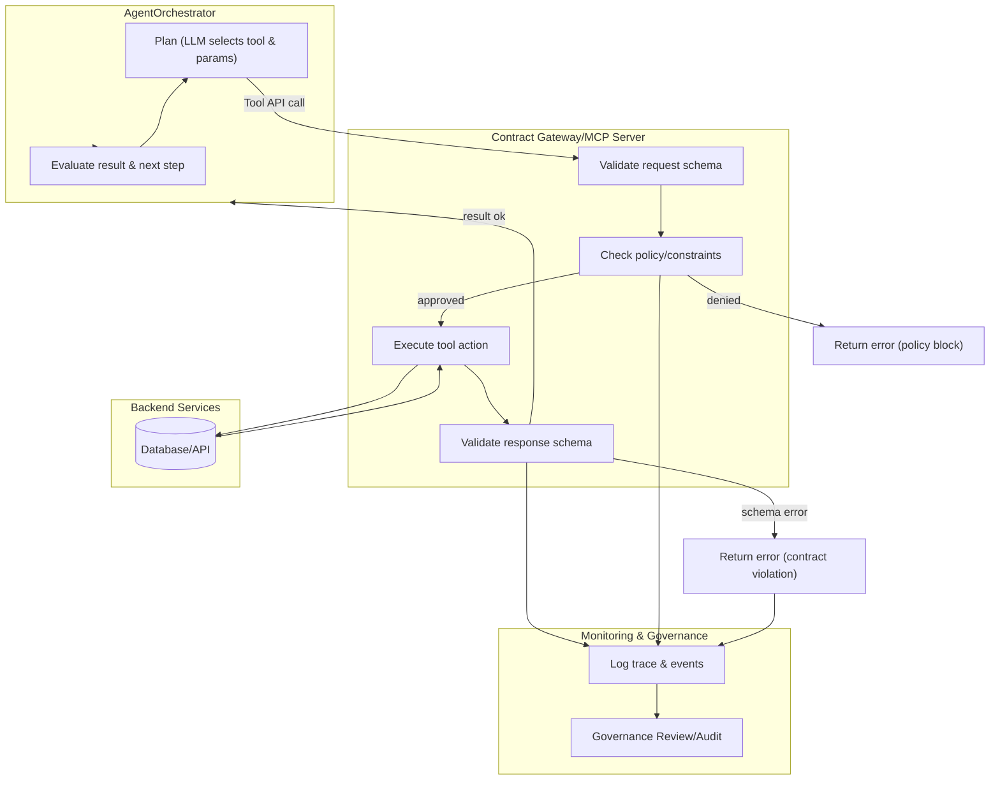

:::warning WORK IN PROGRESS
:::

# Enabling Agentic AI Through Well-Defined API Contracts: Building Reliable and Scalable Toolchains

## Executive Summary
Agents powered by large language models (LLMs) are poised to transform workflows in domains like retail banking, but their autonomy must be grounded in robust interfaces. A bank’s AI assistant might need to retrieve customer data, analyze transactions, and execute transfers—all by invoking software tools. Each such tool call is an **affordance** for the agent, defining what action it can take. Well-defined API contracts for these tools are the _substrate of agency_ that makes these actions reliable and governable. In contrast, if agents must infer how to use tools from ad-hoc cues (like scraping web pages or reading unstructured docs), the result is brittle, inefficient, and potentially unsafe integration[^1]. By designing disciplined API contracts, organizations can expose a controllable action space where agents reason safely and effectively.

**API Contracts as Autonomy Enablers:** An API contract specifies exactly what a tool expects as input and what it returns, along with any constraints or guarantees. For agent toolchains, such contracts serve as explicit affordances the agent can plan over. They eliminate ambiguity and unexpected variability in tool usage, which is crucial because unlike traditional software, LLM-based agents don’t follow a predetermined code path – they decide actions on the fly. Clear contracts let the agent know _a priori_ what each tool can do and how to invoke it correctly. In essence, the contract is a **shared language** between the agent and the tool: a promise that “if you provide input `X` in format `Y`, you will get output `Z`.” This empowers autonomous reasoning while keeping it within safe bounds.

**Reliability through Structure:** By enforcing a schema for requests and responses, contracts make agent-tool interactions deterministic on the interface level (even if the agent’s internal reasoning is probabilistic). The contract acts as a gatekeeper, ensuring every request and response conforms to the expected structure[^2]. This yields consistency: no matter how an LLM phrases a query or what creative variation it produces, the downstream system receives data in the **expected format**[^2]. For example, if the contract says a “transferFunds” tool must return `{"status": "...", "transaction_id": "..."}`, the agent’s output either matches that or it’s rejected. Such consistency not only prevents runtime errors but also simplifies debugging – errors are caught at the API boundary rather than deep in business logic[^2]. In short, structured contracts turn the inherent uncertainty of LLM outputs into a predictable interface.

**Built-In Guardrails and Policies:** The API contract is also a natural point to enforce **guardrails**. Constraints in the contract (allowed value ranges, required fields, authentication roles, etc.) can prevent an agent from taking disallowed actions or passing unsafe data. It’s far more effective to control “what an agent can do” via explicit permissions and capability limits than to try to dictate exactly _how_ it reasons internally[^3]. Just as companies assign role-based permissions to human employees, an AI agent should be sandboxed by design – for example, a contract could forbid a “fund\_transfer” tool from moving more than $10,000 at a time or require a human approval flag for transactions above a threshold. By imposing such **capability constraints** and approval gates in the contract, we acknowledge that agents (like humans) will make mistakes, but we deliberately limit the scope of what those mistakes can do[^3]. In practice, a well-scoped API might **refuse** an out-of-policy request or route it for human review, providing a safety net without completely stripping the agent of autonomy.

**Auditability and Transparency:** Each tool invocation through a contract is an opportunity to log a structured event. Because inputs and outputs adhere to a schema, it’s straightforward to record the parameters an agent used and the results it got, along with metadata like timestamps and tool identifiers. This provides an **audit trail** of the agent’s decision-making. Such transparency is vital in regulated sectors like banking. If an agent denies a loan or flags a transaction, auditors need to see the chain of tool calls and data that led to that outcome. API contracts make it feasible to capture this data consistently. Moreover, they enable runtime monitors to track compliance (e.g. did the agent call only approved tools? did any response violate data policies?). In essence, contracts turn every agent action into a _traceable, reviewable unit of work_ rather than an inscrutable end-to-end automation.

**In summary, well-defined API contracts allow us to reap the benefits of agentic AI (flexibility, adaptiveness, and scale) without surrendering reliability or control.** They formalize the interface between stochastic AI decisions and deterministic software actions. The rest of this paper delves into how to design these contracts and the surrounding toolchain for robust, governable AI deployment in an enterprise setting.

## Tool Taxonomy and Selection Criteria

An agent’s “toolbox” can include a wide range of APIs and functions. It’s useful to categorize the types of tools an AI agent might use, as this informs how we design their contracts and governance. In a retail banking scenario, for example, an agent’s tools may include everything from internal data queries to external service calls. Here is a simplified taxonomy of agent tools:

*   **Data Access Tools:** APIs that read or write from databases and data stores. For instance, a _customer\_info.lookup_ API might retrieve a user’s profile or transaction history. Contracts for data tools should specify query parameters, filters, and what data fields are returned. Care must be taken to include **sensitivity tags** (e.g. marking fields that contain PII or financial data) so the agent and compliance layers know how to handle the output.
    
*   **Retrieval and Knowledge Tools:** Functions for fetching knowledge or documents relevant to a task. This includes search engines, retrieval-augmented generation endpoints, or an internal knowledge base query. These tools expand the agent’s context window by providing information on demand (e.g. retrieving the latest exchange rates or policy documents). Key contract elements here are the query format and any scope limitations (e.g. a tool that searches FAQs vs. one that does open web search). Since these tools return unstructured text or documents, their contracts often include metadata about result confidence or source provenance.
    
*   **Decision Support & Analytics:** Tools that perform calculations, scoring, or ML model inferences to aid decision-making. In banking, this might be a credit scoring service, a fraud detection model, or a financial calculator. These tools usually expect well-defined inputs (numerical or categorical features) and produce structured outputs (scores, flags, recommendations). The API contract should define the exact schema of inputs/outputs and possibly the **confidence or risk level** of the result. For example, a fraud detection API might return a risk score along with a list of features that most influenced the score.
    
*   **Workflow Actuation Tools:** These actually effect changes in the environment or trigger transactions. Examples include an _initiate\_fund\_transfer_ API, a tool to send an email or notification, or an interface to create a support ticket. These are high-impact actions, so their contracts tend to be the most restrictive. They require precise input validation (to avoid mistakes like transferring the wrong amount or to the wrong account) and often embed policy checks (like requiring certain pre-conditions or approvals). For such tools, **idempotency** is a crucial property: the contract should specify how repeated calls are handled (e.g. using idempotency keys) to avoid duplicate actions if an agent erroneously repeats a step.
    
*   **External Service Integrations:** Tools that interface with third-party services or external platforms. In banking, this could be pulling a credit report from an external bureau, verifying identity through a government API, or interacting with a partner’s system. These are effectively specialized cases of the above categories but warrant special attention for security. Contracts should clearly define how data is sanitized before leaving the organization and how responses are filtered on return. Often, **rate limits** and usage quotas are attached to these tools, so the agent knows (or is informed via the orchestration layer) not to overuse them.
    

Each tool in the taxonomy should be onboarded with a conscious decision: _Does the agent truly need this capability to fulfill its purpose?_ Minimizing the toolset is a security best practice (least privilege) and also simplifies the agent’s planning problem. Selection criteria for adding a tool include: its utility vs. potential risk, how well its function can be described in the contract, and whether adequate guardrails (like masking sensitive outputs or requiring confirmations) can be implemented. In an enterprise setting, it’s wise to tier tools by risk. For example, read-only data retrieval tools might be “low risk” and freely usable by the agent, while money movement or customer communication tools are “high risk” and require additional checks or human sign-off. The API contract itself can carry a **risk classification** field to indicate this tier, which the agent’s orchestration logic or a policy engine can interpret (e.g. disallowing certain plans or triggering oversight for high-risk actions).

_(Footnote: In modern AI agent architectures, “tools” generally refer to any external function the LLM can call, from simple information lookups to action-taking APIs[^9]. Well-designed tools and interfaces, such as Anthropic’s Model Context Protocol (MCP), allow agents to interact with these functions through a standardized layer.)_

## Contract Schema: Elements and Patterns

Designing an API contract for agent use involves more than the typical API spec. In addition to the inputs and outputs, we must embed semantic context and safety constraints. A robust **contract schema** will include at least the following elements:

*   **Intent and Description:** A human-readable description of what the tool does, its purpose, and when it should be used. For agents, this is crucial – it’s part of how the LLM “decides” when a tool is relevant. For example: _“Tool: `approve_loan` – Approve a loan application if criteria are met. Use only after risk checks are passed, and provide a reason code.”_ Clear intent helps the agent choose the right tool and prevents misuse (the description can explicitly warn about misuse, which the LLM can factor into its reasoning).
    
*   **Input Schema:** A precise definition of the expected input parameters (often in JSON). This includes data types, required vs optional fields, allowed value ranges or enums, and format (e.g. regex for account numbers). By using JSON Schema or OpenAPI definitions, we ensure the agent’s generated input can be automatically validated before the tool executes[^2]. For instance, an input schema for a transfer tool might require: `{ "from_account": "string", "to_account": "string", "amount": "number (min=0)", "currency": "string(enum)" }`. If the agent omits a field or uses the wrong type, the request is rejected immediately, prompting the agent (or a surrounding orchestrator) to correct course.
    
*   **Output Schema:** Likewise, define the structure of the tool’s response. This enables the agent to parse results deterministically (no guessing what a field means). For numeric or coded outputs, define units or categories. E.g., an interest rate calculator might output `{ "rate": 0.05 }` meaning 5%, and the contract should clarify the unit or range (0.0–1.0 for percentages). Output schema validation ensures the tool implementation doesn’t drift over time – if a newer version of a service adds a field or changes types, the contract (and validation) will catch it if not updated. This guards against **model hallucinations adding fields** as well[^2]; any extra or misnamed field in the output would cause a schema check failure, flagging a potential hallucination or integration bug for developers to investigate.
    
*   **Capability Constraints:** Metadata specifying the limits of the tool’s use. This can include rate limits (e.g. “max 5 calls per minute”), quotas, size limits (e.g. max records returned), or transaction limits (max amount of money to transfer, as mentioned). It may also define the context scope – for example, a tool may only access data for the current user’s accounts (preventing cross-customer data access). By declaring these in the contract, the agent’s planner can be made aware of limitations, and the execution layer can automatically enforce them (returning an error or warning if exceeded).
    
*   **Authentication and Permissions:** While the agent itself might be running under a service identity, each tool should declare what authorization is required. In a contract, this could be represented as required scopes or roles. For instance, a tool might only be available to an agent operating in a “customer service” role vs. an “auditor” role. Ensuring the agent has the right credential or token for the tool is part of the contract enforcement (often integrated with the infrastructure’s auth systems). The contract can also indicate if additional user consent is needed (e.g. “this action requires OTP confirmation from the customer”).
    
*   **Risk and Sensitivity Flags:** As noted, tagging a tool with a risk level guides how it’s orchestrated. A simple read of public information might be “low risk”, whereas a tool that can leak PII or execute transactions is “high risk”. Sensitivity flags could also mark what categories of data are involved (personal data, financial data, etc.). These tags feed into policy engines and logging: e.g. all calls to high-sensitivity tools might be recorded in a special audit log with full payloads for later review[^4]. They also allow an orchestrator to inject _dynamic guardrails_ (like pausing for confirmation before executing a high-risk tool, or sanitizing the output of a sensitive read).
    
*   **Example Calls and Responses:** Including one or two examples in the contract (as documentation) can be extremely helpful, especially for the humans who maintain or review the system. But even the agent could benefit: during prompt construction for the LLM, providing a few-shot example of a properly formatted tool call and response can anchor the model’s outputs to the schema. (This crosses into prompt engineering, but it’s worth mentioning as a technique to reinforce contract adherence.)
    
*   **Version and Lifecycle Info:** Every contract should carry a version number (more on versioning later) and possibly deprecation info. For instance, the contract might say “v1.2 – deprecated in favor of v2 by 2026”. This lets both humans and agents know the expected longevity of a tool. In advanced setups, an agent could even adjust its planning if it knows a tool is deprecated (preferring an alternative). At minimum, the system monitoring can alert when an agent is still using a soon-to-be-retired API.
    

To illustrate, here’s a tiny example of a YAML contract for a hypothetical `check_balance` tool:

```yaml
name: check_balance
description: > 
  Retrieve the current balance of a given account. 
  Use only when the user has been authenticated for that account.
input:
  type: object
  required: [account_id]
  properties:
    account_id:
      type: string
      pattern: "^[0-9]{12}$"   # 12-digit account number
output:
  type: object
  properties:
    balance:
      type: number
      description: Balance in account’s currency
    currency:
      type: string
      description: Currency code (ISO 4217)
constraints:
  rate_limit: 10 per minute
  scope: "account_id must belong to requesting customer"
risk_level: low
```

Such a contract clearly delineates what the tool does and doesn’t do. An agent using this `check_balance` knows exactly what to provide and what it will get. If it violates the schema or constraints (say, providing an invalid account format or calling too frequently), the system will reject the call – protecting both the backend and maintaining the agent’s logical consistency.

## Security and Data Protection Boundaries

API contracts for agentic AI double as **security boundaries**. In the banking context, this is paramount: we’re granting an autonomous agent access to potentially sensitive operations and data. A well-designed toolchain uses the contract layer to enforce least privilege, data minimization, and compliance requirements:

*   **Least Privilege & Scoped Access:** Each tool’s contract should encode the minimal access it needs. For example, if a tool reads transaction data, perhaps it should only read for a single customer at a time (scope limited by an account/customer ID) – enforced by the input schema and the service logic. Agents should have separate credentials or tokens per tool or per domain of tools, with no more rights than necessary. A “contract gateway” or middleware can attach the appropriate token when forwarding the agent’s call to the backend service, ensuring the agent cannot exceed its allowed scope. If the agent tries to call an unauthorized tool or with an ID outside its scope, the call is denied. This design contains an agent’s actions similarly to how microservice requests are authorized in a zero-trust architecture.
    
*   **Data Masking and Redaction:** Contracts can specify fields that must be redacted or transformed for the agent. For instance, an _account\_lookup_ tool might return a customer profile that includes a national ID or Social Security Number – the contract can mark that field as sensitive and the tool gateway could automatically hash or mask it (or the agent may be restricted from seeing it entirely). Sensitive data classification labels from the contract feed into a redaction engine. This way, even if an agent has access to personal data, we can enforce that certain high-risk data never leaves the secure service boundary or is only provided in a sanitized form. (E.g., last 4 digits of an ID instead of the full number.) Organizations should integrate their data classification policies here, so that any output to an AI agent is treated just like output to any external party in terms of compliance.
    
*   **Encryption and Transit Security:** While not unique to AI, it’s worth stating that all agent-to-tool communications should be encrypted (TLS) and authenticated. Contracts can declare if additional encryption of payloads is required (for instance, an extra encryption layer for particularly sensitive info, even within internal networks). Given that LLM agents might run in various environments (some on cloud platforms, etc.), it is crucial to prevent man-in-the-middle or eavesdropping on tool APIs. This aligns with existing API security practices but becomes part of the AI governance story.
    
*   **Execution Sandboxes:** If a tool involves executing code (for example, an agent might have a tool to run a SQL query or a Python script for advanced calculations), that execution environment must be sandboxed. The contract should enumerate what side effects are allowed. A “code execution” tool contract, for instance, might specify that the code runs in a container with no network access and time/memory limits. The agent thus knows any code it sends will only produce a result, and cannot, say, call arbitrary external URLs unless explicitly allowed by the tool’s design. This prevents the agent from using a tool in a malicious way (intentionally or due to prompt injection). Recent threat advisories emphasize such sandboxing and strict access controls as key to AI agent security[^4].
    
*   **Policy Hooks:** The contract layer can integrate with enterprise policy engines. For example, before a tool executes, a policy engine could evaluate the call (tool name, parameters, maybe the agent’s identity or the conversation context) against rules: _“If tool=‘transferFunds’ and amount > $10000, require manager\_approval=true in input”_. The agent, if properly designed, would know to include that field after a prior step where it obtained approval. If not, the policy hook will reject the call. By externalizing some rules like this, you get flexibility to update policies without retraining the model or changing the core code – just adjust the contract or the associated policy configs.
    
*   **Monitoring and Anomaly Detection:** Security isn’t just prevention; it’s also detection. As agents operate, the sequence of tool calls can be monitored for abnormal patterns. For instance, if an agent suddenly calls _export\_data_ tool and then _web\_search_ repeatedly, that might signal a potential data exfiltration attempt (maybe due to a prompt injection attack instructing it to leak data). By having all calls mediated through a central gateway (which checks contracts), one can implement real-time monitoring rules or anomaly detection on the agent’s behavior. In essence, the contract gateway doubles as an **API firewall** for the agent, much like an API gateway in front of microservices. It can log all requests, check them against a security policy, and even impose circuit breakers (e.g., if an agent exceeds a certain error rate or appears to be stuck in a malicious loop, cut it off or quarantine it).
    

Designing secure boundaries requires assuming that things _will_ go wrong – the agent might get compromised or simply err in judgment. The contracts and surrounding enforcement should be built to mitigate damage when that happens. A compelling analogy from recent research is that we should constrain agents’ _actions_ rather than try to fully control their _thoughts_[^3]. By doing so, even if an LLM veers off track or is induced to attempt something harmful, the hard limits at the API level will stop it from succeeding (and alert us to the attempt).

## Reliability and Resilience Patterns

When dozens of microservices and APIs coordinate under traditional software control, architects use various patterns to ensure reliability—retries, circuit breakers, idempotent operations, graceful degradation, etc. These become even more important (and a bit more complex) with AI agents, due to their non-deterministic nature and tendency to occasionally produce incorrect actions. We can however still apply classic resilience patterns at the tool interface layer to make the overall system robust:

*   **Idempotency and Deduplication:** Any tool that causes an irreversible action (booking a transaction, sending an email, etc.) should ideally be idempotent – meaning repeating the exact same call twice won’t double-execute the action. Commonly this is done by including an idempotency key (a unique identifier for the action) in the request. The contract can require such a key for certain tools, guaranteeing that if an agent accidentally issues the same request twice (perhaps due to a reasoning loop or not receiving a timely confirmation), the backend will recognize the duplicate and not perform it again. This saves us from scenarios where an agent’s slight confusion could cause, say, two identical payments to go out. In the agent planning context, an orchestrator might also detect duplicate intents and suppress them, but having the tool itself be safe against repeats is a final safeguard.
    
*   **Timeouts and Fallbacks:** Agents might call tools that in turn depend on other systems (database, third-party API) which can hang or slow down. A contract can specify a **timeout** for each call (e.g. “this tool will respond within 3 seconds or return an error”). The agent’s orchestrator should then have a plan for when a tool fails to respond or returns a timeout error. This could involve trying a fallback tool or strategy. For example, if _verify\_address_ API times out, maybe the agent can try an alternate _verify\_address\_backup_ API, or proceed with a best-effort assumption. Designing these fallback paths can be done via the agent’s prompting logic or via a higher-level workflow controller. What’s important is to avoid the agent getting stuck endlessly waiting. In complex workflows, you might even encode in the contract what a reasonable retry strategy is (“if timeout, wait 5 seconds and retry up to 3 times”). These patterns can be automated by the orchestration layer around the agent.
    
*   **Circuit Breakers:** In distributed systems, a circuit breaker stops calls to a service that is consistently failing, to give it time to recover (and to fail fast instead of hanging each time). In an agent toolchain, a similar mechanism can apply. If a particular tool has been returning errors or bad data frequently (perhaps the downstream system is partially down or the agent is calling it with bad inputs repeatedly), the orchestrator or gateway can “trip” and refuse further calls for a period. The agent can be informed (maybe via an error message that the tool is temporarily unavailable), prompting it to adjust its plan. This prevents thrashing and can protect downstream services from overload if an agent goes into a rapid retry loop. It’s essentially a safety valve in case the agent does not learn quickly on its own to stop hitting a failing endpoint.
    
*   **Graceful Degradation:** Agents should be designed to handle tool failures gracefully. That is more on the agent side (prompt design to consider what to do if a tool fails). From the tool contract perspective, we facilitate this by providing meaningful error information. Instead of just a generic “500 error,” the contract could define error schema with specific codes (e.g. “RATE\_LIMIT\_EXCEEDED” or “DATA\_NOT\_FOUND”). This structured feedback can be fed into the agent’s next reasoning step. For instance, if a _summarize\_transactions_ tool returns an error “DATA\_NOT\_FOUND” for a given account, the agent might realize it should first call _fetch\_transactions_. In essence, resilience includes designing a bit of a _conversation_ between agent and tools for exception cases. Testing various failure modes and ensuring the agent can recover (or at least not catastrophically fail) is a key part of robust system design.
    
*   **Stateful Tool Orchestration:** Sometimes an agent might initiate a long-running process (like start a loan approval workflow) that involves multiple steps or waiting periods. The tool contract can support reliability here by including a **status** field or a follow-up token. For example, calling _initiate\_loan\_process_ might return `{ "status": "PENDING", "process_id": "12345" }`. The agent knows from the contract that if it gets a “PENDING”, it should later call _check\_loan\_status_ with that `process_id`. This way, even if the agent or underlying model session ends and resumes later, the process can be continued or monitored by referencing the ID. This pattern prevents situations where the agent might accidentally start multiple parallel processes because it wasn’t tracking state. It ties in closely with idempotency and transaction management.
    
*   **Testing for Reliability:** (This overlaps with the next section on testing, but it’s worth noting as a pattern.) Define test scenarios for each tool where you simulate failures: invalid inputs, service downtime, high latency, partial responses, etc., and observe how the agent responds. This is akin to **chaos engineering** for AI agents. By doing so in sandbox tests, you can refine the contracts (maybe you discover an error type that needs a better contract definition) or add additional constraints to handle the edge case. A resilient toolchain is one that doesn’t just work in the happy path, but fails safely and recoverably in unhappy paths.
    

One emerging best practice is designing **fallback tool chains** – essentially backup sequences the agent can use if a primary tool fails. This can be achieved by having multiple tools for similar actions (perhaps from different providers or with different trade-offs). The contract metadata could even indicate that relationship (like Tool A is primary, Tool B is secondary). The agent’s policy or prompt can encode: “If Tool A fails, attempt Tool B.” We see parallels of this in high-availability microservice design (active-passive services), now being applied to agent planning. The goal is to avoid single points of failure in the agent’s capabilities. As a recent guide noted, agents should maintain multiple approaches for accomplishing objectives, rather than relying on a single workflow that could fail completely[^5]. This **graceful degradation** ensures the overall user experience doesn’t collapse just because one API is down or one strategy didn’t work.

In summary, reliability in agent toolchains comes from _both_ sides: making the tools themselves robust (through idempotent, well-specified behavior) _and_ making the agent’s orchestration smart about errors. The API contract is the handshake between these sides – by clearly defining how errors and retries are signaled, we let the agent handle problems in a structured way rather than flailing.

## Observability and Auditability

With autonomous agents taking actions on our behalf, having full visibility into what they’re doing is non-negotiable. Observability in this context means being able to trace, understand, and explain the agent’s sequence of tool calls and decisions. Fortunately, our structured API contract layer provides a natural instrumentation point. Here’s how to build observability into the toolchain:

*   **Structured Tracing of Tool Calls:** Every time the agent invokes a tool, the system (MCP server or gateway) should emit a trace event. This event can include the tool name, input parameters (with sensitive fields masked), timestamp, and correlation IDs (like a session ID or user ID). Using modern distributed tracing frameworks, we can tag all calls in a single agent session with a unique trace ID, so we can later reconstruct the narrative of what the agent did from start to finish. Think of it as a flight recorder: if the agent made 5 calls to various tools to complete a task, we want to see those 5 calls in order, how long each took, and whether each succeeded. Traditional logging might scatter these details, but a centralized orchestrator can group them[^5]. Engineers and auditors should be able to ask, “What series of actions led the agent to this outcome?” and the traces should tell that story clearly.
    
*   **Semantic Event Logs:** Beyond low-level traces, it’s useful to log higher-level semantic events. For example, when a tool returns a result, the orchestrator/agent could log an event like “Fraud check result = HIGH\_RISK, agent will halt transaction”. These can be custom application logs or even be captured through a monitoring UI that reconstructs the agent’s reasoning steps. Some frameworks allow you to attach **explanations** or intermediate reasoning results as part of the trace (especially if the agent externalizes its chain-of-thought). The goal is to have not just _what_ was done, but ideally _why_. In practice, capturing the full “why” is hard (since it’s in the LLM’s head, so to speak), but we can log, for instance, the content of the prompt or the function call arguments that the agent decided on. This provides insight into its decision process. One might store the prompt tokens that led to each tool invocation, enabling offline analysis of whether a prompt or instruction caused a problematic action.
    
*   **Policy Outcome Logging:** Whenever a guardrail triggers or a policy check is applied, log it. If the agent’s call was blocked because it violated a schema or policy, that’s an important event. Over time, analyzing these logs can reveal patterns: perhaps the agent frequently attempts a certain disallowed action – indicating either a flaw in its prompt or a need to adjust the policy/tool design. Conversely, logs might show an agent always complying well in some areas, which builds trust. In regulated environments, demonstrating this compliance logging is part of governance. For example, if an auditor asks “Has the AI ever attempted to access data beyond a customer’s scope?”, you should be able to query logs for any policy violation events of that nature.
    
*   **Performance Metrics and SLAs:** Observability also includes the health of the system. Track metrics like tool call latency, success/failure rates, throughput of actions per hour, etc. Service Level Agreements (SLAs) might be set (e.g. “95% of balance check calls must complete within 2 seconds”). By monitoring these, we ensure the agent’s added reasoning layer isn’t bogging things down too much. If certain tools become a bottleneck (maybe an external API is slow), that shows up in metrics and can inform optimizations (caching, upgrading the service, etc.). In effect, treat each tool API as you would a microservice for monitoring purposes – because it is one, just invoked by an AI agent rather than a human-driven UI.
    
*   **Real-Time Dashboards:** It’s highly valuable to have a live dashboard for the AI agent’s activity. This might show currently active agent sessions, the tools they’re using, and any alerts or anomalous behavior. For instance, if an agent normally makes 3–5 tool calls per user query but suddenly starts looping with 50 calls in a session, that should surface on a dashboard (and perhaps trigger an alert). Observability isn’t just post hoc analysis; it’s also live oversight. Many organizations repurpose APM (Application Performance Monitoring) tools or custom-build interfaces to visualize the agent’s “conversation” with tools as a flow chart or timeline. This can help quickly diagnose stuck sessions or logic errors. As one best-practice guide suggests, designing visualization systems that show the decision tree and progress of agents in a comprehensible way helps both engineers and stakeholders trust and refine the system[^5].
    
*   **Why, not just What:** Perhaps the hardest part is capturing the **rationale** behind agent decisions. We touched on logging prompts or intermediate reasoning. In some cases, developers include the agent’s chain-of-thought (if using a ReAct style prompt) in the logs. If that’s not possible or desired (due to the extra tokens or sensitive info), another approach is to have the agent itself output brief explanations as part of the plan (though this could affect performance). There’s active research on making AI decision-making more interpretable; in our contracts context, one simple thing is to annotate tool calls with a reason. For example, instead of just calling `transferFunds(amount=100)`, the agent could call a variant that includes a justification string: `transferFunds(amount=100, reason="refund customer for fee")`. The contract can allow a “reason” field that doesn’t affect execution but gets logged. This gives a breadcrumb of intent. Even if not used in real-time, it’s useful later to answer _why did it do that?_.
    

At a minimum, your observability framework should **capture every decision point from input to final action** in a structured way[^5]. Later, if something goes wrong (say a customer complains the AI made a bad decision), you have the forensic evidence to diagnose and improve. It’s analogous to having server logs and user interaction logs for a web application – but here it’s AI-tool interactions. Modern systems even treat these logs as data to feed back into model improvement: e.g. if an agent repeatedly asks for clarification from a tool or gets something wrong, those traces can highlight where the model might need more training or prompt adjustments.

In summary, observability turns the black box of an AI agent into a glass box. API contracts make this feasible by structuring the agent’s actions. And with proper logging and tracing, we gain the **real-time insight** to manage AI agents like any other mission-critical system – with the bonus that we can also explain their actions after the fact, fulfilling audit requirements and building trust.

## Versioning and Evolution of Tool Contracts

Enterprises are living systems: APIs evolve, new tools are added, old ones are retired or changed. When humans integrate with APIs, we manage versioning via clear strategies (v1, v2, etc.) and deprecation notices. The same diligence must apply to agent-facing APIs. In fact, it’s even more critical, because an AI agent doesn’t read changelogs or migration guides – if a tool changes unexpectedly, the agent might start failing in unpredictable ways. Thus, adopting a rigorous versioning practice for API contracts is part of keeping the AI **stable and up-to-date**.

*   **Semantic Versioning:** Just as we do for services, use semantic versioning (MAJOR.MINOR.PATCH) for each contract/interface. A new MAJOR version indicates breaking changes (an input/output schema change, removed fields, different semantics), which would likely _not_ be something the agent can handle without re-prompting or fine-tuning. Minor versions can indicate backward-compatible additions (like an optional field added, or new allowed enum value), which ideally the agent can ignore if not used. Patch versions are small fixes that don’t affect the interface contract (e.g. tightening a constraint or fixing a typo in description)[^6]. By communicating version in the contract and possibly in the tool’s name or endpoint (e.g. `/v1/transferFunds` vs `/v2/transferFunds`), we ensure clarity. Agents (or rather their developers) should know that an upgrade from v1 to v2 is non-trivial. In practice, one might keep an agent using v1 until it’s explicitly updated to understand v2’s differences.
    
*   **Deprecation Policy:** Hand-in-hand with versioning, have a policy for how long old versions are supported. For example, if v2 is out, maybe v1 will be supported for 6 more months. This should be documented so that those maintaining the AI agent pipeline can plan upgrades. The AI itself won’t magically know about new versions; it’s up to us to update prompts or tool definitions given to the agent. Automated tools can help here: for instance, analyzing prompts or function call code to locate references to v1 endpoints and suggest changes. During the deprecation overlap, one could route calls to either version (via an API gateway) and log usage. If an agent consistently uses a deprecated function, that’s a signal to fix the prompt or adjust the function mapping. Some organizations might implement a warning system: a deprecated tool’s contract can emit a warning in logs (or even to the agent as a non-fatal message, if the agent can handle it) to indicate it should be updated.
    
*   **Compatibility Tests:** When introducing a new version or changing a contract, thorough testing is essential to ensure the agent still performs. This includes unit tests on the schema (does the agent’s output still validate?), integration tests (maybe replay some real scenarios to see if agent behavior changes), and possibly A/B testing in production. An interesting approach is **automated diff checks** of contracts: parse the old and new contract and flag differences. If a difference is not backward-compatible, treat it like a breaking change requiring a prompt or code update. For example, removing a field or tightening a value range in the schema is breaking – the diff tool can catch that and warn the developers before the new contract is deployed. This is akin to continuous integration tests for APIs, ensuring we don’t accidentally break the agent’s affordances.
    
*   **Documentation and Discovery:** Maintain a registry of all available tools (and their versions) that the agent can use. This acts as an “action space catalog” for the agent. When new tools are added, they should be clearly documented and (if possible) introduced to the agent gradually. Perhaps initially run experiments with the new tool off-line or with only a small percent of agent sessions, to verify it’s used correctly. Agents might have a prompt that explicitly lists the tools and how to call them (as is common in function-calling approaches). Keeping that prompt in sync with the latest contracts is important. Automating the generation of that prompt section from the contract definitions can eliminate a class of errors (like describing a parameter incorrectly in the prompt). Essentially, treat the contract spec as the single source of truth, and derive documentation and agent instructions from it.
    
*   **Evolution of Agent Capabilities:** As the set of tools grows, there’s an architectural question: how to ensure the agent doesn’t get confused or overburdened by too many options? One solution is **capability discovery** where the agent is initially given only a core set of tools, and can request access to more if needed. Contracts could be grouped by domains or tagged so the orchestrator only provides relevant ones depending on context (for example, if the conversation is about credit cards, maybe the investment account tools are hidden to reduce noise). This keeps the “affordance graph” manageable at any given time. From a versioning perspective, if a tool is entirely replaced by another (say a third-party service is replaced with a new provider), one strategy is to keep the old contract but internally map it to the new implementation for a while, or clearly mark it as aliasing the new one. This way the agent can continue using the familiar interface while the backend transitions – essentially _wrapping_ the new tool to look like the old contract. Later, you might update the agent to use the new contract directly and retire the wrapper.
    
*   **Retiring Tools:** When a tool is no longer needed or too risky, simply disabling it without notice could lead an agent to attempt calls that fail. A graceful retirement involves marking the tool as deprecated (as mentioned) and possibly simulating its absence in a staging environment to see how the agent copes. In some cases, if an agent tries to call a now-removed tool, the orchestrator can intercept and provide a fallback action or a safe failure message. This ties back to having fallback strategies—perhaps the contract for a soon-to-be-retired tool can suggest an alternative action for the agent to use.
    

The overarching goal is to manage change _proactively_. Agents might not throw exceptions the way code does when an API changes; they might instead produce incorrect outputs or take wrong actions. So the feedback loop for versioning is partly through careful monitoring of agent performance. If you notice a sudden spike in errors or weird agent behavior after a contract update, it’s a red flag that the agent wasn’t fully adapted to the change. This is why a phase-wise rollout and compatibility testing are crucial. Use semantic versioning to communicate the _magnitude_ of changes[^6] and follow a consistent strategy so that everyone (from developers to the agent itself) can trust the contracts as stable commitments.

## Implementation: Platforms and Toolchain Integration

Implementing these principles in practice can be achieved with a mix of in-house frameworks and emerging standards. One notable approach is the **Model Context Protocol (MCP)**, an open standard (spearheaded by Anthropic) that provides a structured way for AI assistants to connect to tools and data sources[^7]. MCP essentially takes a contract-first philosophy: you define the tool interfaces (in a JSON/YAML spec), and it helps generate a server (connector) that the model can interact with. Let’s talk through how one might stand up an MCP server or similar “contract gateway” and how little code it can take when the contract is well-defined.

Suppose we have a simple contract for a `notify_customer` tool that sends a notification to a user’s email or phone. Once we’ve written the contract spec (with input schema like `{ "customer_id": "...", "message": "..." }`), we can use tooling to auto-generate much of the boilerplate: request parsing, validation, and a stub for the actual action. This is akin to how OpenAPI codegen works for REST APIs. The agent developer only needs to fill in the logic of sending the notification (or call the existing service that does it). Everything else – verifying the input matches the schema, enforcing rate limits, logging the call – can be handled by a generic layer.

In under 100 lines of Python (using FastAPI for example), one can load an API contract and spin up a server that registers each tool as an endpoint. Here’s a **pseudo-code** illustration of an MCP server handler generation using a contract definition:

```python
contract = load_contract("transfer_funds.yaml")  # Load the API contract spec
app = FastAPI()

@app.post(f"/tools/{contract.name}")
async def invoke_tool(request: Request):
    data = await request.json()
    validate(data, contract.input_schema)          # Enforce input schema
    enforce_policies(contract.name, data)          # Guardrails (if any defined)
    result = perform_action(data)                  # Business logic (tool implementation)
    validate(result, contract.output_schema)       # Enforce output schema
    log_event(contract.name, data, result)         # Emit observability event
    return result
```

_(The real code would handle exceptions, auth, etc., but this snippet shows the concept.)_

In this example, `load_contract` might parse a YAML and give us an object with the contract details. We then dynamically create an endpoint path (perhaps all tools are exposed under a `/tools/` prefix). The `validate` calls use JSON Schema validation against the contract. If validation fails, the server can return a 400 error which the agent or orchestrator will interpret as a schema violation (perhaps prompting the agent to correct format). The `enforce_policies` could check things like user permissions or any runtime rules (maybe using an external policy engine or simple condition checks embedded in the contract). The actual `perform_action` is where the integration happens – e.g., calling the internal payment system to transfer funds – which is business logic outside the scope of the contract per se. Finally, we validate the output and log the event.

This pattern highlights a key benefit: **contract-first development**. Once the contract is designed, much of the wiring can be automated. Some organizations have created templates or internal frameworks such that adding a new tool is as simple as writing a contract file and a few lines of handler code – the rest (endpoint registration, docs, tests) is taken care of. This reduces engineering friction and encourages teams to create granular, well-encapsulated tools (because the overhead of exposing a tool is low). It also means the governance aspects (logging, auth, etc.) don’t get skipped, since they’re baked into the generation process.

Platforms like MCP come with additional advantages: standardized discovery (the agent can query what tools are available via the protocol), and uniform error handling. It’s an open ecosystem approach – tools can be hosted anywhere as MCP servers, and multiple agent systems could use them. Even if you don’t adopt MCP specifically, these ideas can be implemented with your own API gateway or orchestration layer.

**Managed Orchestration vs. Code-First:** One decision point is whether to use an out-of-the-box agent orchestration platform or build with lightweight frameworks. Managed platforms (some cloud providers or startups offer agent orchestration services) can speed up development, but they might lock you into certain patterns or make it harder to inject your custom governance. A code-first approach, as advocated by some (e.g., Anthropic suggests starting simple with direct API calls[^8]), gives you full control and visibility. It may start with more manual effort, but as shown, that effort can be alleviated by good abstractions and templates.

**Integration with Existing Systems:** In an enterprise, you often don’t start from scratch. There are existing APIs and microservices. Wrapping those in agent-friendly contracts might be as simple as writing a thin adapter. For example, if there’s an existing REST service for _open\_account_, one can write an MCP contract that mirrors it, and the handler simply calls the REST endpoint internally. Over time, if these adapters proliferate, you effectively have an internal marketplace of AI-exposable services. It’s wise to catalog these and perhaps layer them: some might be low-level (very atomic operations) while others could be higher-level workflows. The agent might call either directly, but often higher-level “composite tools” (which internally call multiple services) can encapsulate common sequences. This simplifies the agent’s job (fewer steps to plan) and centralizes logic (so the sequence can be updated in one place). The downside is less flexibility for the agent, so it’s a trade-off and likely an evolving mix (some straightforward tasks can be one tool call, more complex tasks may still require the agent chaining several atomic tools).

**Latency and Throughput Considerations:** Using tools means the agent workflow is not just one big prompt-response; it’s multiple calls and context switches. Each tool call might add latency (network calls, processing). In aggregate, ensure that the end-to-end flow still meets user experience needs. Caching frequent results (either at the agent level or tool level) can help. For instance, if the agent always calls _get\_exchange\_rate_ before a currency conversion, cache the rate for a short time. Also, consider parallelizing tool calls if possible: an orchestrator might allow the agent to request multiple tools and then combine results (though most current agent frameworks do this sequentially via the LLM’s decisions). But some advanced designs could break out of the strictly linear chain-of-thought to gain efficiency (with the risk of complicating the agent’s reasoning consistency). It’s a frontier area of research.

To conclude on implementation: the combination of **contract-centric design** with light but powerful frameworks (like FastAPI + JSON schema validation, or MCP’s reference implementation) enables teams to build an agent toolchain that is both robust and agile. New capabilities can be added quickly without compromising standards, and the resulting system remains **governable by design** – since every action passes through a contract that the organization controls.

## APIs as Cognitive Affordances for Agents

Stepping back, it’s worth reflecting on how an AI agent “sees” these API contracts. In cognitive science, **affordances** are possibilities for action that an environment offers to an actor. Here, each API tool with a well-defined contract is an affordance the agent can leverage. By making affordances explicit, we raise the ceiling of what the agent can reliably do and we reduce the chance it will hallucinate actions that don’t exist.

In early experiments with LLM agents, many failures occur because the model overestimates its abilities or tries to do everything with plain text. For example, without a tool, an LLM asked to get the latest stock price might _make one up_, because it has no direct knowledge or means to fetch it. Introduce a `get_stock_price` API, and not only can the agent get real data, but it also will learn _when to use it_ (since the contract description will say “use this tool to fetch real-time prices”). Thus, contracts give the agent **grounding in reality** – a way to impact and query the real world beyond its training data, with safe constraints. Research has shown that providing machine-native affordances (like APIs) significantly improves task success rates for agents compared to having them rely on raw text inference alone[^1].

Furthermore, a network of interlinked API contracts (let’s call it a **contract graph**) effectively becomes the map of the agent’s action space. The agent’s planning algorithm (whether it’s chain-of-thought prompting or a more explicit planner module) navigates this graph. Because each node (tool) is well-defined, the agent can reason about sequences: _“To do X, I might need to call Tool A, then based on result call Tool B.”_ In prompting terms, we supply the agent with a list of functions and their signatures; the agent then decides which to call and with what arguments. The better those signatures (contracts) are defined, the more accurate the agent’s choices. If the contracts also include information like “cost” or “risk” (implicitly or explicitly), the agent can factor that into planning. For example, “Tool Y might solve the problem but is expensive or slow, so maybe try other steps first.”

This ties into the idea of **explicit affordance reasoning**: the agent doesn’t have to infer what actions are possible – we enumerate them. A study on web agents highlighted that without explicit action declarations, agents waste time and fail by guessing what to do on a webpage, but when the page provides a machine-readable list of actions, the agent’s efficiency and success shoot up[^1]. In our domain, if the agent knows the bank’s system provides a `calculate_loan_offer` tool, it won’t try to do complex math or policy logic itself; it will delegate appropriately. In a sense, the contracts are like tools in a toolbox (to use a simple analogy), and the agent is the mechanic. If each tool is clearly labeled and fits its purpose, the mechanic can fix the car faster and safer than if he had to jury-rig solutions from ambiguous instruments.

From a governance perspective, these affordances are also **control points**. Each tool call is a checkpoint where oversight can be applied. So the contract graph is not just the action space, but also the _governance surface_. We decide what nodes are present (what the agent is allowed to do) and what edges exist (which sequences are possible or make sense). If we discover an unsafe sequence (like “agent transfers money then uses an external email tool to send account info”), we can address it by adjusting contracts (maybe remove the ability to send certain data via that tool, or add a policy check).

Finally, clear affordances reduce **hallucination of functionality**. If an agent _doesn’t_ have a certain tool, a well-calibrated agent won’t promise that action. For instance, if there’s no tool to directly “close an account,” the agent hopefully will respond to a user request with an apology or alternate steps, rather than hallucinating that it closed the account. It knows its limits based on the affordances given. Conversely, if we add a new capability, the agent can immediately expand its behavior to use it (assuming it’s described in the prompt). This is much more scalable than trying to inject all possible knowledge into the model’s weights. We’re delegating to tools for specialist tasks.

In summary, API contracts serve as the **bridge between an LLM’s abstract reasoning and concrete actions**. They empower the agent with real functions, guide its planning with clear rules, and simultaneously act as levers we can pull to direct and constrain the agent. The result is agency that is _intentional_ and _safe_: the agent can figure out complex tasks (thanks to the flexibility of LLM reasoning) while each step of execution is grounded in an explicit, agreed-upon operation.

## Phased Roadmap for Enterprise Adoption

Adopting agentic AI with a contract-driven toolchain is a journey. Organizations should phase the introduction of these concepts to manage complexity and risk. Here’s a high-level roadmap in three phases:

*   **Phase 1 (Foundation):** Start by inventorying your existing internal APIs and tools. Classify them by potential _agent use case_ and risk level. For 1 or 2 relatively low-risk pilot scenarios, design a minimal contract schema template (covering inputs/outputs and basic metadata). Implement those contracts for the pilot tools and wrap them with validation and logging. At this stage, the goal is to get a simple agent working end-to-end with, say, one data retrieval tool and one action tool, under strict supervision. You might use a primitive orchestrator that just ensures schema compliance and logs every step. This phase is about proving the concept and ironing out integration kinks. Key outcomes: a baseline contract format for your org, a simple agent performing a useful task (e.g., answering a customer inquiry by retrieving info and drafting a response), and initial logs that give insight into agent behavior.
    
*   **Phase 2 (Scaling):** Once the pilot agents show promise, expand the toolchain and robustness features. Introduce formal versioning workflow for your contracts – perhaps using a repository or registry to manage them. Implement more of the reliability patterns: add timeouts to tool calls, define fallback chains for critical tasks, and include circuit breaker logic in the orchestrator. Build out observability with dashboards and alerts for agent activities (you might integrate with your SIEM or APM tools for this). At this stage, also integrate a policy engine or at least hard-coded policy checks for high-risk actions. Security reviews should be conducted for each new tool contract (especially those with write/delete capabilities). Additionally, this is when you can set up an **MCP server** or similar infrastructure to host a set of governed tools. Focus on exposing 3–5 high-value tools through this server, each with proper authentication, audit logging, and documentation. By the end of phase 2, you should have multiple agents or agent features running in different parts of the organization, all using a standardized contract approach, with better confidence in their reliability. Human oversight (perhaps a human-in-the-loop for final approvals) can still be present for the riskiest actions while trust is being established.
    
*   **Phase 3 (Optimization & Maturity):** In the long term, with dozens of tools and multiple agents, investments in automation and refinement pay off. Here you implement **continuous improvement** mechanisms: automated contract diffing and linting as part of your CI/CD – any contract change or addition triggers tests and risk checks. Adaptive risk scoring could be introduced: for example, the system learns which agent behaviors correlate with issues and raises risk levels dynamically in those scenarios (and maybe requires additional approvals). Multi-agent orchestration may come into play, negotiating contracts between agents (if you have separate agents collaborating, e.g., one generates a plan and another executes). You might develop simulation environments where agents and tools are tested with random variations and even adversarial inputs to detect drift or vulnerabilities (like an automated red-teaming of the AI system). At this stage, one could also consider _regeneration_ of the MCP server or connectors as contracts evolve – essentially treating the contract spec as code and regenerating stubs frequently to catch any mismatch between spec and implementation. Phase 3 is also where we pursue more advanced topics: perhaps allowing the agent to propose new tools (it might say “I can’t do X effectively, I need an API for Y”), which could then feed into development plans. The contract-first approach makes adding that new API more straightforward, and governance ensures it’s done safely. Finally, fully optimize the workflow: remove any remaining unnecessary human gates (if confidence is high and controls are solid), fine-tune the models with feedback from logs (so the agent gets better at using tools), and potentially scale out to customer-facing autonomous services with proper fail-safes.
    

Throughout all phases, keep stakeholders involved. In retail banking, compliance and security teams should be partners from day one. Demonstrating the audit logs, the policy enforcement, and the controlled scope of the agent’s actions will help gain their buy-in. It’s much easier to expand the agent’s autonomy when there’s evidence that every step it takes is governed and observable.

**Mermaid Diagram: Agent-Toolchain Lifecycle**



_(Diagram: The agent orchestrator (LLM) decides on an action and calls a tool via the contract gateway. The gateway validates the request against the contract, checks any policies, executes the action on backend services, then validates the response. Logs and events are recorded for governance. The agent receives the tool result and evaluates if another step is needed, forming a feedback loop until the task completes.)_

## Conclusion

Enterprise AI agents can be powerful allies, handling complex tasks at scale, but they must operate within well-defined bounds. API contracts provide those bounds—the explicit rules and scaffolding that turn a free-form AI into a reliable agent. By carefully designing tool interfaces with clear schemas, constraints, and metadata, we give our AI a map and toolkit for action. We also give ourselves, as system owners, the needed levers to monitor and control those actions. The result is a **symbiosis of flexible intelligence and hardened infrastructure**: the agent brings reasoning and adaptability; the contracts and toolchain bring safety, reliability, and auditability.

Retail banking, with its regulatory demands and need for trust, stands to benefit immensely from such a setup. Imagine an AI agent that can genuinely assist a customer end-to-end – not just chat, but actually _do_ things like update details, initiate transactions, provide personalized advice – all while proving to the bank’s compliance team that it followed policy at every step and produced a full audit trail of its decisions. This vision is achievable by following the principles outlined: treat APIs as first-class components of AI behavior, and design them so that each is a robust capsule of functionality the agent can leverage.

As AI capabilities evolve, the contract-based approach will help ensure we always have a handle on _what_ our agents are allowed to do. It prevents the scenario of a “black box” AI making rogue moves. Instead, we’ll have **transparent boxes** executing approved moves, orchestrated by an intelligence that’s creative but constrained. It’s a model for scaling AI in any critical domain: marry the **cognitive flexibility** of LLMs with the **precise control** of software engineering.

By starting small, rigorously testing, and expanding stepwise, organizations can introduce agentic AI safely. The key takeaway is that autonomy is not the enemy of governance—if anything, with well-defined contracts, we can achieve higher levels of autonomy _because_ we have governance built-in. Teams won’t need to hard-code every workflow if they trust the agent to improvise within the sandbox we’ve crafted. They can focus on defining the right tools and rules, and then let the agent cook up solutions.

In closing, building reliable and scalable AI toolchains via API contracts is both an engineering challenge and an organizational shift. It requires collaboration between AI developers, backend API teams, security, and business stakeholders. But the payoff is an AI workforce that is as dependable as it is innovative, unlocking efficiency and insights while operating with the checks and balances that enterprise environments demand. The future of agentic AI will be written in the language of API contracts—and those who master that language will lead in deploying AI that is truly transformative yet deeply responsible.

---

[^1]: Agent action affordances and web interaction constraints (arXiv): https://arxiv.org/html/2511.11287v1
[^2]: API contracts in LLM workflows (Treblle): https://treblle.com/blog/api-contracts-in-llm-workflows
[^3]: Sandboxing, approval gates, and capability constraints (arXiv): https://arxiv.org/html/2508.05687v1
[^4]: Threat advisory and AI agent risk mitigation (DTEX): https://www.dtexsystems.com/resources/i3-threat-advisory-mitigating-ai-agent-risks/
[^5]: AI agent reliability strategies (Galileo): https://galileo.ai/blog/ai-agent-reliability-strategies
[^6]: API versioning strategies (xMatters): https://www.xmatters.com/blog/api-versioning-strategies
[^7]: Model Context Protocol (Anthropic): https://www.anthropic.com/news/model-context-protocol
[^8]: Building effective agents (Anthropic): https://www.anthropic.com/engineering/building-effective-agents
[^9]: Agent security risk categorization (VirtueAI): https://blog.virtueai.com/2025/07/02/dive-deep-into-ai-agent-security-comprehensive-risk-categorization-and-assessment/
