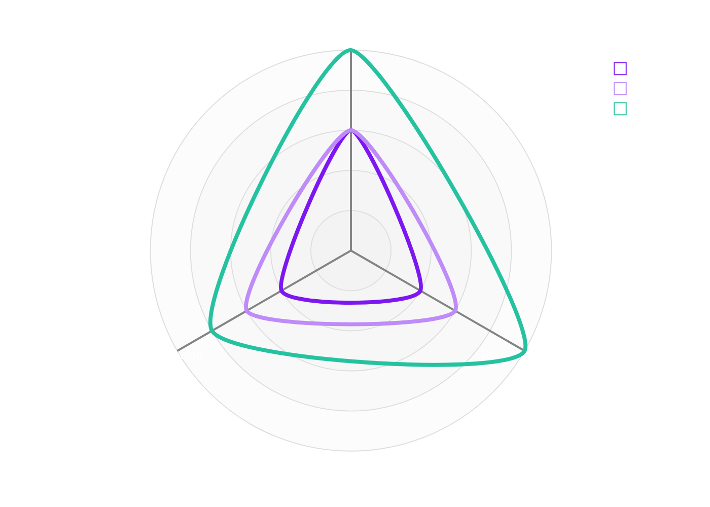

# Selecting the Right Agentic AI Technology Stack


## Introduction

Building on the themes from *Banking Reimagined Through Agentic AI* and *Balancing Autonomy and Agency*, this paper moves from conceptual foundations to the practical question now facing banking and enterprise leaders: how to architect and select the right technologies for agentic AI at scale. As organisations shift from standalone LLM assistants to agents embedded in core workflows, technology choices increasingly shape risk posture, integration complexity, and long-term platform strategy.

This decision has become significantly more challenging. The ecosystem has fragmented into open frameworks (e.g., LangChain, AutoGen, LlamaIndex), managed cloud platforms (e.g., Copilot Studio, Azure AI Agents), and low-code builders—all overlapping in capability but inconsistent in maturity, governance, and integration patterns. Without a structured selection approach, enterprises risk over-engineering simple use cases, under-engineering complex ones, and creating unmanaged “agent sprawl” across business units.

> &nbsp;  
> **Example:**  
> A workflow such as “policy lookup → summarise → draft email” does **not** require a custom LangChain + vector database stack.
It can be delivered more safely and cost-effectively using **Microsoft 365 Copilot extensions**, which leverage existing M365 entitlements, security boundaries, and identity/role controls.  
> &nbsp;  

The purpose of this white paper is to provide a **vendor-neutral, architecture-led decision framework** to help organisations navigate this complexity. It maps the technology landscape, evaluates the strengths and constraints of each category, and introduces a practical model linking use-case complexity to the appropriate technology stack—ensuring agentic AI is deployed safely, efficiently, and strategically.

## Landscape of Agentic AI Technologies

Today’s agentic AI ecosystem can be viewed in several categories, from code-first frameworks for building bespoke agents to fully managed enterprise platforms.

| **Category**                       | **Examples**                                                    | **Strengths**                                                  | **Limitations**                                        | **Enterprise Fit**                                   |
| ---------------------------------- | --------------------------------------------------------------- | -------------------------------------------------------------- | ------------------------------------------------------ | ---------------------------------------------------- |
| **Code-First Frameworks**          | LangChain, LangGraph, CrewAI, AutoGen                          | Full flexibility; custom control; on-prem possible             | Engineering-heavy; requires custom governance          | High-autonomy agents; regulated/complex integrations |
| **Visual & Low-Code Builders**     | n8n, LangFlow, Flowise, Dify                                   | Rapid prototyping, visual debugging                            | Limited robustness; not ideal for mission-critical ops | POCs, early workflows, small applications            |
| **Managed Agent Platforms**        | Microsoft Copilot Studio, Microsoft Foundry, AWS Bedrock Agents, Vertex Agents | Identity, compliance, logging; enterprise connectors; scalable | Vendor-bound paradigms; less low-level control         | Broad deployment; governance-critical workflows      |
| **Vendor Product Embedded Agents** | Microsoft Dynamics 365 Autonomous Agents                      | Domain-specific; turnkey workflows                             | Limited customisability; vendor lock-in                | CRM, ERP, vertical SaaS use cases                    |

<p class="center"> _Table 1: Agentic AI Technologies - Category Comparison_ </p>  

### Code-First Frameworks (Build-Your-Own Agents)

**Code-first frameworks** enable developers to compose custom AI agents programmatically, offering maximal flexibility and extensibility. These libraries often require software development effort but give fine-grained control over agent logic, integration, and deployment environment.

---

#### LangChain *(LangChain, Inc.)*
**References:** [GitHub](https://github.com/langchain-ai/langchain) | [Docs](https://python.langchain.com/)


&nbsp;  

**Purpose:**  
A **widely adopted Python and JavaScript framework** for building LLM-powered applications and agents with modular components (prompts, memory, tools, chains).

**Who it’s for:**  
Application developers, ML/AI engineers, and platform teams who want a flexible, code-first toolkit for LLM workflows.

**What it does:**  
* Provides composable primitives for prompts, chains, tools, memory, and agents  
* Integrates with many model providers, vector stores, and external tools/APIs  
* Supports retrieval-augmented generation (RAG), chatbots, tool-using agents, and decision workflows  
* Offers LangSmith for tracing, evaluation, and observability in production  
* Can be self-hosted or embedded into existing Python/JS services and backends

**Best for:**  
General-purpose LLM applications, RAG chatbots, tool-using assistants, and decision-making agents where flexibility and ecosystem breadth matter.

<details>
  <summary>Example: Create an agent</summary>

  ```python title="agent.py"
  # pip install -qU langchain "langchain[anthropic]"
  from langchain.agents import create_agent

  def get_weather(city: str) -> str:
      """Get weather for a given city."""
      return f"It's always sunny in {city}!"

  agent = create_agent(
      model="claude-sonnet-4.1",
      tools=[get_weather],
      system_prompt="You are a helpful assistant",
  )

  # Run the agent
  agent.invoke(
      {"messages": [{"role": "user", "content": "what is the weather in sf"}]}
  )
  ```
</details>

---

#### LangGraph *(LangChain, Inc.)*
**References:** [GitHub](https://github.com/langchain-ai/langgraph) | [Docs](https://langchain-ai.github.io/langgraph/)


&nbsp;  

**Purpose:**  
A **graph-based orchestration framework** built on LangChain for modeling agent workflows as explicit, stateful graphs.

**Who it’s for:**  
Engineers needing fine-grained control over complex, multi-step, long-running agent workflows.

**What it does:**  
* Represents workflows as directed state graphs with nodes, edges, and branching logic  
* Manages long-lived, resumable state across multi-step conversations and tasks  
* Supports loops, branching, and deterministic control over transitions  
* Integrates with LangChain components (LLMs, tools, retrievers, memory)  
* Enables visual inspection and debugging of graph structure and execution

**Best for:**  
Dynamic, complex workflows and long-running agents that require explicit state modeling, deterministic control, and robust orchestration.

<details>
  <summary>Example: Create an agent</summary>

  ```python title="Example"
  from langgraph.graph import StateGraph, MessagesState, START, END

  def mock_llm(state: MessagesState):
      return {"messages": [{"role": "ai", "content": "hello world"}]}

  graph = StateGraph(MessagesState)
  graph.add_node(mock_llm)
  graph.add_edge(START, "mock_llm")
  graph.add_edge("mock_llm", END)
  graph = graph.compile()

  graph.invoke({"messages": [{"role": "user", "content": "hi!"}]})
  ```
</details>

---

#### AutoGen *(Microsoft Research)*
**References:** [GitHub](https://github.com/microsoft/autogen) | [Docs](https://microsoft.github.io/autogen/)


&nbsp;  

**Purpose:**  
An **open-source framework for multi-agent conversational workflows**, enabling specialized agents to collaborate via message passing.

**Who it’s for:**  
Researchers and advanced developers exploring multi-agent patterns, collaborative reasoning, and human-in-the-loop workflows.

**What it does:**  
* Defines conversational agents that exchange messages to solve tasks collaboratively  
* Supports planner–solver patterns, tool use, and external API integrations  
* Handles asynchronous, long-running conversations between agents and humans  
* Provides abstractions for evaluating, routing, and coordinating multiple agents  
* Works with multiple model providers and backends via extensible clients

**Best for:**  
Planner–solver scenarios, collaborative problem solving, experimentation with advanced multi-agent patterns, and research-grade multi-agent systems.

<details>
  <summary>Example: Create an agent</summary>

  ```python title="agent.py"
  # pip install -U "autogenstudio"
  import asyncio
  from autogen_agentchat.agents import AssistantAgent
  from autogen_ext.models.openai import OpenAIChatCompletionClient

  async def main() -> None:
      model_client = OpenAIChatCompletionClient(model="gpt-4.1")
      agent = AssistantAgent("assistant", model_client=model_client)
      print(await agent.run(task="Say 'Hello World!'"))
      await model_client.close()

  asyncio.run(main())
  ```
</details>

---

#### CrewAI *(CrewAI Community / Open Source)*
**References:** [GitHub](https://github.com/crewAIInc/crewAI) | [Docs](https://docs.crewai.com/)


&nbsp;  

**Purpose:**  
A **lightweight Python framework** for orchestrating teams of role-based agents (“crews”) that collaborate to complete tasks.

**Who it’s for:**  
Developers who want a simple but powerful abstraction for coordinating multiple specialized agents with clear roles and goals.

**What it does:**  
* Defines agents with roles, goals, and backstories via config (YAML / Python)  
* Organizes agents into “crews” that can work sequentially or in parallel  
* Supports shared context, critique/review patterns, and validation between agents  
* Integrates with tools (search, APIs, retrieval) to ground agent behavior  
* Provides project scaffolding to structure agents, tasks, and orchestration code

**Best for:**  
Research–draft–review pipelines, parallelized agent teams, and workflows where multiple specialized agents collaborate with built-in validation.

<details>
  <summary>Example: Create an agent</summary>

  ```yaml title="agents.yaml"
  researcher:
    role: >
      {topic} Senior Data Researcher
    goal: >
      Uncover cutting-edge developments in {topic}
    backstory: >
      You're a seasoned researcher with a knack for uncovering the latest
      developments in {topic}. Known for your ability to find the most relevant
      information and present it in a clear and concise manner.
  ```

  ```yaml title="tasks.yaml"
  research_task:
    description: >
      Conduct a thorough research about {topic}
      Make sure you find any interesting and relevant information given
      the current year is 2025.
    expected_output: >
      A list with 10 bullet points of the most relevant information about {topic}
    agent: researcher
  ```

  ```python title="crew.py"
  from crewai import Agent, Crew, Process, Task
  from crewai.project import CrewBase, agent, crew, task
  from crewai_tools import SerperDevTool
  from crewai.agents.agent_builder.base_agent import BaseAgent
  from typing import List

  @CrewBase
  class LatestAiDevelopmentCrew():
    """LatestAiDevelopment crew"""
    agents: List[BaseAgent]
    tasks: List[Task]

    @agent
    def researcher(self) -> Agent:
      return Agent(
        config=self.agents_config['researcher'],
        verbose=True,
        tools=[SerperDevTool()]
      )

    @task
    def research_task(self) -> Task:
      return Task(
        config=self.tasks_config['research_task'],
      )

    @crew
    def crew(self) -> Crew:
      """Creates the LatestAiDevelopment crew"""
      return Crew(
        agents=self.agents, # Automatically created by the @agent decorator
        tasks=self.tasks, # Automatically created by the @task decorator
        process=Process.sequential,
        verbose=True,
      )
  ```

  ```python title="main.py"
  import sys
  from latest_ai_development.crew import LatestAiDevelopmentCrew

  def run():
      """
      Run the crew.
      """
      inputs = {
          'topic': 'AI Agents'
      }
      LatestAiDevelopmentCrew().crew().kickoff(inputs=inputs)
  ```

</details>

---

#### LlamaIndex *(LlamaIndex, Inc.)*
**References:** [GitHub](https://github.com/run-llama/llama_index) | [Docs](https://docs.llamaindex.ai/)


**Purpose:**  
A **developer-first data framework** that connects LLMs to enterprise knowledge sources with rich ingestion, indexing, and retrieval.

**Who it’s for:**  
Developers and data teams building knowledge-grounded assistants and RAG systems over proprietary or large-scale datasets.

**What it does:**  
* Ingests documents from many sources (files, DBs, SaaS apps, data lakes)  
* Builds structured indices (vector, keyword, hybrid, graph) for efficient retrieval  
* Exposes query engines and agents that operate over indexed data  
* Provides tools for chunking, metadata, routing, and query transformation  
* Integrates with multiple LLMs, vector stores, and observability tools

**Best for:**  
Enterprise search, RAG applications, and agents that must reason over complex or large proprietary knowledge bases.

<details>
  <summary>Example: Create an agent</summary>

  ```python title="agent.py"
  # pip install llama-index
  from llama_index.core import VectorStoreIndex, SimpleDirectoryReader

  documents = SimpleDirectoryReader("data").load_data()
  index = VectorStoreIndex.from_documents(documents)
  query_engine = index.as_query_engine()
  response = query_engine.query("Some question about the data should go here")
  print(response)
  ```
</details>

---

#### Haystack *(deepset)*
**References:** [GitHub](https://github.com/deepset-ai/haystack) | [Docs](https://haystack.deepset.ai/)


&nbsp;  

**Purpose:**  
An **open-source, production-grade framework** for building transparent, auditable search, QA, and agent pipelines.

**Who it’s for:**  
Enterprise teams needing end-to-end, governable LLM pipelines with strong observability and cloud-agnostic deployment.

**What it does:**  
* Provides modular components for retrieval, generation, routing, and tools  
* Supports pipeline graphs for multi-step QA and agentic workflows  
* Integrates with many document stores, vector DBs, and model backends  
* Offers step-level debugging, tracing, and evaluation capabilities  
* Can be deployed in cloud, on-prem, or hybrid environments

**Best for:**  
Regulated, audit-heavy workflows; enterprise-scale RAG; and multi-step agent pipelines requiring full traceability and governance.

<details>
  <summary>Example: Create an agent</summary>

  ```python title="agent.py"
  # pip install haystack-ai
  import os

  from haystack.components.agents import Agent
  from haystack.components.generators.chat import OpenAIChatGenerator
  from haystack.dataclasses import ChatMessage
  from haystack.tools import ComponentTool
  from haystack.components.websearch import SerperDevWebSearch

  os.environ["OPENAI_API_KEY"] = "<YOUR OPENAI API KEY>"
  os.environ["SERPERDEV_API_KEY"] = "<YOUR SERPERDEV API KEY>"

  search_tool = ComponentTool(component=SerperDevWebSearch())

  basic_agent = Agent(
      chat_generator=OpenAIChatGenerator(model="gpt-4o-mini"),
      system_prompt="You are a helpful web agent.",
      tools=[search_tool],
  )

  result = basic_agent.run(messages=[ChatMessage.from_user("When was the first version of Haystack released?")])

  print(result['last_message'].text)
  ```
</details>

---

#### Feature Matrix: Open Frameworks

| **Feature / Capability**           | **LangChain**                        | **LangGraph**                                    | **AutoGen**                                 | **CrewAI**                                 | **LlamaIndex**                                   | **Haystack**                                        |
| ---------------------------------- | ------------------------------------ | ------------------------------------------------ | ------------------------------------------- | ------------------------------------------ | ------------------------------------------------ | --------------------------------------------------- |
| **Primary Purpose**                | Modular LLM app & agent toolkit      | Stateful graph-based agent orchestration         | Multi-agent conversational systems          | Teams of role-based agents                 | Data + retrieval framework with agent extensions | End-to-end search, QA, and agentic pipelines        |
| **Ideal Use Cases**                | General-purpose LLM agents, RAG apps | Complex, stateful and controlled agent workflows | Multi-agent collaboration & problem solving | Team-based agents with roles and critiques | Knowledge-grounded agents, enterprise RAG        | Transparent, governable pipelines at scale          |
| **Architecture Model**             | Chains / tools                       | Directed state graph                             | Multi-agent messaging                       | Role-based multi-agent orchestration       | Retrieval + agent abstraction                    | Pipeline graph with nodes                           |
| **Supports Multi-Agent**           | 🔴 Limited                           | 🟢 Yes (via graphs)                              | 🟢 Yes (core)                               | 🟢 Yes (core)                              | 🔴 Limited                                       | 🟢 Yes                                              |
| **Tool / Function Calling**        | 🟢 Strong                            | 🟢 Strong                                        | 🟢 Strong                                   | 🟢 Strong                                  | 🟢 Strong                                        | 🟢 Strong                                           |
| **Long-Running State**             | 🟡 Partial                           | 🟢 Full support                                  | 🟢 Yes (async conversations)                | 🟢 Yes                                     | 🔴 Limited                                       | 🟢 Yes                                              |
| **Deterministic Workflow Control** | 🟡 Moderate                          | 🟢 High (explicit graphs)                        | 🟡 Low–moderate                             | 🟡 Moderate                                | 🔴 Low                                           | 🟢 High                                             |
| **Looping / Branching**            | 🔴 Limited                           | 🟢 Native support                                | 🟡 Message-driven                           | 🟡 Message-driven                          | 🔴 No explicit model                             | 🟢 Native support                                   |
| **Memory / Context Management**    | 🟢 Yes                               | 🟢 Yes                                           | 🟢 Yes                                      | 🟢 Yes                                     | 🟢 Strong (data-aware)                           | 🟢 Yes                                              |
| **RAG / Data Integration**         | 🟢 Good                              | 🟢 Good                                          | 🟡 Moderate                                 | 🟡 Moderate                                | 🟢 Excellent.                                    | 🟢 Excellent                                        |
| **Observability / Debugging**      | LangSmith                            | Graph inspection                                 | Event logs                                  | Conversational logs                       | Index + query logs                              | Step-level debugging / traceability                 |
| **Production Readiness**           | 🟢 Mature ecosystem                  | 🟡 Emerging but growing                          | 🟡 Research-backed, evolving                | 🟡 Growing adoption                        | 🟢 Mature for RAG                                | 🟢 High (enterprise-ready)                          |
| **Performance / Latency Focus**    | 🟡 Moderate                          | 🟡 Moderate                                      | 🟡 Moderate                                 | 🟢 High (lean implementation)              | 🟡 Moderate                                      | 🟢 High                                             |
| **Ecosystem Maturity**             | 🟢 Very High                         | 🟡 Medium                                        | 🟡 Medium                                   | 🟡 Medium                                  | 🟢 High                                          | 🟢 High                                             |
| **Cloud / Vendor Lock-in**         | 🟢 None                              | 🟢 None                                          | 🟢 None                                     | 🟢 None                                    | 🟢 None                                          | 🟢 None                                             |

<p class="center"> _Table 2: Code-First Frameworks - Feature Matrix_ </p>  

### Visual & Low-Code Builders

Visual and low-code builders provide **drag-and-drop canvases** to design agent flows without deep programming expertise. They help bridge business and engineering teams, accelerate prototyping, and can support production workloads where their execution and governance features are sufficient.

---

#### Dify *(LangGenius, Inc.)*
**References:** [GitHub](https://github.com/langgenius/dify) | [Docs](https://docs.dify.ai/)


&nbsp;  

**Purpose:**  
An **all-in-one, source-available platform** that combines visual agent building with integrated backend and hosting services.

**Who it’s for:**  
Teams that want a comprehensive, low-code environment to design, deploy, and operate AI applications and agents without managing much infrastructure.

**What it does:**  
* Lets users define “AI Apps” via prompts and visual flows (RAG, tools, branching)  
* Connects to data sources (files, DBs, SaaS) and manages credentials centrally  
* Provides built-in hosting, conversation history, logging, and admin dashboards  
* Exposes apps as REST APIs, SDKs, and hosted chat UIs for quick rollout  
* Supports plugins/extensions and self-hosted or cloud deployment models

**Best for:**  
Internal assistants, support bots, and lightweight agentic apps where configuration-over-code and speed of delivery matter more than deep customization.

---

#### LangFlow *(IBM)*
**References:** [GitHub](https://github.com/langflow-ai/langflow) | [Docs](https://docs.langflow.org/)


&nbsp;  

**Purpose:**  
An open-source **visual IDE** for building LLM and agent workflows on top of LangChain components.

**Who it’s for:**  
Developers, data scientists, and prototypers who prefer a visual canvas for designing and iterating on LLM-powered workflows and agents.

**What it does:**  
* Provides a drag-and-drop canvas for prompts, retrievers, tools, and chains  
* Supports interactive testing and debugging of flows inside the browser UI  
* Exports flows to code or deploys them as APIs and embeddable widgets  
* Reuses LangChain’s ecosystem of models, vector stores, and tools  
* Integrates with LangSmith and other observability backends for tracing

**Best for:**  
Rapid prototyping of RAG apps and agents, collaborative design sessions with stakeholders, and scenarios where visual debugging accelerates iteration.

---

#### Flowise *(Workday, Inc.)*
**References:** [GitHub](https://github.com/FlowiseAI/Flowise) | [Docs](https://docs.flowiseai.com/)


&nbsp;  

**Purpose:**  
A **Node.js/TypeScript-based visual builder** with a React UI for creating LLM chatflows and agentflows.

**Who it’s for:**  
Web and backend developers who want a JavaScript-friendly, self-hostable, visual environment to build and run LLM applications and agents.

**What it does:**  
* Offers a visual canvas for single-agent “Chatflows” and multi-agent “Agentflows”  
* Integrates with popular LLMs, vector stores, databases, and external APIs  
* Provides built-in tracing, evaluation, and human-in-the-loop steps  
* Supports multi-user workspaces and RBAC for team collaboration  
* Deploys flows as REST APIs, SDKs, or embeddable chat widgets with OpenTelemetry-based monitoring

**Best for:**  
Web-centric teams needing production-oriented, self-hosted low-code orchestration that can evolve from low-code prototypes to robust JS/TS services.

---

#### n8n *(n8n GmbH)*
**References:** [GitHub](https://github.com/n8n-io/n8n) | [Docs](https://docs.n8n.io/)


&nbsp;  

**Purpose:**  
A **general-purpose automation and workflow platform** that adds LLM and AI nodes to its existing catalog of integrations.

**Who it’s for:**  
Automation and integration teams who already use (or prefer) n8n for workflows and want to embed LLM-powered decision steps without adopting a new agent-specific platform.

**What it does:**  
* Provides a node-based visual workflow editor with hundreds of app/API connectors  
* Adds LLM/AI nodes for generation, classification, routing, and simple “mini-agents”  
* Orchestrates events, webhooks, and cron jobs alongside AI-powered steps  
* Can be self-hosted or run in the n8n cloud with environment-level governance  
* Integrates with existing CI/CD and DevOps practices for workflow management

**Best for:**  
Extending existing automation and integration workflows with AI capabilities (summarization, routing, enrichment) while staying in a familiar automation stack.

---

#### Feature Matrix: Visual & Low-Code Builders
| **Feature / Capability**       | **Dify**                                 | **LangFlow**                                | **Flowise**                               | **n8n**                                       |
| ------------------------------ | ---------------------------------------- | ------------------------------------------- | ----------------------------------------- | --------------------------------------------- |
| **Primary Purpose**            | Full-stack AI app & agent builder        | Visual IDE for LangChain workflows          | Node-based builder for LLM agents & flows | General automation platform with AI nodes     |
| **Development Model**          | Visual flows + built-in UI + APIs        | Drag-and-drop canvas, LangChain-based       | Drag-and-drop graph (Node.js/TS)          | Visual automation workflows (Zapier-style)    |
| **Agent Support**              | 🟢 Single & multi-step agents            | 🟢 LangChain agents                         | 🟢 Chatflows & Agentflows                 | 🟡 Basic LLM steps, not agent-first           |
| **Multi-Agent Orchestration**  | 🟡 Limited                               | 🟡 Emerging via LangChain                   | 🟢 Supported via Agentflows               | 🔴 Not native (requires custom logic)         |
| **Tool / Connector Ecosystem** | 🟢 Plugins, DBs, RAG, APIs               | 🟢 All LangChain tools/models               | 🟢 Wide model/tool integration            | 🟢 400+ connectors (APIs, SaaS, infra)        |
| **Built-In RAG Support**       | 🟢 Native knowledge base + vector stores | 🟢 LangChain retrievers                     | 🟢 Integrated vector DB nodes             | 🟡 Possible via community nodes               |
| **Observability / Debugging**  | 🟢 Logs, analytics, conversation history | 🟢 Step playback, graph inspection          | 🟢 Tracing, evaluation, step logs         | 🟢 Execution logs & node-level tracing        |
| **Human-in-the-Loop**          | 🟢 Review & approval built-in            | 🟡 Manual steps via components              | 🟢 HITL nodes available                   | 🟡 Possible via workflow pauses               |
| **Enterprise Governance**      | 🟡 Some controls; improving              | 🟡 Limited (depends on LangChain ecosystem) | 🟡 Workspace + RBAC (self-host)           | 🟢 Strong (RBAC, secrets mgmt, versioning)    |
| **Hosting Model**              | Cloud + self-host (source available)     | Self-host / OSS                             | Self-host / OSS + Docker                  | Self-host, cloud, Docker                      |
| **Scalability**                | 🟡 Moderate (app server model)           | 🟡 Depends on infra                         | 🟢 Horizontal scaling supported           | 🟢 Strong scaling via queues & workers        |
| **Ideal For**                  | Fast deployment of full AI applications  | Rapid prototyping of LangChain pipelines    | Production-ready JS/TS agent workflows    | Event-driven automation with LLM augmentation |
| **Vendor Lock-In**             | 🟡 Moderate                              | 🟢 Low (open ecosystem)                     | 🟢 Low (open-source)                      | 🟢 Low (connector-driven, OSS option)         |

<p class="center"> _Table 3: Visual & Low-Code Builders - Feature Matrix_ </p>  

### Managed Agent Platforms (Enterprise Services)

Managed agent platforms provide **end-to-end environments** to design, deploy, and operate AI agents, typically from major cloud and enterprise vendors. They bundle orchestration, connectors, security, and governance into a managed runtime, trading some low-level flexibility for faster time-to-value, standardised controls, and integrated support.

---

#### Copilot Studio *(Microsoft)*
**References:** [Docs](https://learn.microsoft.com/en-us/microsoft-copilot-studio/) | [Introduction Video](https://www.youtube.com/watch?v=u85b51fFV6Q)


&nbsp;  

**Purpose:**  
A **low-code, graphical builder** for creating and customizing copilots (conversational agents and workflow bots).

**Who it’s for:**  
Business users, analysts, and low-code makers.

**What it does:**  
* Build conversational copilots using a visual designer or natural language
* Connect to data via Power Platform connectors and Microsoft Graph
* Automate tasks through agent flows
* Deploy copilots across Microsoft 365 surfaces (Teams, Outlook, SharePoint) and external channels
* Governance and identity through Power Platform + Entra ID

**Best for:**  
End-user-facing assistants, support bots, guided workflows, and Microsoft 365–integrated copilots

---

#### Microsoft Foundry *(Microsoft)*
**References:** [Docs](https://learn.microsoft.com/en-us/azure/ai-foundry/) | [Introduction Video](https://www.youtube.com/watch?v=C6rxEGJay70)


&nbsp;  

**Purpose:**  
A **developer-focused platform-as-a-service** for building **advanced AI applications and agents** using Azure AI, models, tools, and enterprise infrastructure.

**Who it’s for:**  
Developers, engineers, and enterprise AI teams.

**What it does:**  
* Unified workspace for models, agents, tools, vector stores, and data
* Full lifecycle: build → evaluate → deploy → govern AI systems
* Supports custom agent orchestration and multi-agent systems
* Integrated observability, networking, DevOps, security, and responsible AI controls
* Runs as a scalable Azure resource for production workloads

**Best for:**  
Complex, highly integrated AI agents, domain systems, and production-grade AI applications

---

#### Amazon Bedrock Agents *(Amazon Web Services)*
**References:** [Docs](https://docs.aws.amazon.com/bedrock/latest/userguide/agents.html) | [Overview](https://aws.amazon.com/bedrock/agents/)


&nbsp;  

**Purpose:**  
A **managed agent runtime on AWS** that layers “AgentCore” orchestration on top of Bedrock models for secure, policy-driven automation.

**Who it’s for:**  
AWS-centric developers, platform teams, and solution architects building production agents over AWS data, APIs, and services.

**What it does:**  
* Configures agents with models, tools/APIs, instructions, and data sources, while AWS runs the orchestration layer  
* Invokes tools securely via AWS infrastructure with IAM-based access control and VPC integration  
* Enforces **AgentCore Policies** that encode natural-language rules (e.g., refund limits) and block non-compliant actions[^13][^14]  
* Provides **AgentCore Evaluations** to test correctness, safety, and quality before and after deployment[^14]  
* Manages long-term **AgentCore Memory** for personalization and context across sessions[^14]  
* Integrates with AWS observability (CloudWatch, X-Ray) and security services for monitoring and auditability  

**Best for:**  
Regulated, high-volume AWS workloads such as customer service journeys, underwriting support, internal operations automation, and financial product recommendation flows.

---

#### Vertex AI Agents *(Google)*
**References:** [Docs](https://docs.cloud.google.com/agent-builder/overview) | [Vertex AI](https://cloud.google.com/vertex-ai)


&nbsp;  

**Purpose:**  
A **full-stack agent platform on Google Cloud** that unifies agent development (ADK), cataloging, and managed runtime with built-in memory, tools, and security.

**Who it’s for:**  
Google Cloud customers, ML/AI platform teams, and developers building multi-tool or multi-agent workloads on Vertex AI.

**What it does:**  
* Provides **Agent Builder** and the open-source **Agent Development Kit (ADK)** for defining and testing agents and multi-agent systems[^15]  
* Runs agents on the managed **Agent Engine** with scaling, versioning, and lifecycle management[^15]  
* Offers **Agent Garden** with pre-built agents and tools to accelerate common patterns[^15]  
* Connects agents to web search, code execution, RAG, SaaS connectors, and Google Cloud services (e.g., via Apigee APIs)[^15]  
* Supplies **Memory Bank** for long-term, cross-session context and personalization[^15]  
* Implements **Agent Identity** (service-account–based IAM) and **Agent Threat Detection** for fine-grained permissions and runtime security monitoring[^15]  
* Integrates with Cloud Logging, Monitoring, and Trace for end-to-end observability and debugging  

**Best for:**  
Customer support, knowledge agents, and composable AI services on GCP that require rich tool integration, multi-agent patterns, and strong observability.

---

#### Feature Matrix: Managed Agent Platforms

| **Feature / Capability**             | **Copilot Studio** (M365)                                                      | **Azure AI Agents**                                                                             | **AWS Bedrock AgentCore / Agents**                                                        | **Vertex AI Agent Engine / Builder**                                                       |
| ------------------------------------ | ------------------------------------------------------------------------------ | ----------------------------------------------------------------------------------------------- | ----------------------------------------------------------------------------------------- | ------------------------------------------------------------------------------------------ |
| **Primary Orientation**              | Low-code M365 business apps & copilots                                         | Pro-dev cloud agents & digital workforce                                                        | Cloud-native agent runtime on AWS                                                         | Full-stack GCP agent lifecycle platform                                                    |
| **Development Model**                | Visual designer + prompt config (low-code)                                     | SDK + Studio (code-first & visual)                                                              | Console + APIs (config-driven)                                                            | ADK (open-source) + console (code-first & visual)                                          |
| **Multi-Agent Orchestration**        | 🟢 Connected Agents within Copilot ecosystem                                   | 🟢 Connected / multi-agent workflows in Foundry Agent Service                                   | 🟢 Multi-tool / multi-step flows within AgentCore         | 🟢 ADK multi-agent patterns + Agent Engine runtime        |
| **Tool / Connector Ecosystem**       | 🟢 Power Platform connectors, Microsoft Graph, SaaS data                       | 🟢 Azure services, Logic Apps, Functions, external APIs       | 🟢 AWS services, custom APIs via Tool Gateway             | 🟢 Google tools (Search, code exec), RAG, SaaS connectors |
| **Enterprise Identity & Access**     | 🟢 Entra ID, M365 admin center, Power Platform controls                        | 🟢 Azure AD / Entra, managed identities, IAM                              | 🟢 IAM roles, policies, VPC controls                      | 🟢 Agent Identity with IAM-style perms & logging          |
| **Security / Governance Controls**   | 🟢 Rich governance playbook, DLP, Purview, audit                               | 🟢 Foundry control plane, policies, Defender integration                          | 🟢 AgentCore Policy, automated rule enforcement, evaluations           | 🟢 Model Armor, SCC, threat detection, audit logs                         |
| **Memory / Long-Term Context**       | 🟡 Conversation history via M365 / app context                                 | 🟡 Patterns via storage + service integrations                                                  | 🟢 AgentCore Memory managed service                      | 🟢 Agent Engine Memory Bank managed service               |
| **Observability / Telemetry**        | 🟢 M365 & Power Platform monitoring, admin analytics                           | 🟢 Foundry observability, control plane, Azure Monitor                            | 🟢 AgentCore dashboards, quality & performance monitoring | 🟢 Agent Engine dashboards, traces, Cloud Logging / Monitoring            |
| **Low-Code / Citizen Dev Support**   | 🟢 First-class; Power Platform native                                          | 🟡 Some studio features; mainly for pro devs                                                    | 🔴 Primarily developer / DevOps oriented                                                  | 🟡 Console + ADK; more developer-centric                                                   |
| **Pro-Developer Depth**              | 🟡 Extensibility via connectors & APIs                                         | 🟢 Deep SDKs, CI/CD, infra integration                                                          | 🟢 SDK, infra-agnostic agent runtime on AWS                                               | 🟢 ADK, CLI, multi-language SDKs (Python/Java/Go)                         |
| **Deployment Surfaces**              | 🟢 Teams, Outlook, SharePoint, custom apps in M365                             | 🟢 Any Azure app/service, web & backend endpoints                                               | 🟢 Any AWS workload, web services, backends                                               | 🟢 Web/mobile backends, GCP workloads, Agent Engine endpoints                              |
| **Multi-Cloud / Hybrid Flexibility** | 🔴 Strong Microsoft bias / M365-centric                                        | 🟡 Azure-centric, some openness via APIs & MCP/A2A            | 🔴 AWS-centric platform                                                                   | 🟡 GCP-centric; some openness via protocols & ADK                                          |
| **Typical Enterprise Fit**           | Microsoft-first orgs; internal copilots & workflows                            | Azure-first orgs; complex business process automation                                           | AWS-first orgs; scalable production agents & back-office                                  | Google Cloud-first orgs; multi-tool, multi-agent services                                  |
| **Vendor Lock-In Risk**              | 🔴 High (data, governance, UX woven into M365 stack)                           | 🔴 High (Azure infra + Foundry ecosystem)                                                       | 🔴 High (AWS-native services & tooling)                                                   | 🔴 High (Vertex & GCP services as core dependencies)                                       |

<p class="center"> _Table 4: Managed Agent Platforms - Feature Matrix_ </p>

### Vendor Product Embedded Agents
:::warning TODO
Content for "Vendor Product Embedded Agents" section to be added later.
:::

## Evaluation Framework for Agentic AI Solutions



Effective selection of an agentic AI stack depends on evaluating technologies across dimensions that matter most for enterprise-scale performance, risk, and organisational alignment.

### Architecture Criteria

| **Criteria**                                                                                                                                                                                                                                                | **Code-First Frameworks**                                                  | **Low-Code Builders**                                                 | **Managed Platforms**                                                                           |
| ----------------------------------------------------------------------------------------------------------------------------------------------------------------------------------------------------------------------------------------------------------- | -------------------------------------------------------------------------- | --------------------------------------------------------------------- | ----------------------------------------------------------------------------------------------- |
| **Integration & Tooling Fit** <br/> Assess how easily the platform connects to enterprise data, APIs, and automation systems, including reliability of tool/function calling and the presence of first-party connectors without introducing vendor lock-in. | 🟡 **3 (Moderate)** – Flexible integrations but require custom engineering | 🟢 **4 (Strong)** – Broad connectors, simpler integration patterns    | 🔵 **5 (Excellent)** – Deep enterprise connectors, identity-aware tool invocation               |
| **Security Boundary & Identity** <br/> Evaluate identity integration, role separation, secrets handling, and the ability to confine agent actions within a controlled security perimeter.                                                                   | 🟠 **2 (Limited)** – IAM must be manually implemented and governed         | 🟡 **3 (Moderate)** – Some identity controls; varies by product       | 🔵 **5 (Excellent)** – Native IAM, least-privilege controls, audit-enforced boundaries          |
| **Autonomy Controls & Guardrails** <br/> Check whether autonomy can be limited and supervised through enforceable policies, safety guardrails, and auditable constraints on reasoning and tool use.                                                         | 🟡 **3 (Moderate)** – Guardrails require custom design                     | 🟠 **2 (Weak)** – Minimal policy enforcement                          | 🔵 **5 (Excellent)** – Policy-driven autonomy limits, safety enforcement built-in               |
| **Latency & Throughput** <br/> Determine whether the platform meets performance needs, scales efficiently for high-volume workflows, and provides managed or self-managed scaling.                                                                          | 🟢 **4 (Strong)** – Highly optimisable with engineering effort             | 🟡 **3 (Moderate)** – Adequate for typical workloads                  | 🔵 **5 (Excellent)** – Managed auto-scaling and predictable production performance              |
| **Interoperability (APIs, Events, Graphs)** <br/> Assess support for API-first and event-driven patterns, stateful graph orchestration, and multi-agent communication.                                                                                      | 🟢 **4 (Strong)** – Powerful API and graph orchestration via code          | 🟡 **3 (Moderate)** – Good API support; limited graph/state modelling | 🟢 **4 (Strong)** – Strong API/event ecosystems; robust orchestration via cloud-native services |
| **Memory & State Management** <br/> Evaluate how agent memory and state are stored, secured, and governed, including deterministic execution for repeatability.                                                                                             | 🟡 **3 (Moderate)** – Custom persistence or LangGraph needed               | 🟠 **2 (Weak)** – Basic session memory only                           | 🟢 **4 (Strong)** – Managed memory services with governance and lifecycle controls              |
| **Scalability & Reliability** <br/> Review observability, retries, fallbacks, and distributed execution to ensure the platform can operate reliably under production load.                                                                                  | 🟡 **3 (Moderate)** – Achievable with engineering investment               | 🟢 **4 (Strong)** – Reliable for departmental workloads               | 🔵 **5 (Excellent)** – Enterprise-grade reliability, retries, fallback orchestration            |

<p class="center"> _Table 5: Architecture Criteria – Evaluation Matrix_ </p>

### Risk & Governance Criteria

| **Criteria**                                                                                                                                                                    | **Code-First Frameworks**                                       | **Low-Code Builders**                                                          | **Managed Platforms**                                                                           |
| ------------------------------------------------------------------------------------------------------------------------------------------------------------------------------- | --------------------------------------------------------------- | ------------------------------------------------------------------------------ | ----------------------------------------------------------------------------------------------- |
| **Auditability & Traceability** <br/> Ensure that all agent actions, decisions, and tool invocations are logged with step-level visibility and enterprise-grade observability. | 🟠 **2 (Limited)** – Requires bespoke telemetry and logging     | 🟡 **3 (Moderate)** – Basic logs with some visibility                          | 🔵 **5 (Excellent)** – End-to-end audit trails, structured logs, compliance-grade observability |
| **Model Risk Management** <br/> Ensure support for versioning, testing, evaluations, explainability, and governance workflows aligned with responsible AI standards.            | 🟠 **2 (Limited)** – Manual governance and evaluation processes | 🟠 **2 (Limited)** – Partial support; varies widely                            | 🔵 **5 (Excellent)** – Integrated evaluation, versioning, safety tooling                        |
| **Data Residency & Compliance** <br/> Check deployment options, regulatory fit, and integration with enterprise compliance controls for sensitive workloads.                    | 🟠 **2 (Limited)** – Residency achieved only via custom hosting | 🟡 **3 (Moderate)** – On-prem/self-host options but limited compliance tooling | 🔵 **5 (Excellent)** – Certified environments, region-bound hosting, governance controls        |
| **Operational Risk & Fallback** <br/> Assess how failures are handled, including escalation paths, fallback behaviors, and safeguards against unsafe or non-compliant actions.  | 🟡 **3 (Moderate)** – Depends on developer-implemented controls | 🟡 **3 (Moderate)** – Basic fallback and workflow controls                     | 🔵 **5 (Excellent)** – Managed fallback, exception routing, safety escalation paths             |
| **Agent Sprawl Prevention** <br/> Evaluate whether governance mechanisms limit uncontrolled agent creation, enforce version control, and maintain centralized oversight.        | 🔴 **1 (Weak)** – No built-in governance; prone to sprawl       | 🟠 **2 (Limited)** – Workspace-level controls only                             | 🟢 **4 (Strong)** – Centralised catalogs, RBAC, lifecycle governance                            |

<p class="center"> _Table 6: Risk & Governance Criteria – Evaluation Matrix_ </p>

### Organisation Criteria

| **Criteria**                                                                                                                                                                                                                                             | **Code-First Frameworks**                                              | **Low-Code Builders**                                             | **Managed Platforms**                                                                |
| -------------------------------------------------------------------------------------------------------------------------------------------------------------------------------------------------------------------------------------------------------- | ---------------------------------------------------------------------- | ----------------------------------------------------------------- | ------------------------------------------------------------------------------------ |
| **Engineering Maturity Required** <br/> Match platform choice to available engineering capability—code-first requires mature practices; low-code reduces complexity; managed services simplify operations but require adherence to platform conventions. | 🔴 **1 (High Burden)** – Requires senior engineering, DevOps, MLOps    | 🟠 **2 (Moderate)** – Designed for generalist developers          | 🟢 **4 (Low Burden)** – Minimal engineering required; platform abstractions          |
| **Platform Alignment** <br/> Select platforms aligned with the organisation’s cloud and productivity ecosystem (Microsoft, AWS, GCP, hybrid/on-prem).                                                                                                    | 🟠 **2 (Limited)** – Often mismatches enterprise cloud strategy        | 🟡 **3 (Moderate)** – Some alignment depending on integrators     | 🔵 **5 (Excellent)** – Native alignment with ecosystem identity, data, and tooling   |
| **Total Cost of Ownership (TCO)** <br/> Consider engineering effort, compute/model cost, monitoring overhead, training needs, and potential vendor lock-in over the full lifecycle.                                                                      | 🟡 **3 (Moderate)** – Low licensing cost but high engineering overhead | 🟢 **4 (Strong)** – Efficient build/run cost for departmental use | 🟠 **2 (Variable)** – Low engineering cost but higher platform licensing and lock-in |

<p class="center"> _Table 7: Organisation Criteria – Evaluation Matrix_ </p>

## Conclusion

The evaluation across architecture, governance, and organisational dimensions makes one finding clear: **each class of agentic AI technology serves a different enterprise purpose**, and effective selection depends on aligning the stack with the use case, risk profile, and operating environment.

**Code-first frameworks** offer unmatched control and customisation, making them ideal for specialised, high-autonomy agents or non-standard deployment patterns. However, their engineering overhead and limited built-in governance make them unsuitable as an enterprise default.

**Low-code builders** provide rapid prototyping and accessible tooling for departmental automation and lightweight workflows, but they lack the security, identity, and compliance rigor required for mission-critical, organisation-wide adoption.

**Managed enterprise platforms**—such as Copilot Studio, Azure AI Agents, AWS Bedrock Agents, and Vertex AI Agents—deliver the strongest governance, identity integration, policy enforcement, and production-grade reliability. Their conventions reduce operational and regulatory risk, making them the preferred choice for broad enterprise deployment in regulated sectors.

In practice:

* **Managed platforms** for regulated, high-impact, or cross-organisation workflows
* **Low-code builders** for rapid experimentation and team-level automation
* **Code-first frameworks** for edge cases requiring bespoke logic or specialised autonomy

By adopting this use-case–aligned, layered approach, organisations can **maximize value from agentic AI while minimizing operational and compliance risk**, enabling safe and scalable deployment across the enterprise.

---

[^1]: https://www.bvp.com/atlas/bessemers-ai-agent-autonomy-scale
[^2]: https://www.microsoft.com/en-us/microsoft-365-copilot/microsoft-copilot-studio
[^3]: https://aws.amazon.com/blogs/aws-insights/the-rise-of-autonomous-agents-what-enterprise-leaders-need-to-know-about-the-next-wave-of-ai/
[^4]: https://dev.to/clickit_devops/langchain-vs-langgraph-which-llm-framework-should-you-use-2k1p
[^5]: https://github.com/langchain-ai/langgraph
[^6]: https://www.ibm.com/think/topics/langgraph
[^7]: https://www.linkedin.com/pulse/agentic-ai-orchestration-fullstack-developers-comparing-gaddam-kshme
[^8]: https://www.ibm.com/think/topics/llamaindex
[^9]: https://www.llamaindex.ai/
[^10]: https://www.leanware.co/insights/langgraph-vs-haystack-which-is-best-for-ai-development
[^11]: https://haystack.deepset.ai/
[^12]: https://learn.microsoft.com/en-us/answers/questions/2280477/connected-agents-feature-on-microsoft-copilot-stud
[^13]: https://docs.aws.amazon.com/bedrock/latest/userguide/agents.html
[^14]: https://techcrunch.com/2025/12/02/aws-announces-new-capabilities-for-its-ai-agent-builder/
[^15]: https://docs.cloud.google.com/agent-builder/overview
[^16]: https://alessandro-annini.medium.com/whats-my-agi-again-implementing-an-autonomous-agent-in-js-e05d73cf532c
[^17]: https://docs.exa.ai/reference/anthropic-tool-calling
[^18]: https://www.anthropic.com/engineering/writing-tools-for-agents
[^19]: https://www.anthropic.com/engineering/building-effective-agents
[^20]: https://www.anthropic.com/research/building-effective-agents
[^21]: https://huggingface.co/docs/transformers/en/agents
[^22]: https://architect.salesforce.com/fundamentals/agentic-enterprise-it-architecture
[^23]: https://medium.com/data-science-collective/guardrails-for-ai-agents-8913f6b67b51
[^24]: https://learn.microsoft.com/en-us/microsoft-copilot-studio/fundamentals-what-is-copilot-studio
[^25]: https://learn.microsoft.com/en-us/azure/ai-foundry/what-is-azure-ai-foundry?view=foundry&preserve-view=true