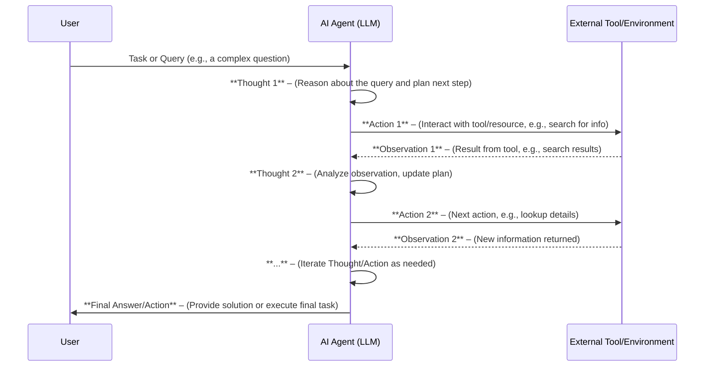

# Understanding AI Agents and Autonomy

*Whitepaper Series on AI Agents – Series 1*

## Executive Summary

- **AI Agents Defined:** AI agents are autonomous software entities that perceive information, make decisions, and take actions to achieve specific goals on behalf of users or organizations. They integrate key components – such as perception (inputs), reasoning/decision-making, and actuation (outputs) – to operate with minimal human intervention (see **Core Concepts**)[^1].

- **Agentic AI and Intelligent Agents:** *Agentic AI* refers to advanced AI systems composed of multiple agents that exhibit **agency** – the capacity to act independently in a goal-driven manner with limited supervision. These systems build on *intelligent agents* (individual AI-driven actors that can sense, decide, and act) and leverage technologies like large language models to plan and adapt dynamically. We clarify how agentic AI differs from general-purpose AI and other related terms in this paper.

- **Autonomy Levels and Governance:** Not all AI agents operate with the same degree of independence. We outline a five-level autonomy framework from **Level 1 (Operator)** – where a human user has full control – up to **Level 5 (Observer)** – where the agent acts fully independently. As autonomy increases, user involvement decreases, which **raises new risks** (e.g. unpredictable actions, accountability issues) and necessitates stronger governance and oversight mechanisms. Proper controls (such as defined approval steps or certification of high-autonomy agents) are essential to responsibly deploy advanced AI agents.

- **ReAct Framework for Advanced Agents:** We introduce *ReAct (Reasoning and Acting)* – a cutting-edge framework for developing AI agents that can **think** (generate reasoning traces) and **act** (execute actions like tool use) in an interleaved loop. This approach, emerging from recent research, improves an agent's ability to solve complex tasks by dynamically planning and accessing external information[^2]. We explain how ReAct works and its significance for building the next generation of intelligent, autonomous agents.

## Introduction

Artificial Intelligence (AI) is entering a new era where **autonomous AI agents** perform tasks and make decisions with minimal direct human guidance. From automated customer service assistants to adaptive supply chain optimizers, these agents promise to enhance efficiency and unlock new capabilities. At the same time, the rise of agentic AI systems – AI composed of multiple coordinated agents – raises important questions about control, risk, and governance. Business executives and technical professionals alike need a clear understanding of what AI agents are, how autonomous they can (and should) be, and what frameworks exist to build them safely and effectively.

This whitepaper – the first in a series on AI Agents – provides a foundational overview of **AI agents and autonomy**. We define key concepts and components that underlie intelligent agents, clarify terminology (including *agentic AI*, *intelligent agents*, and *artificial general intelligence*), and examine how varying levels of autonomy relate to user involvement, risk, and oversight. In the technical section, we introduce the ReAct framework, an innovative approach enabling advanced agents to reason and interact with their environment iteratively. The goal is to equip decision-makers and technologists with a solid grasp of these core concepts, facilitating informed strategy, design, and governance of AI agent solutions.

## Core Concepts

### Defining AI Agents and Key Components

An **AI agent** is essentially an autonomous entity – typically a software program or algorithm – that **perceives its environment and acts upon it** to achieve certain objectives. A classic definition from AI research describes an agent as "anything that can be viewed as perceiving its environment through sensors and acting upon that environment through actuators"[^1]. In simpler terms, the agent takes in information (from users, data streams, sensors, etc.), decides what to do based on that input and its goals, and then executes actions to influence its environment or produce outcomes.

**Key Components of an AI Agent:** While implementations vary, most intelligent agents share a common set of functional components that enable their autonomous operation:

- **Perception (Input Handling):** The agent's ability to ingest and interpret information from its environment or users. This could involve sensors in a physical robot, or APIs and data feeds in a software agent. Techniques like natural language processing help an agent parse text or speech input, while computer vision might help interpret visual data.

- **Reasoning and Decision-Making:** The "brain" of the agent that processes inputs, considers objectives, and determines the best course of action. This can range from simple rule-based logic ("if X, then do Y") to complex cognitive reasoning with machine learning. Modern AI agents often evaluate options, predict outcomes, and even employ planning algorithms or learned policies to make rational decisions. This component may incorporate a **planning** module to break down goals into tasks, and a **policy** or model to select actions.

- **Action (Actuation):** The mechanism for executing decisions and affecting the environment. For software agents, an action might be an API call, database query, or a message sent to another system. For embodied agents (robots, autonomous vehicles), actions involve physical actuators (motors, etc.). Many AI agents today use **tool use or API calling** as actions – for example, an agent might retrieve information via a web search or trigger an external service to complete a task.

- **Memory (State):** Effective agents maintain memory of relevant information – both short-term (the current context or recent interactions) and long-term (learned knowledge or history). Memory enables an agent to carry context over time, learn from past experiences, and improve continuity in decision-making.

- **Learning and Adaptation:** A hallmark of *intelligent* agents is that they can improve their performance over time. Through machine learning methods (supervised, unsupervised, or reinforcement learning), an agent can adapt its internal models based on feedback or new data[^3]. This means the agent isn't static – it can refine its behavior (e.g., become more accurate or efficient) as it gathers more experience.

*(Note:* In multi-agent systems or human-facing agents, a **communication** component is also vital – allowing agents to exchange information with other agents or interact naturally with humans. For instance, natural language generation might be used for a chatbot agent's responses. However, in this paper we focus on the core individual agent functions of perception, reasoning, action, etc.)

By integrating these components, AI agents can autonomously carry out tasks such as diagnosing technical problems, scheduling workflows, navigating vehicles, or conversing with customers. Importantly, the sophistication of each component can vary widely – from simple reactive agents (that reflexively respond to stimuli) to cognitive agents capable of long-term planning and complex reasoning. The design of an agent's **architecture** (how these pieces are organized) will depend on the use case and requirements for autonomy, reliability, and performance.

### Agentic AI and Related Terms

As AI agents gain prominence, several related terms often arise. It's important to clarify these to avoid confusion:

- **Intelligent Agents:** In the field of AI, *intelligent agent* is a broad term for any autonomous system that perceives and acts toward a goal. In essence, it is synonymous with an AI agent as defined above. An intelligent agent can be as simple as a thermostat (which perceives temperature and turns heating on/off) or as complex as a self-driving car. The key is that it exhibits *agency* – it makes decisions and takes actions without constant human direction, based on its perceptions and objectives.

- **Agentic AI:** This term refers to **multi-agent** or orchestrated AI systems that are **goal-driven and autonomous**. *Agentic AI* systems consist of one or more intelligent agents (often specialized) that collaborate or are coordinated to achieve higher-level goals. Compared to a single standalone agent, an agentic AI system is typically more **adaptive, proactive, and capable of complex tasks**, because it can break tasks into subtasks handled by different agents and make independent decisions in real time. Crucially, agentic AI exhibits *autonomy* (operating with limited human supervision) and *purposeful agency*. As IBM describes, unlike traditional AI programs that follow predefined scripts or only respond to prompts, agentic AI systems can **set goals, make iterative decisions, and take actions** to fulfill those goals, all with minimal human oversight. In other words, agentic AI emphasizes an AI system's ability to *take initiative* and "figure out" how to satisfy a high-level objective, rather than just generating outputs when asked.[^4]

- **Artificial General Intelligence (AGI):** AGI is often mentioned in discussions about advanced AI agents, but it refers to a different concept. **Artificial General Intelligence** denotes a hypothetical future AI that possesses **general-purpose intelligence at a human level (or beyond)**. An AGI would be capable of understanding, learning, and applying knowledge across an extremely broad range of tasks, matching human cognitive abilities across the board. Importantly, current AI agents – no matter how autonomous or advanced – are *not* AGI. They remain specialized to certain domains or tasks (narrow intelligence). AGI, by contrast, implies the ability to handle virtually any intellectual task. While researchers have not reached consensus on how to achieve or even define AGI precisely[^5], it remains a long-term goal in AI. In summary, today's agentic AI systems are **powerful but narrow** (focused on specific goals or domains), whereas AGI would be a single agent with broad, human-like cognitive versatility. It's possible to have very autonomous agents that are still not "general" in intelligence – autonomy is about independence in operation, while AGI is about scope of intelligence.

### Levels of Autonomy in AI Agents

Autonomy in AI agents isn't all-or-nothing – it exists on a spectrum. It's often useful to categorize **levels of autonomy** to describe how much an agent relies on human input or oversight in its decision-making. A recent framework (Feng et al., 2025) defines five levels of AI agent autonomy, each characterized by the role of the human user in the agent's operation[^6]. In brief:

1. **Level 1 – Operator:** The user is the decision-maker; the agent acts **only on direct instructions**. The agent has no initiative of its own. (Example: a coding assistant that writes code *only* when explicitly prompted line-by-line.)

2. **Level 2 – Collaborator:** The agent and user **share control**. The agent can make suggestions or take limited actions, but the user actively participates in planning and can intervene frequently. (Example: a semi-autonomous data analysis agent that proposes insights, while a human analyst guides its direction.)

3. **Level 3 – Consultant:** The agent takes the lead in performing tasks and making routine decisions, **consulting the user for guidance** on preferences or expertise as needed. The user's role is mainly to provide occasional input or domain knowledge. (Example: an AI research assistant that drafts reports or code and only asks the user for specific clarifications.)

4. **Level 4 – Approver:** The agent operates **independently by default**, handling planning and actions on its own. The human user is only asked to approve decisions in particular high-risk or exceptional cases defined by policy. (Example: an autonomous investment agent that manages a portfolio and only seeks human approval for very large trades or unusual market conditions.)

5. **Level 5 – Observer:** The agent is **fully autonomous**. The human does not intervene in decisions; they only **monitor outcomes** and can step in via an emergency stop if something goes wrong. The agent has full discretion within its domain. (Example: a self-driving taxi system functioning without a human driver or remote operator in the loop.)

These levels illustrate a progression from **human-in-the-loop** at Level 1 (the agent is a passive tool) to **human-on-the-loop** at Level 5 (the agent acts on its own while humans simply supervise). **Figure 1** below visualizes this autonomy spectrum:

*Figure 1: Five levels of AI agent autonomy, from full human control (L1) to full agent autonomy (L5). Each level corresponds to the user's role in guiding or overseeing the agent.*

At lower autonomy levels, user involvement is high – which can mean greater assurance and alignment with human intent, but also more labor and less agent-driven efficiency. At higher levels, the agent has more freedom to operate, which can dramatically increase productivity and allow handling of complex, rapid decisions beyond human speed. However, **greater autonomy comes with increased risk**. As one report notes, autonomy is a "double-edged sword" – it unlocks transformative potential but also raises critical risks. These risks include the agent making inappropriate or unsafe choices, difficulty in tracing accountability for the agent's actions, and the possibility of the agent's goals diverging from the user's intent. For example, a Level 5 autonomous trading agent might execute trades that unintentionally violate regulations if not properly constrained.

**Governance and Oversight:** As a result, the more autonomous an AI agent is, the more robust the governance measures needed to ensure it operates safely and as intended. Organizations should implement **controls proportional to autonomy level**. For instance, a Level 4 or 5 agent might require rigorous testing and validation, fail-safes (such as the ability to override or shut down the agent in emergencies), and clear policies for accountability. Researchers have even proposed *autonomy certificates* – essentially third-party validations limiting an agent to a certified autonomy level – as a way to govern how independently an AI agent can operate in deployment[^6]. The idea is to treat autonomy as a design choice that can be reviewed and licensed, rather than an unchecked technical outcome. In practice, ensuring appropriate human oversight (like periodic reviews of the agent's decisions or outcomes) is crucial especially for higher-level agents.

In summary, understanding an AI agent's autonomy level helps in assessing **required human involvement, potential risks, and necessary governance**. Executives planning AI deployments should determine what level of autonomy is suitable for each use case, balancing efficiency gains against risk and control requirements. Many successful implementations start at a lower autonomy level (where humans and AI collaborate closely) and only **graduate to higher autonomy** as confidence in the agent's reliability and alignment grows.

## Technical Frameworks

### Architectures of AI Agents: From Reactive to Cognitive

Building an effective AI agent involves choosing an appropriate architecture – the framework that ties together the agent's components and decision-making logic. Broadly, agent architectures range from **simple reactive designs** to more **complex cognitive designs**:

- **Reactive Agents:** These agents act on current perceptions without internal model or long-term planning. For example, a reactive agent might follow condition-action rules ("if sensor detects obstacle, then turn"). Reactive architectures are fast and straightforward but limited in handling complex, sequential tasks because they don't explicitly plan ahead or maintain an internal state beyond the immediate moment.

- **Model-Based and Goal-Driven Agents:** More advanced agents maintain an internal **model of the environment** (or state) to inform their decisions. They may simulate "what if" scenarios internally. *Goal-based agents* choose actions that they expect will achieve defined goals, and *utility-based agents* even evaluate which actions maximize some utility or reward function (optimizing outcomes). Such agents typically incorporate a planning module to chart a sequence of actions toward a goal. They can handle more complex scenarios than purely reactive agents, at the cost of additional computation and complexity.

- **Learning Agents:** These agents have components to learn and adapt over time (the *learning element*) in addition to the performance element that actually makes decisions. A learning agent can start with basic knowledge and improve through experience, adjusting its model or rules based on feedback. For instance, a robotic agent might learn from trial-and-error (reinforcement learning) to navigate more efficiently. Modern AI agents often blend learning with decision-making to remain effective in dynamic environments.

Most practical AI agents today are a hybrid of these ideas. A typical architecture will include a **perception module**, a **reasoning/planning module**, and an **action execution module**, often with feedback loops connecting them (see **Core Concepts: Key Components**). The agent perceives inputs, updates its internal state or understanding, decides on an action, performs the action, then perceives new inputs and repeats – forming a continuous perception-action loop. Figure 2 illustrates this loop in the context of an advanced reasoning agent.

### The ReAct Framework: Integrating Reasoning and Acting

One notable modern framework for implementing advanced AI agents is called **ReAct**, which stands for *Reasoning and Acting*. Proposed by researchers in 2022, ReAct is designed particularly for agents based on **large language models (LLMs)** that perform complex tasks like question answering, web navigation, or multi-step problem solving[^2]. The core idea of ReAct is to have the AI **intertwine its thought process with actions** in an iterative loop, rather than solving problems in one go or following a fixed script.

In a ReAct-based agent, the LLM is prompted to generate two kinds of outputs in sequence:

1. a **Thought** – a natural language reasoning step (what the agent is thinking or inferring at that moment), and

2. an **Action** – a task-specific command to interact with an external environment or tool (for example, a search query, a database lookup, an API call, or a physical action).

After the agent outputs an Action, it receives an **Observation** from the environment (e.g., search results, data retrieved, sensor reading). The agent then uses that observation to formulate its next Thought, and then possibly another Action, and so on. This continues in a loop until the agent decides it has enough information to produce a final answer or achieve its goal. **Figure 2** shows a simplified interaction sequence of an AI agent using the ReAct approach:

*Figure 2: An example of the ReAct reasoning-action loop. The AI agent alternates between internal reasoning ("Thought") and external interactions ("Action"), processing observations from the environment, until it reaches a solution.*

This approach offers several benefits for advanced agents:

- **Dynamic Problem Solving:** By reasoning step-by-step, the agent can break down complex tasks into manageable steps (much like a human would brainstorm and research sub-questions in a complex problem). The agent can handle **open-ended or knowledge-intensive tasks** by successively narrowing down what it needs to do or find out.

- **Access to External Information:** The Action+Observation steps allow the agent to query external sources (tools, databases, the web) to gather information **beyond its initial training data**. This mitigates the issue of AI models "hallucinating" facts – instead of guessing, the agent can look up real data as needed.

- **Transparency and Traceability:** The chain of Thoughts provides a reasoning trace that can be inspected by developers or even presented to users for transparency. This improves **interpretability and trust**, since one can follow *why* the agent made certain moves or conclusions. In contrast, a monolithic black-box answer from an AI is harder to trust in high-stakes settings.

**Role in Developing Advanced Agents:** The ReAct framework has become a foundation for many AI agent systems, especially those leveraging powerful language models. By combining "thinking" and "doing," ReAct agents exhibit a form of decision-making that is closer to human problem-solving. Researchers demonstrated that ReAct prompting enabled language models to outperform more rigid approaches on various tasks – for example, achieving higher success rates on interactive decision-making benchmarks by allowing the model to plan and take actions iteratively[^2]. This has influenced practical tool-using AI agents (such as those built with libraries like LangChain) to adopt a ReAct-style approach, where an LLM-based agent can call tools (APIs, search engines, calculators, etc.) in the midst of generating an answer.

In essence, ReAct provides a **technical blueprint for autonomy**: it shows how an AI agent can be given the autonomy to decide *not only what to answer, but how to gather the information needed to answer*. This significantly expands what AI agents can do. Instead of being limited to responding with what's already in their model's knowledge, agents can **actively fetch new information, verify facts, and take intermediate steps** toward a goal. For executives and practitioners, frameworks like ReAct are important because they unlock more **robust and reliable agent behavior** – enabling AI agents that are both intelligent (reasoning well) and action-oriented (getting things done in the real world).

Of course, giving agents the ability to take actions (especially external actions like calling systems or changing data) amplifies the need for careful governance (as discussed in **Core Concepts** on autonomy levels). Developers must define what tools an agent is allowed to use and set safeguards (for example, limiting an agent's actions to read-only information retrieval versus actions that can modify important data). In the ReAct paradigm, each action is usually explicitly logged and often constrained by the environment (for instance, an agent might only have access to a curated set of tools). This allows for a degree of control even as we hand over more problem-solving autonomy to the AI.

## Conclusion

AI agents are poised to become increasingly prevalent in enterprise and society – from virtual assistants handling routine tasks to autonomous systems managing complex operations. Understanding the fundamentals of these agents and their autonomy is crucial for harnessing their benefits while managing their risks. In this whitepaper, we defined AI agents and broke down their key components, showing how they **perceive, reason, act, and learn** in pursuit of goals. We clarified terms like agentic AI and AGI, highlighting that today's agent-based systems, while powerful, remain domain-constrained and are not the mythical "general intelligence" often sensationalized.

We also examined how the **level of autonomy** can vary in AI agents, and why this matters. Higher autonomy can drive efficiency and enable solutions at scale, but it also transfers more decision-making power from humans to machines – making governance frameworks and safety assurances absolutely essential. Executives should carefully choose the appropriate autonomy level for each AI application and put in place oversight proportional to the agent's independence.

On the technical front, we introduced the ReAct framework as an example of how cutting-edge AI agents are being built to reason and act in tandem. Frameworks like ReAct point to a future where AI agents are not just static question-answerers, but active problem-solvers that can **dynamically plan, research, and execute tasks**. This blurs the line between "AI as a tool" and "AI as a collaborator," and it underscores the importance of designing agents whose actions remain aligned with human intentions and ethical norms.

In conclusion, **autonomous AI agents represent a transformative leap** in AI's capabilities – one that promises significant opportunities for those who understand and implement them wisely. By grounding these innovations in clear concepts, robust technical frameworks, and responsible governance, organizations can confidently navigate the era of intelligent agents. The subsequent papers in this series will delve deeper into specific aspects of AI agents, such as safety and alignment strategies, multi-agent ecosystems, and real-world deployment case studies, to further guide leaders and practitioners on this journey.

---

[^1]: [Stuart Russell and Peter Norvig (1995). *Artificial Intelligence: A Modern Approach*.](https://web.pdx.edu/~arhodes/ai5.pdf)
[^2]: [ReAct: Synergizing Reasoning and Acting in Language Models](https://arxiv.org/abs/2210.03629) | [PDF](https://arxiv.org/pdf/2210.03629)
[^3]: [AI Agent Components - IBM](https://www.ibm.com/think/topics/components-of-ai-agents)
[^4]: [Agentic AI Definition - IBM](https://www.ibm.com/think/topics/agentic-ai)
[^5]: [Artificial General Intelligence - IBM](https://www.ibm.com/think/topics/artificial-general-intelligence)
[^6]: [Levels of Autonomy for AI Agents](https://arxiv.org/abs/2506.12469) | [PDF](https://arxiv.org/pdf/2506.12469)