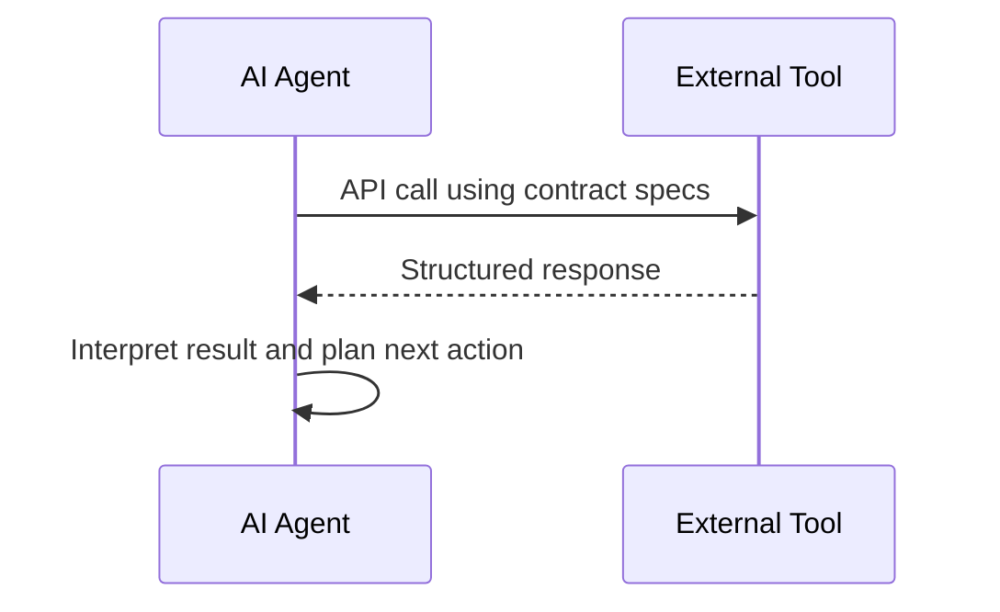

# How Well-Defined API Contracts Enable Tools for AI Agents

*Whitepaper Series on AI Agents – Series 2*

## Executive Summary

AI agents extend their capabilities by calling external services, or "tools," via APIs. For these agents to function autonomously and reliably, they must interface with services using clear, consistent, and well-structured API contracts. These contracts ensure interoperability, reduce integration friction, and allow AI agents to safely act on real-time data across systems.

## Introduction

Modern AI agents can reason, plan, and execute actions by interacting with external tools. These tools might include databases, analytics engines, financial platforms, or messaging services. API contracts—machine-readable specifications of API behavior—are vital to enabling agents to interact effectively with such systems. This explainer outlines what API contracts are, how they support AI agents, and how standards like the Model Context Protocol (MCP) help simplify and scale agent-tool integrations.

## What Are API Contracts?

API contracts formally describe how a system’s API behaves. They specify:

* Endpoints and methods (e.g., GET /portfolio)
* Input parameters and expected data types
* Response structures and error codes
* Authentication and usage constraints

Using OpenAPI, gRPC, or similar specifications, these contracts allow developers—and AI agents—to programmatically understand what data is required and what will be returned.

## Tools in the AI Agent Context

In this context, "tools" refer to external services that an AI agent can call to accomplish tasks:

* Retrieve or process information (e.g., a risk engine)
* Perform actions (e.g., executing trades, sending emails)
* Query structured data (e.g., SQL databases or market feeds)

AI agents use reasoning processes (e.g., ReAct) to determine when and how to use tools based on task goals. Without standardized interfaces, this reasoning is error-prone or impossible.

## Why Contracts Matter

API contracts bring the following advantages:

* **Interoperability**: Agents can integrate with multiple services that follow consistent specifications.
* **Autonomy**: Agents can plan multi-step actions without ambiguity or human intervention.
* **Resilience**: Contracts allow agents to handle errors and version changes safely.

For example, an AI audit assistant might rely on three APIs—OCR for invoices, accounting for transactions, and a rules engine for compliance. Contracts allow the agent to reliably parse and sequence these calls.

## The Model Context Protocol (MCP)

MCP standardizes how AI agents interact with external tools. It separates tool invocation from model logic, making tools plug-and-play. MCP uses JSON-RPC to transmit structured requests/responses and provides discovery and schema definitions for each tool.

Benefits include:

* Unified error handling
* Context-aware responses
* Central governance and security

MCP allows enterprises to scale agent deployments without bespoke integrations for each new tool.

## Design and Governance Considerations

To ensure scalable and reliable AI integration, contracts should include:

* **Versioning**: Define how APIs evolve without breaking agent workflows.
* **Rate limits**: Protect systems from excessive agent calls.
* **Schema consistency**: Standardize formats for easier parsing.
* **Security and permissions**: Specify auth scopes and API key handling.
* **Lifecycle governance**: Track changes and inform dependent agents.

## Example: AI Agent for Portfolio Rebalancing

An investment AI agent performs these steps:

1. Fetch prices from a market data API.
2. Call a risk tool to assess portfolio health.
3. Query an optimization engine for trade recommendations.
4. Execute trades via a broker API.
5. Log actions to a compliance ledger.

Each step uses an API with a contract specifying expected inputs, outputs, and constraints. Contracts ensure the agent operates within business rules and provides an auditable trail.

## Mermaid Diagram: Tool Invocation Pipeline

## Recommendations

* Treat APIs as products designed for AI consumption.
* Use OpenAPI or gRPC specs to define contracts.
* Integrate tools through MCP where feasible.
* Monitor usage and version compliance.
* Implement rigorous testing, including simulation of agent behavior.

## Conclusion

Well-defined API contracts are essential infrastructure for AI agents. They allow agents to interact safely and autonomously with enterprise systems. As agent-based architectures mature, standardization, governance, and security around APIs will be critical enablers of scalable success.
